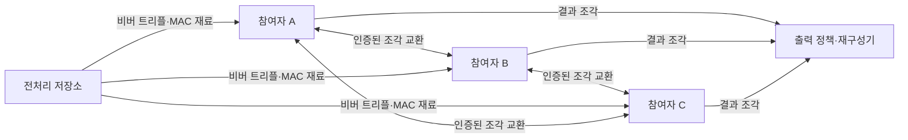
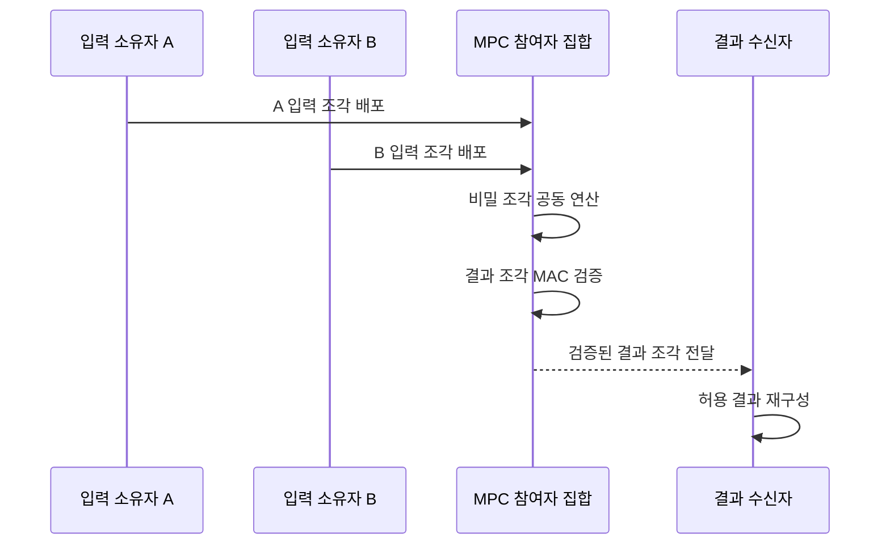

---
sidebar:
  order: 17
  label: "017. 안전한 다자간 연산 MPC (Secure Multi-Party Computation)"
  badge:
    text: "기출 · 50%"
    variant: note
title: "안전한 다자간 연산 MPC (Secure Multi-Party Computation)"
date: "2026-07-27T23:59:59+09:00"
tags:
  - "notes-security"
weight: 17
extra:
  question_no: "017"
  source_status: "기출"
  source_history: "135회"
  priority: 50
  priority_note: "135회 기출이며 PET 비교와 협업 연산 설계에 유용함"
---

## 미리 알고가기

- **안전한 다자간 연산(Secure Multi-Party Computation, MPC, 엠피씨)**: 영문 머리글자를 딴 명칭으로, 여러 참여자가 원본 입력을 서로 공개하지 않고 함수 결과만 공동 계산하는 기술
- **프라이버시 강화 기술(Privacy-Enhancing Technology, PET, 피이티)**: 영문 머리글자를 딴 기술군으로, 데이터 활용 중 원본 노출과 개인 식별 가능성을 축소
- **비밀 분산(Secret Sharing, 시크릿 셰어링)**: 비밀을 조각으로 나눠 임계값 이상의 조각으로만 원본을 복구하는 방식
- **임계값(Threshold)**: 비밀 재구성이나 공동 연산에 필요한 최소 참여자·조각 수
- **공모(Collusion)**: 참여자들이 정보와 조각을 합쳐 다른 참여자의 비밀을 추론하는 행위
- **반정직 공격자(Semi-honest Adversary)**: 절차는 따르지만 관측 메시지로 추가 정보를 추론하는 참여자
- **악의적 공격자(Malicious Adversary)**: 잘못된 입력·메시지·중단으로 결과를 왜곡하는 참여자
- **메시지 인증 코드(Message Authentication Code, MAC, 맥)**: 영문 머리글자를 하나의 단어처럼 읽으며, 비밀키로 메시지의 변조와 출처를 검증하는 값
- **비버 트리플(Beaver Triple, 비버 트리플)**: 고안자 이름을 딴 사전 계산 재료로, 비밀 분산 곱셈의 온라인 통신을 축소
- **가블드 회로(Garbled Circuit, 가블드 서킷)**: 회로의 선 값을 암호화해 입력 공개 없이 출력을 계산하는 방식
- **동형 암호(Homomorphic Encryption)**: 암호문을 복호화하지 않고 계산하는 암호 방식
- **재구성(Reconstruction)**: 임계값 이상의 결과 조각을 모아 허용된 최종 출력을 복구하는 절차

## Ⅰ. 개요

- 정의/개념: 원본 입력을 서로 공개하지 않고 결과만 공동 계산
- 기존 한계: 기존 공동 분석은 원본의 한곳 집중이 필요
- **배경/필요성**: 원본 이전 없는 조직 간 데이터 결합

### 쉽게 이해하기 (학습용)

- 각 기관이 숫자를 조각내 나눠 보내면 누구도 원래 숫자를 보지 못하지만, 조각끼리 계산해 전체 합계만 복구할 수 있다.

## Ⅱ. 특징

- 허용 공모 수가 원본 비밀성을 좌우한다
- 악의적 모델은 부정 메시지를 검증해야 한다
- 반복 출력은 개인 입력을 노출할 수 있다

### 쉽게 이해하기 (학습용)

- 원본을 숨겨도 참여자 한 명만 빼고 합계를 반복 조회하면 빠진 사람의 값을 계산할 수 있으므로, 출력 조건과 횟수도 제한해야 한다.

## Ⅲ. 아키텍처 및 구성요소

| 설계 요소 | 설명 |
|:---|:---|
| 참여자 A | A의 입력 조각·중간 상태 보유 |
| 참여자 B | B의 입력 조각·중간 상태 보유 |
| 참여자 C | C의 입력 조각·중간 상태 보유 |
| 전처리 저장소 | 곱셈·무결성용 무작위 재료 제공 |
| 출력 정책·재구성기 | MAC 검증 후 허용 결과만 복구 |

> 요약: 입력은 조각으로 계산하고 결과만 재구성

### 쉽게 이해하기 (학습용)

- 각 참여자는 원본 대신 의미 없는 조각만 들고 서로 계산하며, 임계값 이상의 올바른 결과 조각이 모일 때만 허용된 답을 복구한다.

## Ⅳ. 원리 및 절차 흐름도

| 절차 | 설명 |
|:---|:---|
| A 입력 조각 배포 | A 원본을 임계 조각으로 분산 |
| B 입력 조각 배포 | B 원본을 임계 조각으로 분산 |
| 비밀 조각 공동 연산 | 조각 상태로 합의한 함수 계산 |
| 결과 조각 MAC 검증 | 부정 참여자의 변조 여부 판정 |
| 검증된 결과 조각 전달 | 정책이 허용한 수신자에게 제공 |
| 허용 결과 재구성 | 임계 조각으로 최종 출력 복구 |

> 요약: 조각 연산·MAC 검증 후 결과만 복구

### 쉽게 이해하기 (학습용)

- 한 참여자가 다른 결과를 먼저 본 뒤 자기 조각을 보내지 않으면 나머지만 손해를 볼 수 있으므로, 중단과 결과 공개 순서도 프로토콜에 정해야 한다.

## Ⅴ. 종류 및 비교

| 판단 기준 | 비밀 분산 MPC | 가블드 회로 MPC | 동형 암호 기반 MPC |
|:---|:---|:---|:---|
| 적용 기준 | 덧셈·곱셈 중심 통계 | 비교·분기 중심 정책 | 통신 횟수를 줄일 집계 |
| 핵심 특징 | 조각끼리 산술 연산 | 암호화 논리 회로 평가 | 암호문 상태로 연산 |
| 한계 | 많은 통신 왕복·전처리 | 회로 크기에 따른 통신 증가 | 큰 암호문·연산 비용 |

> 요약: 함수 구조·통신·연산 비용으로 방식 선택

### 쉽게 이해하기 (학습용)

- 합계처럼 산술이 많으면 비밀 분산이 맞고, 조건 비교가 많으면 가블드 회로가 맞으며, 통신이 비싸면 동형 암호로 일부 계산을 줄일 수 있다.

## Ⅵ. 실무 사례

1. 은행 간 사기 합계는 비밀 분산으로 계산
2. 공동 서명키는 임계 조각으로 분산

### 쉽게 이해하기 (학습용)

- 은행들은 고객 원장을 보내지 않고 금액 조각만 교환해 전체 의심 거래 합계를 계산하며, 출력 횟수를 제한해 개별 은행 값 추론을 줄인다.
- 공동 서명키를 여러 운영자에게 조각내면 임계 인원 승인 때만 서명하고, 소수 운영자 공모만으로는 개인키를 복구할 수 없다.

## Ⅶ. 결론

- 함수·공모 임계값·출력 범위로 MPC 설계

### 쉽게 이해하기 (학습용)

- 원본을 모으지 않아도 공모자 수와 반복 결과에서 비밀이 드러날 수 있으므로, 계산 함수·임계값·출력 대상을 함께 정해야 한다.
