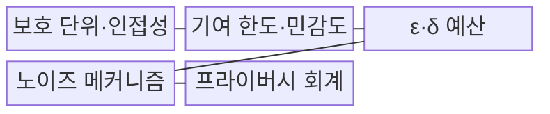
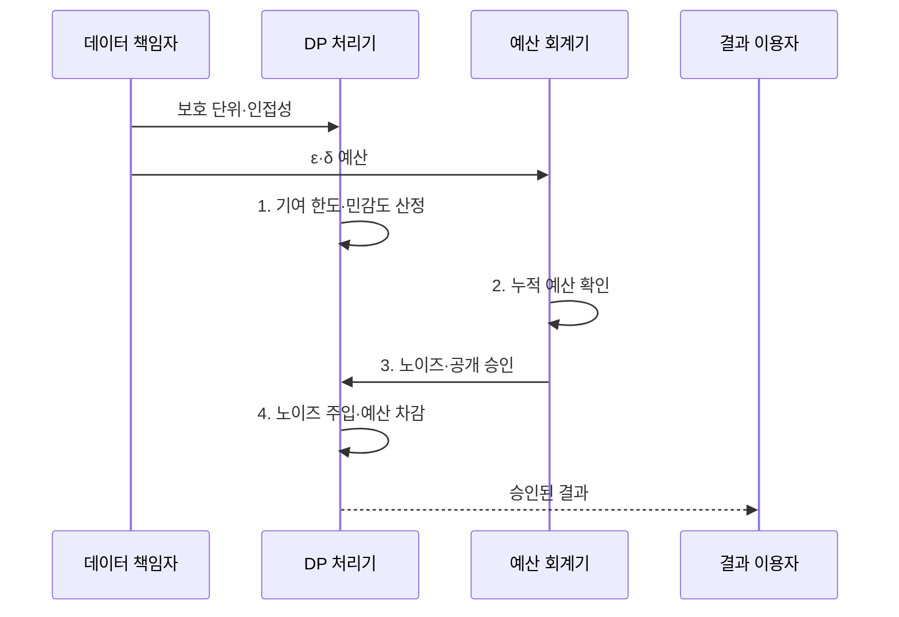

---
sidebar:
  order: 18
  label: "018. 차등 프라이버시 (Differential Privacy)"
  badge:
    text: "기출 · 70%"
    variant: note
title: "차등 프라이버시 (Differential Privacy)"
date: "2026-07-31T11:15:54+09:00"
tags:
  - "notes-security"
weight: 18
extra:
  question_no: "018"
  source_status: "기출"
  source_history: "134회, 135회"
  priority: 70
  priority_note: "134·135회 반복과 AI 프라이버시 연결성이 강함"
---

## 미리 알고가기

- **차등 프라이버시(Differential Privacy, DP)**: 한 개인의 포함 여부가 공개 결과에 미치는 영향을 수학적으로 제한하는 프라이버시 보호 모델이다.
- **프라이버시 예산 ε(Epsilon)**: 두 인접 데이터셋의 출력 분포 차이에 허용하는 프라이버시 손실 한도이며, 작을수록 강한 보장을 뜻한다.
- **실패 확률 δ(Delta)**: 순수 DP 경계를 벗어날 수 있는 허용 확률이며, 작을수록 강한 보장을 뜻한다.
- **인접 데이터셋(Adjacent Dataset)**: 한 보호 단위만 다른 두 데이터셋이다.
- **민감도(Sensitivity)**: 개인 한 명의 변화로 질의 결과가 달라질 수 있는 최대량이다.
- **기여 한도(Contribution Bound)**: 한 개인이 결과에 반영되는 횟수와 크기의 상한이다.
- **노이즈 주입(Noise Injection)**: 확률적 오차를 더해 개인의 영향을 구별하기 어렵게 하는 기법이다.
- **프라이버시 회계(Privacy Accounting)**: 반복 공개로 누적되는 프라이버시 손실을 계산하는 절차다.
- **중앙 DP(Central DP)**: 신뢰하는 수집자가 집계 결과에 노이즈를 넣는 방식이다.
- **로컬 DP(Local DP)**: 각 단말이 수집자에게 보내기 전에 값을 무작위화하는 방식이다.
- **셔플 DP(Shuffle DP)**: 무작위화한 보고의 순서와 출처를 섞는 방식이다.
- **DP-SGD(Differentially Private Stochastic Gradient Descent)**: 표본별 기울기를 제한하고 노이즈를 추가하는 차등 프라이버시 확률적 경사 하강법이다.
- **기울기 클리핑(Gradient Clipping)**: 학습 표본별 기울기 크기를 상한으로 제한하는 기법이다.
- **NIST SP 800-226**: 차등 프라이버시 보장의 평가 요소와 구현상 위험을 제시한 공식 지침이다.

> **키워드:** 차등 프라이버시 (Differential Privacy)

## Ⅰ. 개요

- 정의/개념: 개인 포함 여부의 영향을 제한하는 **확률적 프라이버시 모델**
- 배경/필요성: 익명 통계의 반복 결합으로 **개인 참여 여부 추론 가능**

### 쉽게 이해하기 (학습용)

- 한 사람의 기록을 넣거나 빼도 발표 결과가 비슷하게 보이도록 오차를 더해 참여 여부 추론을 어렵게 한다.

## Ⅱ. 특징

> 요약: ε가 작을수록 **잡음 증가·프라이버시 강화**

- 인접 데이터 정의의 **실제 보호 범위**
- 기여 한도·예산 회계의 **누적 손실 통제**
- **후처리 불변성**으로 추가 분석에도 예산 유지
- **프라이버시 예산 축소**로 잡음 증가·정확도 저하

### 쉽게 이해하기 (학습용)

- 누구의 어떤 변화를 숨길지 먼저 정해야 보호 범위와 잡음 크기를 계산할 수 있다.

## Ⅲ. 구조 및 구성요소

| 구성요소 | 책임 |
|:---|:---|
| 보호 단위·인접성 | 숨길 **개인 변화의 범위** 정의 |
| 기여 한도·민감도 | 개인별 **최대 출력 영향** 제한 |
| ε·δ 예산 | **프라이버시 손실·실패 확률** 상한 |
| 노이즈 메커니즘 | 민감도에 맞춘 **결과 무작위화** |
| 프라이버시 회계 | 반복 공개의 **누적 손실 계산** |

### 쉽게 이해하기 (학습용)

- 누구의 어떤 변화를 숨길지 정한 뒤 개인별 영향과 반복 공개량에 맞춰 오차를 배분한다.

## Ⅳ. 흐름도

**동작 원리**

1. **기여 한도·민감도 산정**: 개인 영향의 최대량 계산
2. **누적 예산 확인**: 반복 공개의 ε·δ 소비량 대조
3. **노이즈·공개 승인**: 오차 적용과 잔여 예산 판정
4. **노이즈 주입·예산 차감**: 무작위화 후 사용량 기록

### 쉽게 이해하기 (학습용)

- 같은 통계를 반복해서 보여 주면 오차를 평균낼 수 있으므로 공개할 때마다 누적 예산을 차감한다.

## Ⅴ. 종류 및 비교

| 차등 프라이버시 방식 | 중앙 DP | 로컬 DP | 셔플 DP |
|:---|:---|:---|:---|
| 적용 기준 | **수집자를 신뢰하는 환경** | **수집자를 불신하는 환경** | **대규모 보고 수집 환경** |
| 핵심 특징 | **수집자 노이즈 적용** | **단말 값 무작위화** | **보고 출처·순서 혼합** |
| 한계 | **원자료 유출** | **낮은 결과 정확도** | **셔플 서버 추적 위험** |

> 요약: 수집자 신뢰 범위로 DP 방식 선택

### 쉽게 이해하기 (학습용)

- 중앙 방식은 수집자가 원자료를 보고 오차를 넣고 로컬 방식은 단말에서 먼저 값을 흐리므로 신뢰 경계가 다르다.

## Ⅵ. 실무 고려사항 및 대책

| 고려사항 | 대책 | 효과 |
|:---|:---|:---|
| **DP 보장 평가 오류** | **NIST SP 800-226 적용** | **과장된 보호 주장 방지** |
| **반복 질의·결합** | **예산 회계·공개 횟수 제한** | **누적 재식별 위험 억제** |
| **기여량 편차** | **개인별 기여 상한 설정** | **민감도·노이즈 안정화** |
| 학습 표본의 **기울기 노출** | **DP-SGD·기울기 클리핑** | **학습 데이터 영향 제한** |

### 쉽게 이해하기 (학습용)

- 공공 통계는 한 사람의 추가·삭제 중 무엇을 숨기는지 정하고 반복 공개에 쓸 예산을 기록한다.

## Ⅶ. 결론

- 신뢰 수집자는 **중앙 DP**, 수집자 불신은 **로컬 DP** 선택

### 쉽게 이해하기 (학습용)

- 작은 예산만 고집하지 말고 숨길 개인 변화와 반복 공개 횟수, 결과에 허용할 오차를 함께 정한다.
