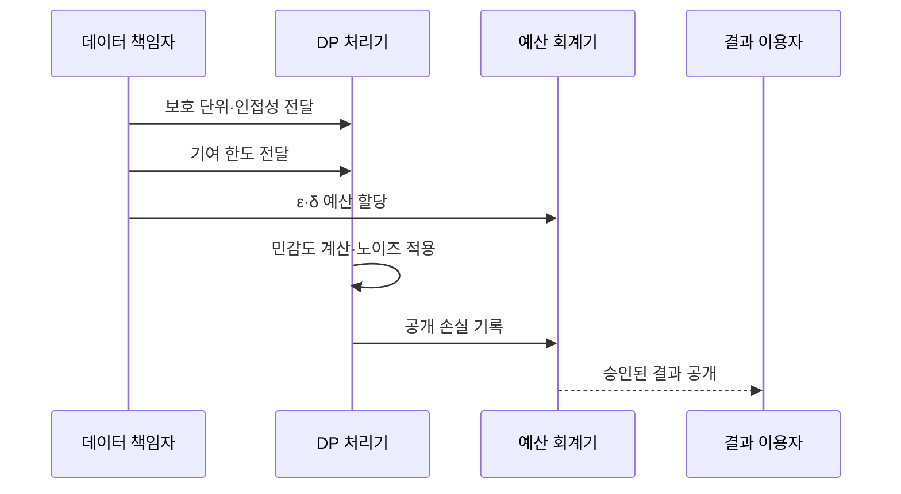

---
sidebar:
  order: 18
  label: "018. 차등 프라이버시 (Differential Privacy)"
  badge:
    text: "기출 · 70%"
    variant: note
title: "차등 프라이버시 (Differential Privacy)"
date: "2026-07-27T23:59:59+09:00"
tags:
  - "notes-security"
weight: 18
extra:
  question_no: "018"
  source_status: "기출"
  source_history: "134회, 135회"
  priority: 70
  priority_note: "134·135회 반복과 AI 프라이버시 연결성이 강함"
---

## 미리 알고가기

- **차등 프라이버시(Differential Privacy, DP, 디피)**: 영문 머리글자를 딴 명칭으로, 한 개인의 포함 여부가 공개 결과에 미치는 영향을 수학적으로 제한
- **프라이버시 예산 ε(Epsilon, 엡실론)**: 그리스 문자로 프라이버시 손실 한도를 표기하며, 작을수록 두 인접 데이터셋의 출력 구별이 어려움
- **실패 확률 δ(Delta, 델타)**: 그리스 문자로 순수 DP 경계를 벗어날 허용 확률을 표기하며, 작을수록 강한 보장을 의미
- **인접 데이터셋**: 한 보호 단위만 다른 두 데이터셋
- **민감도**: 개인 한 명의 변화로 질의 결과가 달라질 수 있는 최대량
- **기여 한도**: 한 개인이 결과에 반영되는 횟수와 크기의 상한
- **노이즈 주입**: 확률적 오차를 더해 개인의 영향을 구별하기 어렵게 하는 기법
- **프라이버시 회계**: 반복 공개로 누적되는 프라이버시 손실을 계산하는 절차
- **중앙 DP**: 신뢰하는 수집자가 집계 결과에 노이즈를 넣는 방식
- **로컬 DP**: 각 단말이 수집자에게 보내기 전에 값을 무작위화하는 방식
- **셔플 DP**: 무작위화한 보고의 순서와 출처를 섞는 방식
- **DP-SGD(Differentially Private Stochastic Gradient Descent, 디피 에스지디)**: 표본별 기울기를 제한하고 노이즈를 더하는 차등 프라이버시 확률적 경사 하강법
- **기울기 클리핑**: 학습 표본별 기울기 크기를 상한으로 제한하는 기법
- **NIST(National Institute of Standards and Technology, 니스트)**: 미국 국립표준기술연구소로, DP 지침을 제시

## Ⅰ. 개요

- 정의/개념: 개인 포함 여부가 출력에 미치는 영향 제한
- 기존 한계: 익명화 통계도 반복 결합 시 개인 추론 가능
- **배경/필요성**: 반복 공개에서 개인 영향의 수학적 제한

### 쉽게 이해하기 (학습용)

- 한 사람의 기록을 넣거나 빼도 발표 결과가 비슷하게 보이도록 오차를 더해 참여 여부 추론을 어렵게 한다.

## Ⅱ. 특징

- 인접 데이터 정의가 실제 보호 범위를 정한다
- 기여 한도로 민감도와 노이즈를 조절한다
- 반복 공개의 누적 손실을 회계 처리한다
- 공개 결과의 후처리는 손실을 늘리지 않는다

### 쉽게 이해하기 (학습용)

- 누구의 어떤 변화를 숨길지 먼저 정해야 함

## Ⅲ. 아키텍처 및 구성요소

| 설계 요소 | 설명 |
|:---|:---|
| 보호 단위·인접성 | 숨길 개인 변화의 범위 정의 |
| 기여 한도·민감도 | 개인별 최대 출력 영향 제한 |
| ε·δ 예산 | 프라이버시 손실·실패 확률 상한 |
| 노이즈 메커니즘 | 민감도에 맞춰 결과 무작위화 |
| 프라이버시 회계 | 반복 공개의 누적 손실 계산 |

### 쉽게 이해하기 (학습용)

- 누구의 어떤 변화를 숨길지 정한 뒤 개인별 영향과 반복 공개량에 맞춰 오차를 배분한다.

## Ⅳ. 원리 및 절차 흐름도

| 절차 | 설명 |
|:---|:---|
| 보호 단위·인접성 전달 | 숨길 개인 변화를 설정함 |
| 기여 한도 전달 | 개인별 반영 상한을 설정함 |
| ε·δ 예산 할당 | 허용할 손실 한도를 배정함 |
| 민감도 계산·노이즈 적용 | 영향에 맞는 오차를 더함 |
| 공개 손실 기록 | 사용한 예산을 누적함 |
| 승인된 결과 공개 | 예산 안의 결과만 제공함 |

> 요약: 보호 범위·예산 안에서 결과 공개

### 쉽게 이해하기 (학습용)

- 같은 통계를 반복해서 보여 주면 오차를 평균낼 수 있으므로 공개할 때마다 누적 예산을 차감한다.

## Ⅴ. 종류 및 비교

| 판단 기준 | 중앙 DP | 로컬 DP | 셔플 DP |
|:---|:---|:---|:---|
| 적용 기준 | 수집자를 신뢰할 때 | 수집자를 불신할 때 | 대규모 보고를 모을 때 |
| 핵심 특징 | 수집자가 노이즈 적용 | 단말이 값을 무작위화 | 보고를 익명으로 섞음 |
| 한계 | 원자료 유출 | 낮은 결과 정확도 | 섞기 서버 추적 |

> 요약: 수집자 신뢰 범위로 DP 방식 선택

### 쉽게 이해하기 (학습용)

- 중앙 방식은 수집자가 원자료를 보고 오차를 넣고 로컬 방식은 단말에서 먼저 값을 흐리므로 신뢰 경계가 다르다.

## Ⅵ. 실무 사례

1. 공공 통계는 인접성·기여 한도·예산 명시

### 쉽게 이해하기 (학습용)

- 공공 통계는 한 사람의 추가·삭제 중 무엇을 숨기는지 정하고 반복 공개에 쓸 예산을 기록한다.

## Ⅶ. 결론

- 통계 결과에서 개인 참여 여부가 추론되는 위험을 줄이기 위해 인접성·개인 기여 한도·반복 질의·허용 오차를 검토하여, 목적에 맞는 프라이버시 예산을 결정해야 한다.

### 쉽게 이해하기 (학습용)

- 작은 예산만 고집하지 말고 숨길 개인 변화와 반복 공개 횟수, 결과에 허용할 오차를 함께 정한다.
