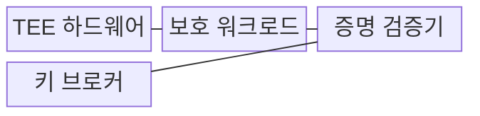
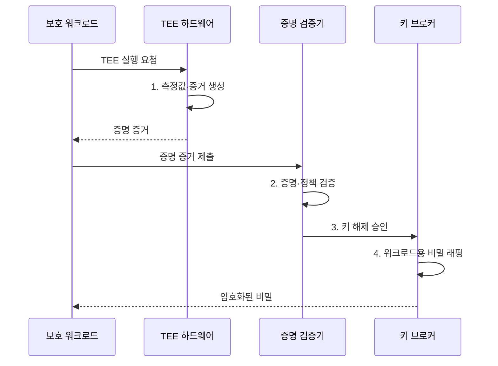

---
sidebar:
  order: 19
  label: "019. 기밀 컴퓨팅 (Confidential Computing)"
  badge:
    text: "미출제 · 50%"
    variant: note
title: "기밀 컴퓨팅 (Confidential Computing)"
date: "2026-07-31T11:16:09+09:00"
tags:
  - "notes-security"
weight: 19
extra:
  question_no: "019"
  source_status: "미출제"
  source_history: ""
  priority: 50
  priority_note: "클라우드·AI의 사용 중 데이터 보호 설계로 독립성이 큼"
---

## 미리 알고가기

- **기밀 컴퓨팅(Confidential Computing)**: 하드웨어 기반 격리와 원격 증명으로 사용 중 데이터와 코드를 보호하는 기술이다.
- **사용 중 데이터(Data in Use)**: 응용이 메모리에 적재하여 연산 중인 데이터다.
- **신뢰 실행 환경(Trusted Execution Environment, TEE)**: 하드웨어 기반 격리로 코드와 사용 중 데이터를 보호하는 실행 환경이다.
- **엔클레이브(Enclave)**: 응용의 일부 코드와 데이터를 격리하는 TEE 보호 구역이다.
- **기밀 가상머신(Confidential Virtual Machine)**: 가상머신 전체의 메모리와 실행 상태를 호스트로부터 보호하는 방식이다.
- **원격 증명(Remote Attestation)**: 원격 실행 환경의 신원·코드·설정 상태를 암호학적 증거로 검증하는 절차다.
- **측정값(Measurement)**: 실행 코드와 설정 상태를 나타내는 해시값이다.
- **워크로드(Workload)**: 시스템에서 실행하는 응용과 처리 작업이다.
- **키 브로커(Key Broker)**: 원격 증명을 통과한 실행 환경에만 암호키와 비밀을 제공하는 서비스다.
- **신뢰 컴퓨팅 기반(Trusted Computing Base, TCB)**: 시스템의 보안성을 보장하기 위해 신뢰해야 하는 하드웨어·소프트웨어 구성요소다.
- **그래픽 처리장치(Graphics Processing Unit, GPU)**: 대규모 병렬 연산을 수행하는 처리장치다.
- **직접 메모리 접근(Direct Memory Access, DMA)**: 주변장치가 CPU를 거치지 않고 메모리에 직접 접근하는 방식이다.
- **부채널 공격(Side-channel Attack)**: 처리 시간·전력·캐시 등 간접 정보를 분석하여 비밀값을 추론하는 공격이다.
- **IETF RFC 9334**: 증명자·검증자·의존 당사자로 구성된 원격 증명 아키텍처를 정의한 공식 문서다.
- **IETF RFC 9711**: 엔티티의 증명 클레임을 전달하는 EAT 토큰 형식을 규정한 표준이다.

## Ⅰ. 개요

- 정의/개념: TEE 격리·원격 증명으로 **사용 중 데이터를 보호하는 기술**
- 배경/필요성: 기존 암호는 연산 중 복호화로 **운영자·호스트 접근 허용**

### 쉽게 이해하기 (학습용)

- 클라우드 운영자를 신뢰하지 않아도 원격 증명으로 승인된 코드와 실행 환경을 확인한 뒤에만 데이터 암호키를 제공한다.

## Ⅱ. 특징

- 메모리·CPU 평문 구간의 **하드웨어 격리**
- 증명 기반 **워크로드 신원·상태 확인**
- 증명 통과 워크로드에만 **키 제공**
- TEE 격리 밖 **부채널 별도 통제**

### 쉽게 이해하기 (학습용)

- 원격 증명을 통과한 TEE에만 데이터 암호키를 제공하여 평문 노출 범위를 제한한다.

## Ⅲ. 구조 및 구성요소

| 구성요소 | 책임 |
|:---|:---|
| TEE 하드웨어 | **실행·메모리 격리** |
| 보호 워크로드 | **민감 데이터 내부 처리** |
| 증명 검증기 | **측정값·정책 대조** |
| 키 브로커 | 승인 환경에 **암호키 제공** |

### 쉽게 이해하기 (학습용)

- 증명 검증기는 TEE의 하드웨어 신원과 워크로드 측정값을 함께 확인한다.

## Ⅳ. 흐름도

**동작 원리**

1. **측정값·증거 생성**: 실행 환경의 신원·상태 기록
2. **증명·정책 검증**: 측정값·TCB·허용 버전 대조
3. **키 해제 승인**: 검증 통과 환경만 키 사용 허가
4. **워크로드용 비밀 래핑**: 승인 TEE만 해제할 형태로 보호

### 쉽게 이해하기 (학습용)

- 워크로드를 패치하면 측정값이 바뀌므로 새 측정값을 검증·승인한 뒤 키를 제공해야 한다.

## Ⅴ. 종류 및 비교

| 기밀 컴퓨팅 방식 | 애플리케이션 엔클레이브 | 기밀 VM | 가속기 TEE |
|:---|:---|:---|:---|
| 적용 기준 | **민감 코드가 작은 환경** | **기존 앱을 이관하는 환경** | **AI 연산 보호 환경** |
| 핵심 특징 | **응용 일부 격리** | **VM 전체 보호** | **GPU·장치 보호** |
| 한계 | **응용 수정 부담** | **넓은 TCB** | **장치 경로 누출** |

> 요약: 보호 범위와 TCB에 맞춰 방식을 선택함

### 쉽게 이해하기 (학습용)

- 보호 범위가 넓을수록 응용 이식은 쉽지만 신뢰해야 할 TCB와 공격 표면이 커진다.

## Ⅵ. 실무 고려사항 및 대책

| 고려사항 | 대책 | 효과 |
|:---|:---|:---|
| **원격 증명 역할 혼선** | **IETF RFC 9334 적용** | **증명·검증 경계 명확화** |
| **증명 클레임 교환 오류** | **IETF RFC 9711 EAT** | **다중 TEE 상호운용성** 확보 |
| **측정 불일치·부채널** | **키 차단·TCB 최소화** | **평문·비밀 노출 억제** |
| 가속기 **DMA 경로 노출** | 메모리 암호화·**장치 증명** | **GPU 처리 데이터 보호** |

### 쉽게 이해하기 (학습용)

- 키 브로커 장애 시에도 증명 검증을 우회하여 비밀을 제공하지 않도록 실패 정책을 적용한다.

## Ⅶ. 결론

- 작은 민감 코드는 **엔클레이브**, 기존 앱 이관은 **기밀 VM** 선택

### 쉽게 이해하기 (학습용)

- 보호 범위를 넓히는 것보다 어떤 하드웨어와 측정 증거를 신뢰할지 명확히 정하고, 검증 실패 시 키 제공을 차단해야 한다.
