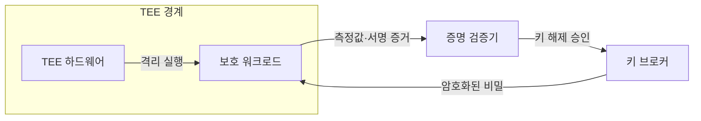
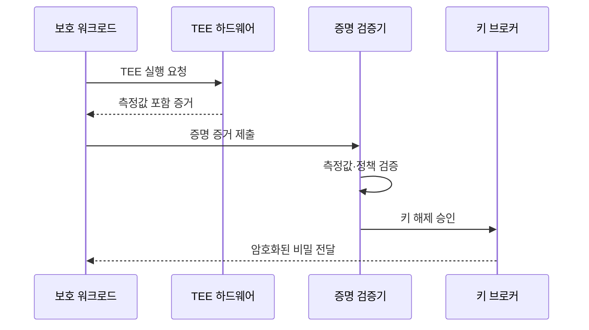

---
sidebar:
  order: 19
  label: "019. 기밀 컴퓨팅 (Confidential Computing)"
  badge:
    text: "미출제 · 50%"
    variant: note
title: "기밀 컴퓨팅 (Confidential Computing)"
date: "2026-07-25T01:05:00+09:00"
tags:
  - "notes-security"
weight: 19
extra:
  question_no: "019"
  source_status: "미출제"
  source_history: ""
  priority: 50
  priority_note: "클라우드·AI의 사용 중 데이터 보호 설계로 독립성이 큼"
---

## 미리 알고가기

- **사용 중 데이터(Data in Use)**: 응용이 메모리에 적재하여 연산 중인 데이터
- **신뢰 실행 환경(Trusted Execution Environment, TEE)**: 하드웨어 기반 격리로 코드와 사용 중 데이터를 보호하는 실행 환경
- **엔클레이브(Enclave)**: 응용의 일부 코드와 데이터를 격리하는 TEE 보호 구역
- **기밀 가상머신(Confidential Virtual Machine)**: 가상머신 전체의 메모리와 실행 상태를 호스트로부터 보호하는 방식
- **테넌트(Tenant)**: 클라우드 사업자의 자원을 분리하여 사용하는 고객 단위
- **원격 증명(Remote Attestation)**: 원격 실행 환경의 신원·코드·설정 상태를 암호학적 증거로 검증하는 절차
- **측정값(Measurement)**: 실행 코드와 설정 상태를 나타내는 해시값
- **워크로드(Workload)**: 시스템에서 실행하는 응용과 처리 작업
- **키 브로커(Key Broker)**: 원격 증명을 통과한 실행 환경에만 암호키와 비밀을 제공하는 서비스
- **신뢰 컴퓨팅 기반(Trusted Computing Base, TCB)**: 시스템의 보안성을 보장하기 위해 신뢰해야 하는 하드웨어·소프트웨어 구성요소
- **그래픽 처리장치(Graphics Processing Unit, GPU)**: 대규모 병렬 연산을 수행하는 처리장치
- **직접 메모리 접근(Direct Memory Access, DMA)**: 주변장치가 CPU를 거치지 않고 메모리에 직접 접근하는 방식
- **부채널 공격(Side-channel Attack)**: 처리 시간·전력·캐시 등 간접 정보를 분석하여 비밀값을 추론하는 공격

## Ⅰ. 개요

- 정의/개념: TEE 격리로 사용 중 데이터 보호
- **배경/필요성**: 운영자·호스트의 평문 접근 제한

### 쉽게 이해하기 (학습용)

- 클라우드 운영자를 신뢰하지 않아도 원격 증명으로 승인된 코드와 실행 환경을 확인한 뒤에만 데이터 암호키를 제공한다.

## Ⅱ. 특징

- 메모리와 CPU의 평문 처리 구간을 보호한다
- 증명으로 워크로드 신원과 상태를 확인한다
- 검증된 인스턴스에만 비밀 키를 제공한다
- 가용성·출력·부채널은 별도로 통제해야 한다

### 쉽게 이해하기 (학습용)

- 원격 증명을 통과한 TEE에만 데이터 암호키를 제공하여 평문 노출 범위를 제한한다.

## Ⅲ. 아키텍처 및 구성요소

| 설계 요소 | 설명 |
|:---|:---|
| TEE 하드웨어 | 실행과 메모리를 격리함 |
| 보호 워크로드 | 민감 데이터를 내부 처리함 |
| 증명 검증기 | 측정값과 정책을 대조함 |
| 키 브로커 | 승인된 환경에 키를 제공함 |

### 쉽게 이해하기 (학습용)

- 증명 검증기는 TEE의 하드웨어 신원과 워크로드 측정값을 함께 확인한다.

## Ⅳ. 원리 및 절차 흐름도

| 절차 | 설명 |
|:---|:---|
| TEE 실행 요청 | 격리된 워크로드를 시작함 |
| 측정값 포함 증거 | 실행 환경의 상태를 생성함 |
| 증명 증거 제출 | 검증기에 상태 증거를 보냄 |
| 측정값·정책 검증 | 승인 상태인지 판정함 |
| 키 해제 승인 | 키 제공 조건 충족을 알림 |
| 암호화된 비밀 전달 | 워크로드만 비밀을 해제함 |

> 요약: 증명에 성공한 TEE에만 비밀을 제공함

### 쉽게 이해하기 (학습용)

- 워크로드를 패치하면 측정값이 바뀌므로 새 측정값을 검증·승인한 뒤 키를 제공해야 한다.

## Ⅴ. 종류 및 비교

| 판단 기준 | 애플리케이션 엔클레이브 | 기밀 VM | 가속기 TEE |
|:---|:---|:---|:---|
| 핵심 특징 | 응용 일부 격리 | VM 전체 보호 | GPU·장치 보호 |
| 적용 기준 | 민감 코드가 작을 때 | 기존 앱을 옮길 때 | AI 연산을 보호할 때 |
| 주요 위험 | 응용 수정 부담 | 넓은 TCB | 장치 경로 누출 |

> 요약: 보호 범위와 TCB에 맞춰 방식을 선택함

### 쉽게 이해하기 (학습용)

- 보호 범위가 넓을수록 응용 이식은 쉽지만 신뢰해야 할 TCB와 공격 표면이 커진다.

## Ⅵ. 실무 사례

1. 키 브로커는 승인된 측정값에만 키 해제

### 쉽게 이해하기 (학습용)

- 키 브로커 장애 시에도 증명 검증을 우회하여 비밀을 제공하지 않도록 실패 정책을 적용한다.

## Ⅶ. 결론

- 클라우드의 사용 중 데이터를 보호하기 위해 TCB 범위·원격 증명 측정값·키 해제 조건·부채널 위험을 검토하여, 워크로드에 맞는 기밀 컴퓨팅 방식을 선택해야 한다.

### 쉽게 이해하기 (학습용)

- 보호 범위를 넓히는 것보다 어떤 하드웨어와 측정 증거를 신뢰할지 명확히 정하고, 검증 실패 시 키 제공을 차단해야 한다.
