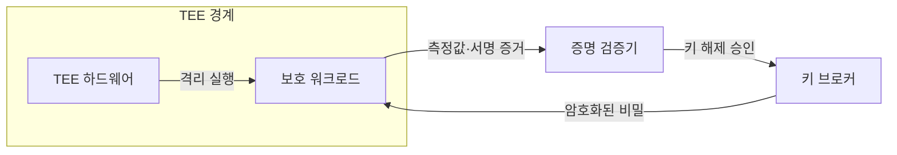
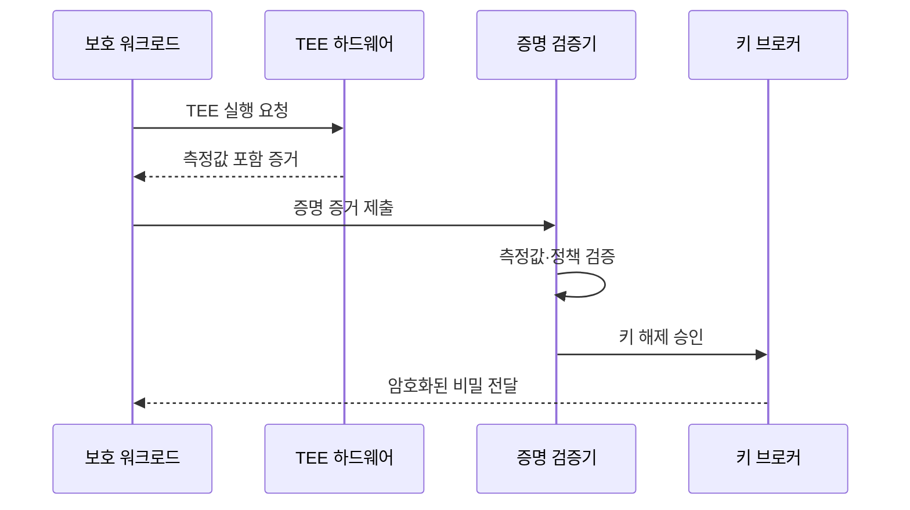

---
sidebar:
  order: 19
  label: "019. 기밀 컴퓨팅 (Confidential Computing)"
  badge:
    text: "미출제 · 50%"
    variant: note
title: "기밀 컴퓨팅 (Confidential Computing)"
date: "2026-07-25T01:05:00+09:00"
tags:
  - "notes-security"
weight: 19
extra:
  question_no: "019"
  source_status: "미출제"
  source_history: ""
  priority: 50
  priority_note: "클라우드·AI의 사용 중 데이터 보호 설계로 독립성이 큼"
---

## 미리 알고가기

- **사용 중 데이터(Data in Use)**: [읽기: 디에이티에이; 표기 이유: 영문 머리글자와 구분 기호] 연산을 위해 처리 중인 데이터임
- **TEE(Trusted Execution Environment)**: [읽기: 티이이; 표기 이유: 영문 머리글자와 구분 기호] 하드웨어로 격리한 실행 환경임
- **엔클레이브(Enclave)**: [읽기: 이엔씨엘에이브이이; 표기 이유: 영문 머리글자와 구분 기호] 응용 일부를 격리하는 TEE 구역임
- **기밀 VM(Virtual Machine)**: [읽기: 브이엠; 표기 이유: 영문 머리글자와 구분 기호] VM 전체 메모리를 보호하는 방식임
- **테넌트**: [읽기: 테넌트; 표기 이유: 한국어 통용어 표기] 클라우드 자원을 빌려 쓰는 고객 단위임
- **원격 증명**: [읽기: 원격 증명; 표기 이유: 한국어 통용어 표기] 원격 환경의 신원과 상태를 검증하는 절차임
- **측정값**: [읽기: 측정값; 표기 이유: 한국어 통용어 표기] 코드와 설정 상태를 나타내는 해시값임
- **워크로드**: [읽기: 워크로드; 표기 이유: 한국어 통용어 표기] 시스템에서 실행하는 응용과 작업임
- **키 브로커**: [읽기: 키 브로커; 표기 이유: 한국어 통용어 표기] 검증된 환경에만 비밀 키를 주는 서비스임
- **TCB(Trusted Computing Base)**: [읽기: 티씨비; 표기 이유: 영문 머리글자와 구분 기호] 보안을 위해 신뢰해야 하는 구성요소임
- **GPU(Graphics Processing Unit)**: [읽기: 지피유; 표기 이유: 영문 머리글자와 구분 기호] 병렬 연산용 처리 장치임
- **DMA(Direct Memory Access)**: [읽기: 디엠에이; 표기 이유: 영문 머리글자와 구분 기호] 장치가 메모리에 직접 접근하는 방식임
- **부채널 공격**: [읽기: 부채널 공격; 표기 이유: 한국어 통용어 표기] 시간·전력 등 간접 정보로 비밀을 추론함

## Ⅰ. 개요

- 정의/개념: TEE 격리로 사용 중 데이터 보호
- **배경/필요성**: 운영자·호스트의 평문 접근 제한

### 쉽게 이해하기 (학습용)

- 클라우드에 맡긴 계산도 승인된 봉인 방 안에서 실행되는지 확인한 뒤 데이터 열쇠를 줌

## Ⅱ. 특징

- 메모리와 CPU의 평문 처리 구간을 보호한다
- 증명으로 워크로드 신원과 상태를 확인한다
- 검증된 인스턴스에만 비밀 키를 제공한다
- 가용성·출력·부채널은 별도로 통제해야 한다

### 쉽게 이해하기 (학습용)

- 승인된 봉인 공간에만 데이터 열쇠를 줌

## Ⅲ. 아키텍처 및 구성요소

| 설계 요소 | 설명 |
|:---|:---|
| TEE 하드웨어 | 실행과 메모리를 격리함 |
| 보호 워크로드 | 민감 데이터를 내부 처리함 |
| 증명 검증기 | 측정값과 정책을 대조함 |
| 키 브로커 | 승인된 환경에 키를 제공함 |

### 쉽게 이해하기 (학습용)

- 증명 검증기는 봉인과 내용물을 함께 확인함

## Ⅳ. 원리 및 절차 흐름도

| 절차 | 설명 |
|:---|:---|
| TEE 실행 요청 | 격리된 워크로드를 시작함 |
| 측정값 포함 증거 | 실행 환경의 상태를 생성함 |
| 증명 증거 제출 | 검증기에 상태 증거를 보냄 |
| 측정값·정책 검증 | 승인 상태인지 판정함 |
| 키 해제 승인 | 키 제공 조건 충족을 알림 |
| 암호화된 비밀 전달 | 워크로드만 비밀을 해제함 |

> 요약: 증명에 성공한 TEE에만 비밀을 제공함

### 쉽게 이해하기 (학습용)

- 패치 후 새 측정값을 승인해야 키가 열림

## Ⅴ. 종류 및 비교

| 판단 기준 | 애플리케이션 엔클레이브 | 기밀 VM | 가속기 TEE |
|:---|:---|:---|:---|
| 핵심 특징 | 응용 일부 격리 | VM 전체 보호 | GPU·장치 보호 |
| 적용 기준 | 민감 코드가 작을 때 | 기존 앱을 옮길 때 | AI 연산을 보호할 때 |
| 주요 위험 | 응용 수정 부담 | 넓은 TCB | 장치 경로 누출 |

> 요약: 보호 범위와 TCB에 맞춰 방식을 선택함

### 쉽게 이해하기 (학습용)

- 보호 범위가 넓으면 이식은 쉽고 TCB는 커짐

## Ⅵ. 실무 사례

1. 키 브로커는 승인된 측정값에만 키 해제

### 쉽게 이해하기 (학습용)

- 키 브로커 장애에도 비밀을 임의 제공하면 안 됨

## Ⅶ. 결론

- TCB·증명 측정값·키 해제 조건으로 방식 선택

### 쉽게 이해하기 (학습용)

- 어떤 증거와 장치를 믿을지가 핵심임
