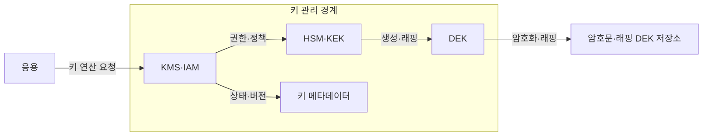
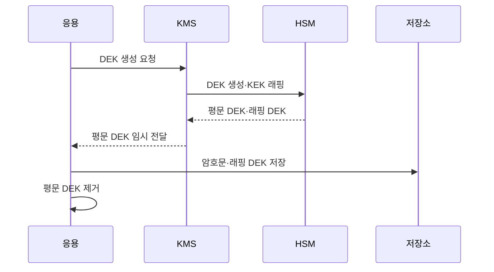

---
sidebar:
  order: 20
  label: "020. 키 관리 - HSM·KMS (Key Management HSM KMS)"
  badge:
    text: "미출제 · 50%"
    variant: note
title: "키 관리 - HSM·KMS (Key Management HSM KMS)"
date: "2026-07-25T01:05:00+09:00"
tags:
  - "notes-security"
weight: 20
extra:
  question_no: "020"
  source_status: "미출제"
  source_history: ""
  priority: 50
  priority_note: "키 생성·보관·회전·폐기는 모든 암호 답안의 기반임"
---

## 미리 알고가기

- **루트 키**: [읽기: 루트 키; 표기 이유: 한국어 통용어 표기] 상위 키로 조직 암호 통제권 대표함
- **데이터 키**: [읽기: 데이터 키; 표기 이유: 한국어 통용어 표기] 실제 데이터 암호화하는 하위 대칭키임
- **봉투 암호화**: [읽기: 봉투 암호화; 표기 이유: 한국어 통용어 표기] 데이터 키를 루트 키로 감싸 보호하는 방식임
- **KEK(Key Encryption Key)**: [읽기: 케이이케이; 표기 이유: 영문 머리글자와 구분 기호] 다른 키를 암호화하는 상위 키임
- **DEK(Data Encryption Key)**: [읽기: 디이케이; 표기 이유: 영문 머리글자와 구분 기호] 실제 데이터를 암호화하는 키임
- **래핑(Wrapping)**: [읽기: 더블유알에이피피아이엔지; 표기 이유: 영문 머리글자와 구분 기호] 한 키로 다른 키를 암호화하는 처리임
- **HSM(Hardware Security Module)**: [읽기: 에이치에스엠; 표기 이유: 영문 머리글자와 구분 기호] 키와 암호 연산을 보호하는 장비임
- **KMS(Key Management System)**: [읽기: 케이엠에스; 표기 이유: 영문 머리글자와 구분 기호] 키 정책과 수명주기를 관리하는 체계임
- **IAM(Identity and Access Management)**: [읽기: 아이에이엠; 표기 이유: 영문 머리글자와 구분 기호] 신원과 접근 권한을 관리하는 체계임
- **API(Application Programming Interface)**: [읽기: 에이피아이; 표기 이유: 영문 머리글자와 구분 기호] 시스템 간 기능 호출 규약임
- **비밀 관리기(Secret Manager)**: [읽기: 에스이씨알이티; 표기 이유: 영문 머리글자와 구분 기호] 비밀번호·토큰을 보관하는 서비스임
- **제로화(Zeroization)**: [읽기: 지이알오아이지에이티아이오엔; 표기 이유: 영문 머리글자와 구분 기호] 키를 복구할 수 없게 삭제하는 처리임
- **이중 통제**: [읽기: 이중 통제; 표기 이유: 한국어 통용어 표기] 둘 이상의 승인이 있어야 작업하는 원칙임
- **분할 지식**: [읽기: 분할 지식; 표기 이유: 한국어 통용어 표기] 한 사람이 전체 비밀을 알지 못하게 나누는 원칙임

## Ⅰ. 개요

- **정의/개념**: 키의 생성·보관·사용·교체·폐기 통제
- **배경/필요성**: 키 노출 제한과 사용 권한·이력 추적

### 쉽게 이해하기 (학습용)

- 튼튼한 자물쇠도 열쇠를 복사하거나 잃어버리면 무용하므로 열쇠의 일생을 관리함

## Ⅱ. 특징

- KEK와 DEK를 분리해 노출 범위를 줄인다
- HSM 내부에서 키 생성과 연산을 수행한다
- KMS가 정책·권한·버전·감사를 제공한다
- 회전·폐기·복구 가능 여부를 통제한다

### 쉽게 이해하기 (학습용)

- HSM은 금고이고 KMS는 금고 안 열쇠를 누가 언제 쓰는지 관리하는 관제 체계임

## Ⅲ. 아키텍처 및 구성요소

| 설계 요소 | 설명 |
|:---|:---|
| KMS·IAM | 정책과 접근 권한을 통제함 |
| HSM·KEK | 상위 키와 연산을 보호함 |
| DEK | 실제 데이터를 암호화함 |
| 키 메타데이터 | 상태·버전·이력을 기록함 |

> 요약: KMS가 통제하고 HSM이 키를 보호함

### 쉽게 이해하기 (학습용)

- 데이터용 작은 열쇠를 상위 열쇠로 감싸고 상위 열쇠는 금고 밖으로 내보내지 않음

## Ⅳ. 원리 및 절차 흐름도

| 절차 | 설명 |
|:---|:---|
| DEK 생성 요청 | 데이터용 키 생성을 요청함 |
| DEK 생성·KEK 래핑 | 키를 만들고 상위 키로 감쌈 |
| 평문 DEK·래핑 DEK | 두 형태의 키를 반환함 |
| 평문 DEK 임시 전달 | 메모리에서만 잠시 사용함 |
| 암호문·래핑 DEK 저장 | 데이터와 감싼 키를 보관함 |
| 평문 DEK 제거 | 사용 직후 메모리에서 지움 |

> 요약: DEK는 잠시 쓰고 KEK로 감싸 보관함

### 쉽게 이해하기 (학습용)

- 열쇠를 만들고 빌려주고 바꾸고 없애는 모든 순간에 승인과 기록을 남김

## Ⅴ. 종류 및 비교

| 판단 기준 | HSM | KMS | Secret Manager |
|:---|:---|:---|:---|
| 핵심 특징 | 키·연산의 장비 보호 | 키 수명주기 통제 | 비밀번호·토큰 보관 |
| 적용 기준 | 루트 키를 보호할 때 | 키를 중앙 관리할 때 | 응용 비밀을 배포할 때 |
| 주요 위험 | 장비 장애 | 권한 정책 오류 | 응용의 비밀 노출 |

> 요약: HSM은 보안 경계이고 KMS는 수명주기 통제 수단임

### 쉽게 이해하기 (학습용)

- 금고와 관리 시스템과 비밀번호 보관함은 서로 대체재가 아니라 역할이 다른 수단임

## Ⅵ. 실무 사례

1. KEK 회전은 DEK 재래핑으로 처리
2. 루트 키 작업은 이중 통제·분할 지식 적용

### 쉽게 이해하기 (학습용)

- 재래핑은 데이터 전체 재암호화를 줄임
- 한 관리자가 혼자 키를 꺼내지 못하게 함

## Ⅶ. 결론

- 키 등급·사용 주체로 HSM·KMS 통제 결정

### 쉽게 이해하기 (학습용)

- 암호의 안전성은 결국 키 관리가 결정함
