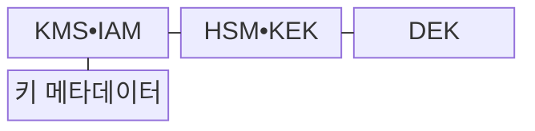
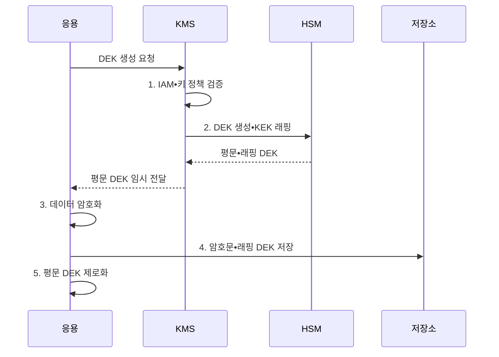

---
sidebar:
  order: 20
  label: "020. 키 관리 - HSM•KMS (Key Management HSM KMS)"
  badge:
    text: "미출제 • 50%"
    variant: note
title: "키 관리 - HSM•KMS (Key Management HSM KMS)"
date: "2026-08-03T08:48:47+09:00"
tags:
  - "notes-security"
weight: 20
extra:
  question_no: "020"
  source_status: "미출제"
  source_history: ""
  priority: 50
  priority_note: "키 생성•보관•회전•폐기는 모든 암호 답안의 기반임"
---

## Ⅰ. 개요

핵심 용어

- **키 관리(Key Management)** 는 암호키의 생성•보관•배포•사용•교체•폐기를 수명주기 전체에서 통제하는 활동이다.
- **루트 키(Root Key)** 는 하위 키를 보호하며 조직 암호체계의 최상위 신뢰점이 되는 키다.

- 정의/개념: 암호키의 생성부터 폐기까지 관리하는 **수명주기 통제**
- 배경/필요성: 응용의 키 직접 보관은 **노출 방지•권한 분리•사용 이력 통제를 어렵게 함**

#### 한줄 요약

- 안전한 암호 알고리즘도 키가 노출되면 보호 효과를 잃으므로 생성부터 폐기까지 키의 전체 수명주기를 통제해야 한다.

## Ⅱ. 특징

핵심 용어

- **데이터 암호화 키(DEK)** 는 실제 데이터를 암호화하는 하위 대칭키이고, **키 암호화 키(KEK)** 는 DEK 등 다른 키를 보호하는 상위 키다.
- **하드웨어 보안 모듈(HSM)** 은 암호키를 외부로 노출하지 않고 내부에서 암호 연산을 수행하는 전용 보안 장비다.
- **키 관리 시스템(KMS)** 은 암호키의 정책•권한•버전•수명주기와 사용 이력을 관리하는 시스템이다.

- KEK•DEK 분리의 **노출 범위 축소**
- HSM 내부 생성•연산의 **키 비반출**
- KMS 정책•권한•버전의 **수명주기 통제**

#### 한줄 요약

- HSM은 키 원본과 암호 연산을 물리적으로 보호하고, KMS는 키를 누가 언제 어떤 용도로 사용할지 정책과 이력으로 통제한다.

## Ⅲ. 구조 및 구성요소

핵심 용어

- **신원•접근 관리(IAM)** 는 사용자와 서비스의 신원을 확인하고 자원 접근 권한을 통제하는 체계다.
- **키 래핑(Key Wrapping)** 은 한 암호키로 다른 암호키의 기밀성과 무결성을 보호하는 처리다.

| 구성요소 | 책임 |
|:---|:---|
| KMS•IAM | **정책•접근 권한** 통제 |
| HSM•KEK | **상위 키•암호 연산** 보호 |
| DEK | **실제 데이터 암호화** |
| 키 메타데이터 | **상태•버전•사용 이력** 기록 |

#### 한줄 요약

- 데이터는 DEK로 암호화하고 DEK는 KEK로 래핑하며, KEK는 HSM 외부로 노출하지 않는다.

## Ⅳ. 흐름도

핵심 용어

- **봉투 암호화(Envelope Encryption)** 는 DEK로 데이터를 암호화하고 KEK로 DEK를 다시 암호화하는 방식이다.
- **제로화(Zeroization)** 는 암호키를 메모리와 저장매체에서 복구할 수 없도록 삭제하는 처리다.

**동작 원리**

1. **IAM•키 정책 검증**: 주체•용도•권한•키 상태 확인
2. **DEK 생성•KEK 래핑**: 데이터 키 생성 후 상위 키로 보호
3. **데이터 암호화**: 평문 DEK를 메모리에서만 사용
4. **암호문•래핑 DEK 저장**: 데이터와 봉투 암호화 키 보관
5. **평문 DEK 제로화**: 사용 완료 키를 메모리에서 제거

#### 한줄 요약

- 키의 생성•배포•사용•회전•폐기 단계마다 권한을 검증하고 감사 이력을 남긴다.

## Ⅴ. 종류 및 비교

핵심 용어

- **비밀 관리기(Secret Manager)** 는 비밀번호•토큰•API 키 등 응용 비밀정보의 저장•배포•회전을 관리하는 서비스다.
- **HSM•KMS** 는 각각 키와 암호 연산의 하드웨어 보안 경계와 키 정책•권한•버전의 중앙 수명주기 통제를 담당한다.

| 키 관리 수단 | HSM | KMS | Secret Manager |
|:---|:---|:---|:---|
| 적용 기준 | **루트 키 보호** | 키의 **중앙 수명주기 관리** | **응용 비밀 배포** |
| 핵심 특징 | **키•연산 장비 보호** | **키 수명주기 통제** | **비밀번호•토큰 보관** |
| 한계 | **장비 장애** | **권한 정책 오류** | 응용의 **비밀 노출** |

> 요약: HSM은 보안 경계이고 KMS는 수명주기 통제 수단임

#### 한줄 요약

- HSM은 키의 물리적 보호, KMS는 키 수명주기 통제, 비밀 관리기는 응용 자격정보 관리를 담당하므로 역할에 맞게 결합한다.

## Ⅵ. 실무 고려사항 및 대책

핵심 용어

- **이중 통제(Dual Control)** 는 중요 작업에 둘 이상의 독립된 승인을 요구하고, **분할 지식(Split Knowledge)** 은 한 사람이 전체 비밀을 알지 못하게 나누는 원칙이다.
- **NIST SP 800-57 Part 1 Rev. 5** 는 키 수명주기 지침을, **NIST FIPS 140-3** 은 암호 모듈 보안 요구사항을 제시한다.

| 문제 | 대책 | 효과 |
|:---|:---|:---|
| **키 수명주기 불일치** | **NIST SP 800-57 Rev. 5** | **생성•회전•폐기 일관화** |
| **암호 모듈 보호 부족** | **NIST FIPS 140-3 검증** | **키 반출•변조 위험 억제** |
| **루트 키 오용** | **이중 통제•분할 지식** | **단일 관리자 남용 차단** |
| 폐기 키의 **복구 가능성** | 메모리•매체 **제로화 검증** | **폐기 후 키 노출 방지** |

#### 한줄 요약

- 루트 키 생성•백업•복구에는 이중 통제와 분할 지식을 적용하여 단일 관리자의 오용을 방지한다.

## Ⅶ. 결론

핵심 용어

- **역할 분리** 는 HSM이 키의 보안 경계를, KMS가 키 수명주기 정책을 담당하도록 책임을 구분하는 원칙이다.
- **HSM•KMS 선택** 은 루트•서명키의 비반출 보호에는 HSM을, 서비스 키의 정책과 수명주기 관리에는 KMS를 적용하는 판단이다.

- 루트•서명키는 **HSM**, 서비스 키 수명주기는 **KMS** 선택

#### 한줄 요약

- 알고리즘 강도만 확보해서는 충분하지 않으며, 키의 생성부터 폐기까지 권한•보관•회전•감사 통제가 이어져야 한다.
