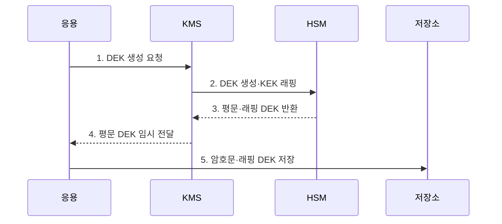

---
sidebar:
  order: 20
  label: "020. 키 관리 - HSM·KMS (Key Management HSM KMS)"
  badge:
    text: "미출제 · 50%"
    variant: note
title: "키 관리 - HSM·KMS (Key Management HSM KMS)"
date: "2026-07-25T01:05:00+09:00"
tags:
  - "notes-security"
weight: 20
extra:
  question_no: "020"
  source_status: "미출제"
  source_history: ""
  priority: 50
  priority_note: "키 생성·보관·회전·폐기는 모든 암호 답안의 기반임"
---

## 미리 알고가기

- **루트 키(Root Key)**: 하위 키를 보호하며 조직 암호체계의 최상위 신뢰점이 되는 키다.
- **데이터 암호화 키(Data Encryption Key, DEK)**: 실제 데이터를 암호화하는 하위 대칭키다.
- **봉투 암호화(Envelope Encryption)**: DEK로 데이터를 암호화하고 키 암호화 키로 DEK를 다시 암호화하는 방식이다.
- **키 암호화 키(Key Encryption Key, KEK)**: DEK 등 다른 암호키를 암호화하여 보호하는 상위 키다.
- **키 래핑(Key Wrapping)**: 한 암호키로 다른 암호키의 기밀성과 무결성을 보호하는 처리다.
- **하드웨어 보안 모듈(Hardware Security Module, HSM)**: 암호키를 외부로 노출하지 않고 내부에서 암호 연산을 수행하는 전용 보안 장비다.
- **키 관리 시스템(Key Management System, KMS)**: 암호키의 정책·권한·버전·수명주기와 사용 이력을 관리하는 시스템이다.
- **신원·접근 관리(Identity and Access Management, IAM)**: 사용자와 서비스의 신원을 확인하고 자원 접근 권한을 통제하는 체계다.
- **응용 프로그래밍 인터페이스(Application Programming Interface, API)**: 시스템 간 기능과 데이터를 호출하기 위한 규약이다.
- **비밀 관리기(Secret Manager)**: 비밀번호·토큰·API 키 등 응용 비밀정보의 저장·배포·회전을 관리하는 서비스다.
- **제로화(Zeroization)**: 암호키를 메모리와 저장매체에서 복구할 수 없도록 삭제하는 처리다.
- **이중 통제(Dual Control)**: 중요 작업을 수행할 때 둘 이상의 독립된 승인을 요구하는 원칙이다.
- **분할 지식(Split Knowledge)**: 한 사람이 전체 비밀정보를 알 수 없도록 여러 관리자에게 나누는 원칙이다.
- **NIST SP 800-57 Part 1 Rev. 5**: 암호키 유형·보호·수명주기·관리 기능을 제시한 현행 최종 지침이다.
- **NIST FIPS 140-3**: 암호 모듈의 인터페이스·역할·물리 보안·키 관리를 규정한 표준이다.

## Ⅰ. 개요

- 정의/개념: 키의 생성·보관·사용·교체·폐기 통제
- **배경/필요성**: 키 노출 제한과 사용 권한·이력 추적

### 쉽게 이해하기 (학습용)

- 안전한 암호 알고리즘도 키가 노출되면 보호 효과를 잃으므로 생성부터 폐기까지 키의 전체 수명주기를 통제해야 한다.

## Ⅱ. 특징

- KEK·DEK 분리의 **노출 범위 축소**
- HSM 내부 생성·연산의 **키 비반출**
- KMS 정책·권한·버전의 **수명주기 통제**

### 쉽게 이해하기 (학습용)

- HSM은 키 원본과 암호 연산을 물리적으로 보호하고, KMS는 키를 누가 언제 어떤 용도로 사용할지 정책과 이력으로 통제한다.

## Ⅲ. 구조 및 구성요소

| 설계 요소 | 설명 |
|:---|:---|
| KMS·IAM | 정책과 접근 권한을 통제함 |
| HSM·KEK | 상위 키와 연산을 보호함 |
| DEK | 실제 데이터를 암호화함 |
| 키 메타데이터 | 상태·버전·이력을 기록함 |

> 요약: KMS가 통제하고 HSM이 키를 보호함

### 쉽게 이해하기 (학습용)

- 데이터는 DEK로 암호화하고 DEK는 KEK로 래핑하며, KEK는 HSM 외부로 노출하지 않는다.

## Ⅳ. 흐름도

| 절차 | 설명 |
|:---|:---|
| DEK 생성 요청 | 데이터용 키 생성을 요청함 |
| DEK 생성·KEK 래핑 | 키를 만들고 상위 키로 감쌈 |
| 평문·래핑 DEK 반환 | 두 형태의 키를 반환함 |
| 평문 DEK 임시 전달 | 메모리에서만 잠시 사용함 |
| 암호문·래핑 DEK 저장 | 데이터와 감싼 키를 보관함 |

> 요약: DEK는 잠시 쓰고 KEK로 감싸 보관함

### 쉽게 이해하기 (학습용)

- 키의 생성·배포·사용·회전·폐기 단계마다 권한을 검증하고 감사 이력을 남긴다.

## Ⅴ. 종류 및 비교

| 키 관리 수단 | HSM | KMS | Secret Manager |
|:---|:---|:---|:---|
| 적용 기준 | 루트 키를 보호할 때 | 키를 중앙 관리할 때 | 응용 비밀을 배포할 때 |
| 핵심 특징 | **키·연산 장비 보호** | **키 수명주기 통제** | 비밀번호·토큰 보관 |
| 한계 | 장비 장애 | 권한 정책 오류 | 응용의 비밀 노출 |

> 요약: HSM은 보안 경계이고 KMS는 수명주기 통제 수단임

### 쉽게 이해하기 (학습용)

- HSM은 키의 물리적 보호, KMS는 키 수명주기 통제, 비밀 관리기는 응용 자격정보 관리를 담당하므로 역할에 맞게 결합한다.

## Ⅵ. 실무 고려사항 및 대책

| 고려사항 | 대책 | 효과 |
|:---|:---|:---|
| 키 수명주기 | **NIST SP 800-57 Rev. 5** | 생성·회전·폐기 일관화 |
| 암호 모듈 보호 | **NIST FIPS 140-3 검증** | 키 반출·변조 위험 억제 |
| 루트 키 오용 | **이중 통제·분할 지식** | 단일 관리자 남용 차단 |

### 쉽게 이해하기 (학습용)

- 루트 키 생성·백업·복구에는 이중 통제와 분할 지식을 적용하여 단일 관리자의 오용을 방지한다.

## Ⅶ. 결론

- **키등급·노출도·수명주기·감사성**으로 관리수단을 결정한다.

### 쉽게 이해하기 (학습용)

- 알고리즘 강도만 확보해서는 충분하지 않으며, 키의 생성부터 폐기까지 권한·보관·회전·감사 통제가 이어져야 한다.
