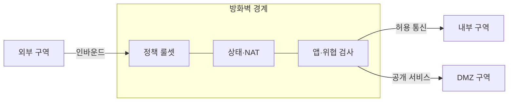
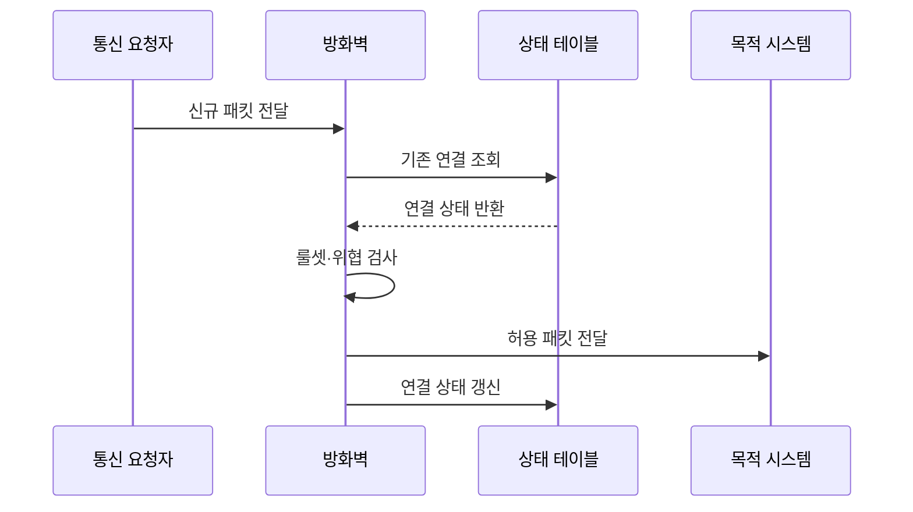

---
sidebar:
  order: 21
  label: "021. 방화벽 - 패킷 필터·상태기반·NGFW (Firewall)"
  badge:
    text: "기출 · 70%"
    variant: note
title: "방화벽 - 패킷 필터·상태기반·NGFW (Firewall)"
date: "2026-07-25T01:05:00+09:00"
tags:
  - "notes-security"
weight: 21
extra:
  question_no: "021"
  source_status: "기출"
  source_history: "129회, 137회"
  priority: 70
  priority_note: "129·137회 반복이며 경계 보안 설계의 기본 축임"
---

## 미리 알고가기

- **IP(Internet Protocol)**: [읽기: 아이피; 표기 이유: 영문 머리글자와 구분 기호] 패킷의 출발지와 목적지 주소 규약임
- **TCP(Transmission Control Protocol)**: [읽기: 티씨피; 표기 이유: 영문 머리글자와 구분 기호] 연결 상태를 관리하는 전송 규약임
- **5-튜플(5-Tuple)**: [읽기: 티유피엘이; 표기 이유: 영문 머리글자와 구분 기호] 주소·포트·프로토콜의 흐름 식별값임
- **상태 기반 검사**: [읽기: 상태 기반 검사; 표기 이유: 한국어 통용어 표기] 연결의 생성과 응답 상태를 추적함
- **DMZ(Demilitarized Zone)**: [읽기: 디엠지; 표기 이유: 영문 머리글자와 구분 기호] 외부 공개 서버를 내부망과 분리한 구역임
- **NAT(Network Address Translation)**: [읽기: 엔에이티; 표기 이유: 영문 머리글자와 구분 기호] 사설·공인 주소를 변환하는 기술임
- **NGFW(Next-Generation Firewall)**: [읽기: 엔지에프더블유; 표기 이유: 영문 머리글자와 구분 기호] 앱과 위협까지 검사하는 방화벽임
- **TLS(Transport Layer Security)**: [읽기: 티엘에스; 표기 이유: 영문 머리글자와 구분 기호] 통신 내용을 암호화하는 규약임
- **기본 거부**: [읽기: 기본 거부; 표기 이유: 한국어 통용어 표기] 명시적으로 허용하지 않은 통신을 차단함
- **음영 규칙**: [읽기: 음영 규칙; 표기 이유: 한국어 통용어 표기] 앞선 규칙 때문에 실행되지 않는 규칙임
- **동서 트래픽**: [읽기: 동서 트래픽; 표기 이유: 한국어 통용어 표기] 내부 시스템 사이에 오가는 통신임

## Ⅰ. 개요

- **정의/개념**: 보안 구역 사이의 허용·거부 통신 통제
- **배경/필요성**: 불필요한 접근과 침해 확산 경로 제한

### 쉽게 이해하기 (학습용)

- 출입문에서 출발지·목적지·용도를 확인하는 장치

## Ⅱ. 특징

- 헤더·연결 상태·앱 문맥으로 통신을 검사한다
- 상단 규칙부터 평가하고 기본 거부한다
- 구역 분리로 침해의 수평 이동을 제한한다
- 암호화 내용은 복호화 없이는 볼 수 없다

### 쉽게 이해하기 (학습용)

- 넓은 허용 규칙은 열린 출입문과 같음

## Ⅲ. 아키텍처 및 구성요소

| 설계 요소 | 설명 |
|:---|:---|
| 정책 룰셋 | 허용·거부 조건을 판단함 |
| 상태·NAT | 연결 추적과 주소 변환을 수행함 |
| 앱·위협 검사 | 응용과 공격 징후를 식별함 |

> 요약: 구역별 통제 정책과 상태를 관리함

### 쉽게 이해하기 (학습용)

- 구역 사이의 허용된 문만 열어 둠

## Ⅳ. 원리 및 절차 흐름도

| 절차 | 설명 |
|:---|:---|
| 신규 패킷 전달 | 5-튜플을 추출함 |
| 기존 연결 조회 | 상태 기반 검사 여부를 확인함 |
| 연결 상태 반환 | 신규·정상·비정상을 알림 |
| 룰셋·위협 검사 | 정책과 공격 징후를 판정함 |
| 허용 패킷 전달 | 승인된 목적지로 전달함 |
| 연결 상태 갱신 | 후속 패킷 판단 정보를 저장함 |

> 요약: 상태와 정책을 통과한 패킷만 전달함

### 쉽게 이해하기 (학습용)

- 연결 장부와 출입 규칙을 함께 확인함

## Ⅴ. 종류 및 비교

| 판단 기준 | 패킷 필터 | 상태 기반 방화벽 | NGFW |
|:---|:---|:---|:---|
| 핵심 특징 | 5-튜플 검사 | 연결 상태 추적 | 앱·사용자·위협 검사 |
| 적용 기준 | 단순 경계 통제 | 일반 네트워크 경계 | 세밀한 인터넷 통제 |
| 주요 위험 | 우회 공격 미탐 | 상태 테이블 고갈 | 복호화 비용 증가 |

> 요약: 판단 깊이와 비용에 따라 선택함

### 쉽게 이해하기 (학습용)

- 검사 범위에 따른 보안 수준의 차이임

## Ⅵ. 실무 사례

1. TLS 복호화는 개인정보 대상 예외 적용
2. DMZ는 외부·내부 경로를 각각 최소 허용

### 쉽게 이해하기 (학습용)

- 복호화하면 내용은 보이지만 사생활 위험이 생김
- 공개 서버 침해가 내부망으로 번지지 않게 함

## Ⅶ. 결론

- 구역 신뢰도·검사 깊이로 허용 정책 결정

### 쉽게 이해하기 (학습용)

- 필요한 통로만 열고 오래된 규칙은 지워야 함
