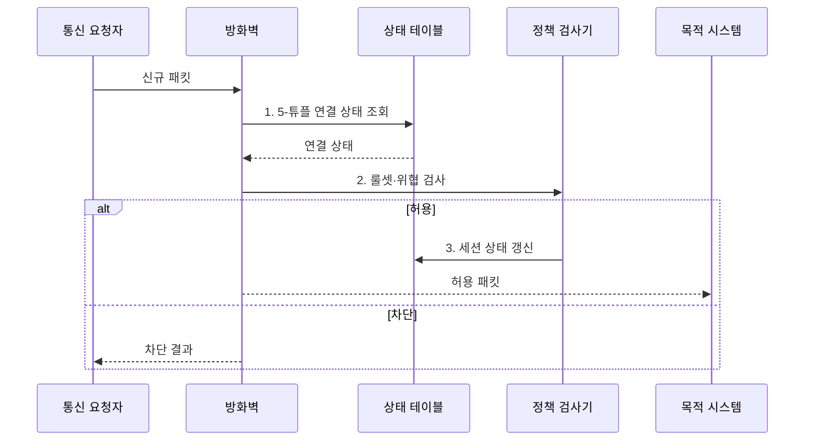

---
sidebar:
  order: 21
  label: "021. 방화벽 - 패킷 필터·상태기반·NGFW (Firewall)"
  badge:
    text: "기출 · 70%"
    variant: note
title: "방화벽 - 패킷 필터·상태기반·NGFW (Firewall)"
date: "2026-08-02T10:20:00+09:00"
tags:
  - "notes-security"
weight: 21
extra:
  question_no: "021"
  source_status: "기출"
  source_history: "129회, 137회"
  priority: 70
  priority_note: "129·137회 반복이며 경계 보안 설계의 기본 축임"
---

## Ⅰ. 개요

핵심 용어

- **방화벽(Firewall)**은 보안 구역 사이에서 정책에 따라 네트워크 통신을 허용하거나 차단하는 통제 장비다.
- **비무장지대(DMZ)**는 외부 공개 서버를 내부망과 분리하여 침해 확산을 제한하는 보안 구역이다.

- 정의/개념: 보안 구역 사이의 통신을 정책에 따라 **허용·차단**하는 경계 보안 장비
- 배경/필요성: 무통제 구역 연결로는 불필요한 접근과 **침해 확산 차단 불가**

### 쉽게 이해하기 (학습용)

- 방화벽은 보안 구역 사이의 출발지·목적지·서비스와 연결 상태를 확인하여 허용된 통신만 전달한다.

## Ⅱ. 특징

핵심 용어

- **기본 거부(Default Deny)**는 명시적으로 허용하지 않은 모든 통신을 차단하는 정책이다.
- **동서 트래픽(East-West Traffic)**은 내부 시스템 사이에 오가는 통신이다.

- 헤더·연결·앱 문맥의 **다계층 검사**
- 상단 규칙 평가와 **기본 거부 정책**
- 구역 분리의 **수평 이동 제한**

### 쉽게 이해하기 (학습용)

- 광범위한 허용 규칙은 침해 확산 경로가 되므로 업무에 필요한 출발지·목적지·서비스만 허용해야 한다.

## Ⅲ. 구조 및 구성요소

핵심 용어

- **상태 기반 검사(Stateful Inspection)**는 연결의 생성·응답·종료 상태를 추적해 패킷 허용 여부를 판단한다.
- **NAT**는 사설 주소와 공인 주소를 변환하지만 주소 변환 자체가 접근 통제를 보장하지는 않는다.

| 구성요소 | 책임 |
|:---|:---|
| 정책 룰셋 | **허용·거부 조건** 판단 |
| 상태·NAT | **연결 추적·주소 변환** 수행 |
| 앱·위협 검사 | **응용·공격 징후** 식별 |

### 쉽게 이해하기 (학습용)

- 정책 관리부가 구역별 최소 허용 규칙을 배포하고 상태표가 정상 연결의 응답 트래픽을 식별한다.

## Ⅳ. 흐름도

핵심 용어

- **5-튜플(5-Tuple)**은 출발지·목적지 IP와 포트, 프로토콜로 구성한 흐름 식별값이다.

**동작 원리**

1. **5-튜플 연결 상태 조회**: 출발지·목적지·포트·프로토콜 기반 세션 확인
2. **룰셋·위협 검사**: 구역 정책과 공격 징후 기반 허용 여부 판정
3. **세션 상태 갱신**: 허용 연결의 응답·종료 상태 저장

### 쉽게 이해하기 (학습용)

- 패킷의 5-튜플과 연결 상태를 정책에 함께 대조하여 신규 연결과 정상 응답을 구분한다.

## Ⅴ. 종류 및 비교

핵심 용어

- **차세대 방화벽(NGFW)**은 응용·사용자·위협 정보를 식별하여 세분화된 정책을 적용하는 방화벽이다.
- **TLS**는 통신의 기밀성과 무결성을 보호하지만 검사 장비에는 복호화 비용을 발생시킨다.

| 방화벽 방식 | 패킷 필터 | 상태 기반 방화벽 | NGFW |
|:---|:---|:---|:---|
| 적용 기준 | **단순 경계 통제** | **일반 네트워크 경계** | **세밀한 인터넷 통제** |
| 핵심 특징 | **5-튜플 검사** | **연결 상태 추적** | **앱·사용자·위협 검사** |
| 한계 | **헤더 규칙 회피 공격** 미탐 | **상태 테이블** 고갈 | **TLS 복호화 비용** 증가 |

> 요약: 판단 깊이와 비용에 따라 선택함

### 쉽게 이해하기 (학습용)

- 패킷 필터링·상태 기반·차세대 방화벽은 식별하는 문맥과 처리 비용이 다르므로 보호 대상에 맞게 선택한다.

## Ⅵ. 실무 고려사항 및 대책

핵심 용어

- **음영 규칙(Shadowed Rule)**은 앞선 상위 규칙과 겹쳐 실제로 실행되지 않는 규칙이다.
- **NIST SP 800-41 Rev. 1**은 방화벽 선택·정책·구성·시험·운영 권고를 제시한다.

| 문제 | 대책 | 효과 |
|:---|:---|:---|
| **방화벽 정책** 수립 | **NIST SP 800-41** 기반 정책 기준화 | **선택·구성 기준** 일관화 |
| 과다·**음영 규칙** | **업무 흐름 승인·정기 정리** | **정책 회피·불필요 접근** 차단 |
| **DMZ 침해** 확산 | **외부·내부 경로** 개별 허용 | 내부망 **수평 이동** 억제 |

### 쉽게 이해하기 (학습용)

- 외부에서 DMZ 서버로 필요한 서비스만 허용하고 DMZ에서 내부망으로의 통신을 별도로 제한하여 침해 확산을 차단한다.

## Ⅶ. 결론

핵심 용어

- **정책 실효성**은 업무에 필요한 통신만 최소 허용하고 미사용·중복·음영 규칙을 지속적으로 제거할 때 유지된다.

- 5-튜플은 **패킷 필터**, 세션은 **상태 기반**, 앱·위협은 NGFW 선택

### 쉽게 이해하기 (학습용)

- 필요한 통신만 최소 허용하고 미사용·중복·음영 규칙을 주기적으로 제거하여 정책의 실효성을 유지해야 한다.
