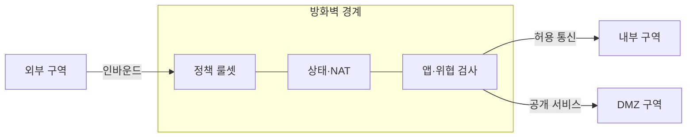
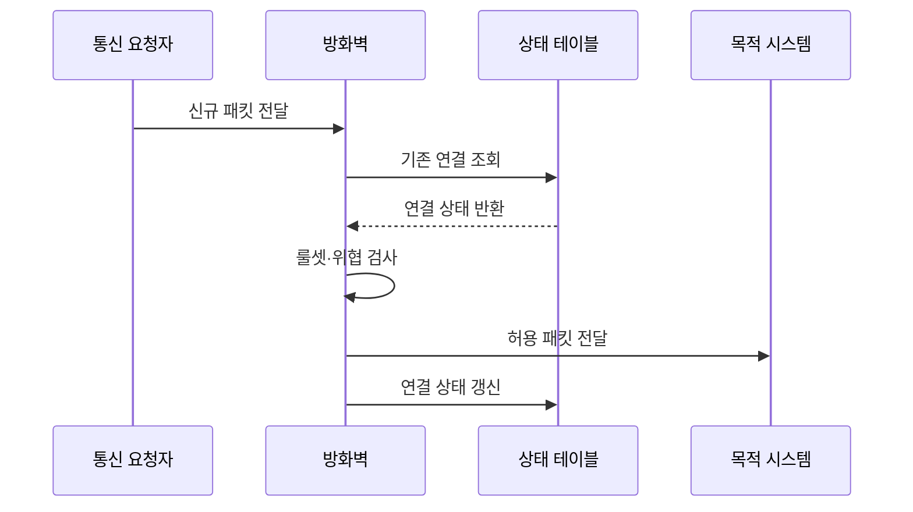

---
sidebar:
  order: 21
  label: "021. 방화벽 - 패킷 필터·상태기반·NGFW (Firewall)"
  badge:
    text: "기출 · 70%"
    variant: note
title: "방화벽 - 패킷 필터·상태기반·NGFW (Firewall)"
date: "2026-07-27T23:59:59+09:00"
tags:
  - "notes-security"
weight: 21
extra:
  question_no: "021"
  source_status: "기출"
  source_history: "129회, 137회"
  priority: 70
  priority_note: "129·137회 반복이며 경계 보안 설계의 기본 축임"
---

## 미리 알고가기

- **인터넷 프로토콜(Internet Protocol, IP)**: 패킷의 출발지와 목적지 주소를 지정하여 네트워크 간 전달을 지원하는 규약
- **전송 제어 프로토콜(Transmission Control Protocol, TCP)**: 연결 상태·순서·재전송을 관리하여 신뢰성 있는 데이터 전송을 제공하는 규약
- **5-튜플(5-Tuple, 파이브 튜플)**: 출발지·목적지 IP와 포트, 프로토콜로 구성한 흐름 식별값
- **상태 기반 검사**: 연결의 생성·응답·종료 상태를 추적해 패킷 허용 여부를 판단
- **비무장지대(Demilitarized Zone, DMZ)**: 외부 공개 서버를 내부망과 분리하여 침해 확산을 제한하는 보안 구역
- **네트워크 주소 변환(Network Address Translation, NAT)**: 사설 주소와 공인 주소를 변환하는 기술로, 주소 변환 자체는 접근 통제를 보장하지 않음
- **차세대 방화벽(Next-Generation Firewall, NGFW)**: 응용·사용자·위협 정보를 식별하여 세분화된 정책을 적용하는 방화벽
- **전송 계층 보안(Transport Layer Security, TLS)**: 통신 상대를 인증하고 전송 데이터의 기밀성과 무결성을 보호하는 프로토콜
- **기본 거부**: 명시적으로 허용하지 않은 모든 통신을 차단하는 정책
- **음영 규칙**: 앞선 상위 규칙과 겹쳐 실제로 실행되지 않는 규칙
- **동서 트래픽**: 내부 시스템 사이에 오가는 통신

## Ⅰ. 개요

- 정의/개념: 보안 구역 사이의 허용·거부 통신 통제
- 기존 한계: 무통제 연결은 불필요한 접근·침해 확산 허용
- **배경/필요성**: 구역별 최소 허용 정책과 확산 경로 제한

### 쉽게 이해하기 (학습용)

- 방화벽은 보안 구역 사이의 출발지·목적지·서비스와 연결 상태를 확인하여 허용된 통신만 전달한다.

## Ⅱ. 특징

- 헤더·연결 상태·앱 문맥으로 통신을 검사한다
- 상단 규칙부터 평가하고 기본 거부한다
- 구역 분리로 침해의 수평 이동을 제한한다
- 암호화 내용은 복호화 없이는 볼 수 없다

### 쉽게 이해하기 (학습용)

- 광범위한 허용 규칙은 침해 확산 경로가 되므로 업무에 필요한 출발지·목적지·서비스만 허용해야 한다.

## Ⅲ. 아키텍처 및 구성요소

| 설계 요소 | 설명 |
|:---|:---|
| 정책 룰셋 | 허용·거부 조건을 판단함 |
| 상태·NAT | 연결 추적과 주소 변환을 수행함 |
| 앱·위협 검사 | 응용과 공격 징후를 식별함 |

> 요약: 구역별 통제 정책과 상태를 관리함

### 쉽게 이해하기 (학습용)

- 정책 관리부가 구역별 최소 허용 규칙을 배포하고 상태표가 정상 연결의 응답 트래픽을 식별한다.

## Ⅳ. 원리 및 절차 흐름도

| 절차 | 설명 |
|:---|:---|
| 신규 패킷 전달 | 5-튜플을 추출함 |
| 기존 연결 조회 | 상태 기반 검사 여부를 확인함 |
| 연결 상태 반환 | 신규·정상·비정상을 알림 |
| 룰셋·위협 검사 | 정책과 공격 징후를 판정함 |
| 허용 패킷 전달 | 승인된 목적지로 전달함 |
| 연결 상태 갱신 | 후속 패킷 판단 정보를 저장함 |

> 요약: 상태와 정책을 통과한 패킷만 전달함

### 쉽게 이해하기 (학습용)

- 패킷의 5-튜플과 연결 상태를 정책에 함께 대조하여 신규 연결과 정상 응답을 구분한다.

## Ⅴ. 종류 및 비교

| 판단 기준 | 패킷 필터 | 상태 기반 방화벽 | NGFW |
|:---|:---|:---|:---|
| 적용 기준 | 단순 경계 통제 | 일반 네트워크 경계 | 세밀한 인터넷 통제 |
| 핵심 특징 | 5-튜플 검사 | 연결 상태 추적 | 앱·사용자·위협 검사 |
| 한계 | 우회 공격 미탐 | 상태 테이블 고갈 | 복호화 비용 증가 |

> 요약: 판단 깊이와 비용에 따라 선택함

### 쉽게 이해하기 (학습용)

- 패킷 필터링·상태 기반·차세대 방화벽은 식별하는 문맥과 처리 비용이 다르므로 보호 대상에 맞게 선택한다.

## Ⅵ. 실무 사례

1. DMZ는 외부·내부 경로를 각각 최소 허용

### 쉽게 이해하기 (학습용)

- 외부에서 DMZ 서버로 필요한 서비스만 허용하고 DMZ에서 내부망으로의 통신을 별도로 제한하여 침해 확산을 차단한다.

## Ⅶ. 결론

- 네트워크 경계의 불필요한 통신을 차단하기 위해 자산 구역·트래픽 방향·세션 상태·검사 깊이·업무 예외를 검토하여, 최소 허용 원칙의 방화벽 정책을 적용해야 한다.

### 쉽게 이해하기 (학습용)

- 필요한 통신만 최소 허용하고 미사용·중복·음영 규칙을 주기적으로 제거하여 정책의 실효성을 유지해야 한다.
