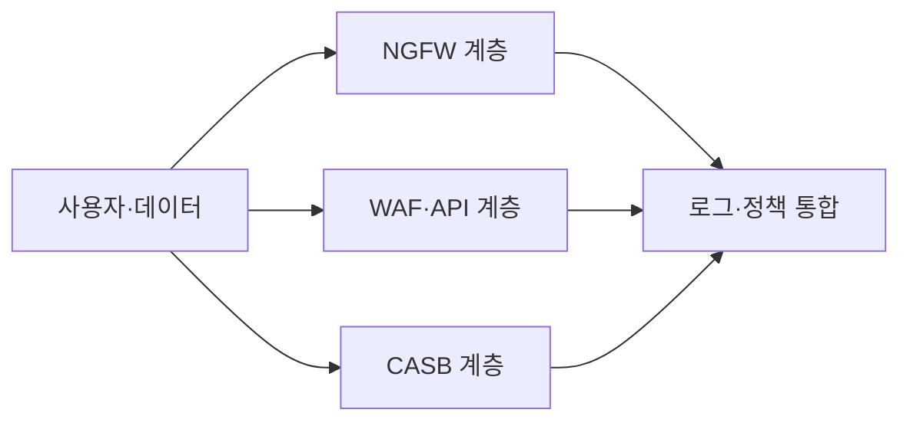
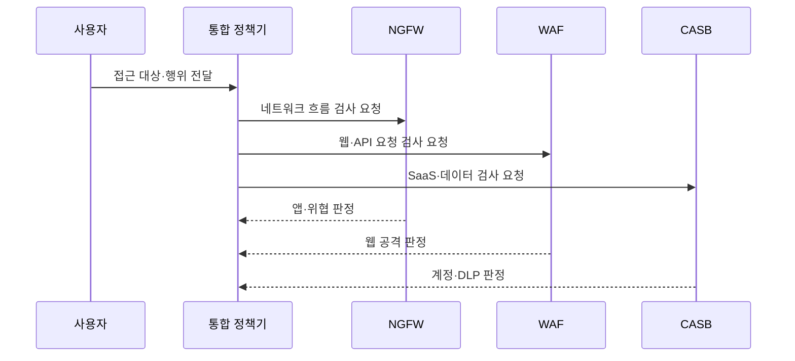

---
sidebar:
  order: 22
  label: "022. 차세대 방화벽 NGFW vs WAF vs CASB 비교 (NGFW WAF CASB Comparison)"
  badge:
    text: "기출 · 50%"
    variant: note
title: "차세대 방화벽 NGFW vs WAF vs CASB 비교 (NGFW WAF CASB Comparison)"
date: "2026-07-25T01:05:00+09:00"
tags:
  - "notes-security"
weight: 22
extra:
  question_no: "022"
  source_status: "기출"
  source_history: "137회"
  priority: 50
  priority_note: "137회 비교 기출로 계층별 보안제품 선택성이 분명함"
---

## 미리 알고가기

- **NGFW(Next-Generation Firewall)**: [읽기: 엔지에프더블유; 표기 이유: 영문 머리글자와 구분 기호] 앱과 위협을 식별하는 방화벽임
- **WAF(Web Application Firewall)**: [읽기: 더블유에이에프; 표기 이유: 영문 머리글자와 구분 기호] 웹 요청의 공격 문맥을 검사함
- **CASB(Cloud Access Security Broker)**: [읽기: 씨에이에스비; 표기 이유: 영문 머리글자와 구분 기호] 클라우드 서비스 이용을 중개·통제함
- **App-ID(Application Identification)**: [읽기: 아이디; 표기 이유: 영문 머리글자와 구분 기호] 포트와 무관하게 앱을 식별함
- **SaaS(Software as a Service)**: [읽기: 에스에이에이에스; 표기 이유: 영문 머리글자와 구분 기호] 인터넷으로 사용하는 응용 서비스임
- **API(Application Programming Interface)**: [읽기: 에이피아이; 표기 이유: 영문 머리글자와 구분 기호] 서비스 간 요청과 응답 규약임
- **HTTP(Hypertext Transfer Protocol)**: [읽기: 에이치티티피; 표기 이유: 영문 머리글자와 구분 기호] 웹 요청과 응답을 전달하는 규약임
- **URL(Uniform Resource Locator)**: [읽기: 유알엘; 표기 이유: 영문 머리글자와 구분 기호] 웹 자원의 위치를 나타내는 주소임
- **DLP(Data Loss Prevention)**: [읽기: 디엘피; 표기 이유: 영문 머리글자와 구분 기호] 민감 데이터의 이동과 유출을 통제함
- **TLS(Transport Layer Security)**: [읽기: 티엘에스; 표기 이유: 영문 머리글자와 구분 기호] 웹과 API 통신을 암호화하는 규약임
- **IdP(Identity Provider)**: [읽기: 아이디피; 표기 이유: 영문 머리글자와 구분 기호] 사용자 인증 정보를 제공하는 시스템임
- **섀도 IT(Shadow IT)**: [읽기: 아이티; 표기 이유: 영문 머리글자와 구분 기호] 조직 승인 없이 사용하는 정보기술임

- **흐름 기호(↓·→·-->)**: [읽기: 아래로·다음으로·연결; 표기 이유: 절차 방향 기호] 순서와 연결 방향을 나타냄
## Ⅰ. 개요

- **정의**: 서로 다른 경계의 보안 통제를 비교함
- **배경/필요성**: 보호 대상별 통제 지점 선택

### 쉽게 이해하기 (학습용)

- 도로·창구·문서실별 위험 식별 구조

## Ⅱ. 특징

- NGFW는 네트워크·사용자·앱을 식별한다
- WAF는 웹·API 공격 문맥을 검사한다
- CASB는 SaaS 계정과 데이터를 통제한다
- 암호화·우회 경로는 가시성을 제한한다

### 쉽게 이해하기 (학습용)

- 같은 통신도 보는 위치에 따라 위험이 다름

## Ⅲ. 구성요소 및 구조

| 구성요소 | 역할 |
|:---|:---|
| 사용자·데이터 | 공통 신원과 데이터 문맥을 제공함 |
| NGFW 계층 | 네트워크와 앱 흐름을 통제함 |
| WAF·API 계층 | 웹 요청과 API 공격을 검사함 |
| CASB 계층 | SaaS 접근과 공유를 통제함 |
| 로그·정책 통합 | 사건과 DLP 정책을 연결함 |

> 요약: 공통 신원/정책으로 통제 연결함

### 쉽게 이해하기 (학습용)

- 서로 다른 경비 기록을 한 사건으로 연결함

## Ⅳ. 원리 및 절차 흐름도

| 메시지 | 처리 내용 |
|:---|:---|
| 접근 대상·행위 전달 | 사용자와 목적지를 식별함 |
| 네트워크 흐름 검사 요청 | NGFW에 흐름 판단을 맡김 |
| 웹·API 요청 검사 요청 | WAF에 요청 판단을 맡김 |
| SaaS·데이터 검사 요청 | CASB에 이용 판단을 맡김 |
| 앱·위협 판정 | 앱과 네트워크 위협을 알림 |
| 웹 공격 판정 | 웹 공격 여부를 알림 |
| 계정·DLP 판정 | SaaS와 데이터 위험을 알림 |

> 요약: 대상별 통제기의 판정을 통합함

### 쉽게 이해하기 (학습용)

- 도로·창구·문서실의 경비를 함께 운영함

## Ⅴ. 종류 및 비교

| 비교축 | NGFW | WAF | CASB |
|:---|:---|:---|:---|
| 핵심 특징 | 사용자·앱 흐름 판단 | 웹 요청 문맥 판단 | SaaS 계정·데이터 판단 |
| 적용 기준 | 구역·앱 흐름 통제 | 웹·API 공격 통제 | SaaS 이용·공유 통제 |
| 주요 위험 | 암호화 가시성 부족 | 우회 경로 노출 | 비연계 앱 사각지대 |

> 요약: 문맥에 맞춰 솔루션 보완 배치함

### 쉽게 이해하기 (학습용)

- 제품별 전용 통제 영역 존재함

## Ⅵ. 실무 사례

- TLS 복호화는 인증서·개인정보를 검토함
- SaaS는 우회 접속과 비연계 앱을 점검함

### 쉽게 이해하기 (학습용)

- 복호화 가시성과 개인정보 보호를 조정함
- 승인 밖 SaaS 경로도 찾아 통제해야 함

## Ⅶ. 결론

- 제품별 문맥을 신원·데이터 정책으로 연결함

### 쉽게 이해하기 (학습용)

- 세 제품은 대체재가 아니라 분업 수단임
