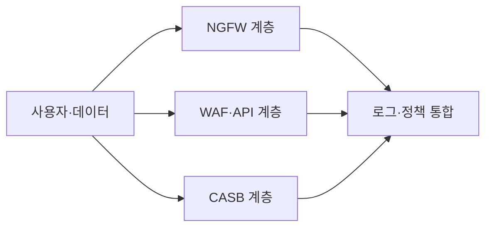
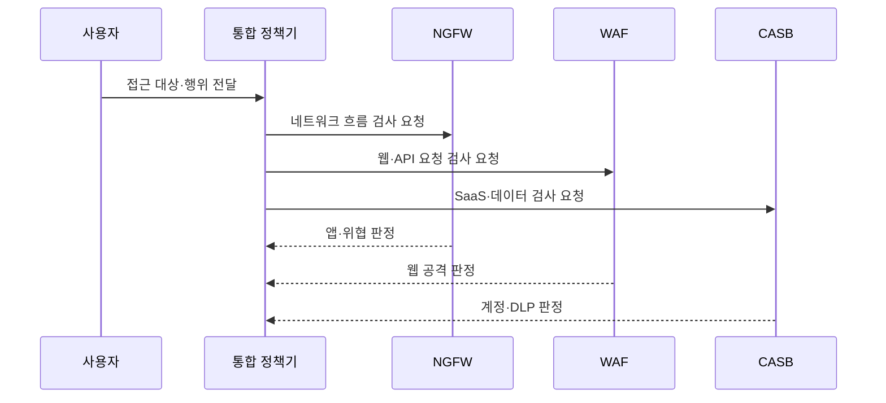

---
sidebar:
  order: 22
  label: "022. 차세대 방화벽 NGFW vs WAF vs CASB 비교 (NGFW WAF CASB Comparison)"
  badge:
    text: "기출 · 50%"
    variant: note
title: "차세대 방화벽 NGFW vs WAF vs CASB 비교 (NGFW WAF CASB Comparison)"
date: "2026-07-27T23:59:59+09:00"
tags:
  - "notes-security"
weight: 22
extra:
  question_no: "022"
  source_status: "기출"
  source_history: "137회"
  priority: 50
  priority_note: "137회 비교 기출로 계층별 보안제품 선택성이 분명함"
---

## 미리 알고가기

- **차세대 방화벽(Next-Generation Firewall, NGFW)**: 네트워크 흐름에서 응용·사용자·위협 정보를 식별하여 접근을 통제하는 방화벽
- **웹 응용 방화벽(Web Application Firewall, WAF)**: HTTP 요청과 응답에서 웹·API 공격 문맥을 분석하여 차단하는 방화벽
- **클라우드 접근 보안 중개(Cloud Access Security Broker, CASB)**: 사용자와 클라우드 서비스 사이에서 계정·이용·데이터 보안정책을 집행하는 중개 솔루션
- **App-ID(Application Identification, 앱 아이디)**: 응용프로그램 식별을 뜻하며, 포트와 무관하게 앱을 식별
- **서비스형 소프트웨어(Software as a Service, SaaS)**: 응용 소프트웨어를 인터넷으로 제공하고 구독하여 사용하는 서비스 모델
- **응용 프로그래밍 인터페이스(Application Programming Interface, API)**: 서비스 간 기능 호출과 요청·응답 형식을 정의한 인터페이스
- **하이퍼텍스트 전송 프로토콜(Hypertext Transfer Protocol, HTTP)**: 웹 클라이언트와 서버 사이에서 요청과 응답을 전달하는 규약
- **통합 자원 식별자(Uniform Resource Locator, URL)**: 웹 자원의 위치와 접근 방법을 나타내는 주소
- **데이터 유출 방지(Data Loss Prevention, DLP)**: 민감 데이터의 저장·이동·사용을 식별하여 유출을 탐지·통제하는 기술
- **전송 계층 보안(Transport Layer Security, TLS)**: 웹·API 통신의 기밀성과 무결성을 보호하는 프로토콜
- **신원 제공자(Identity Provider, IdP)**: 사용자를 인증하고 서비스에 신원·권한 정보를 제공하는 시스템
- **섀도 IT(Shadow IT, 섀도 아이티)**: 조직 승인 없이 사용하는 정보기술·클라우드 서비스

## Ⅰ. 개요

- 정의/개념: NGFW·WAF·CASB의 보호 대상과 통제 지점 비교
- 기존 한계: 단일 보안제품은 모든 경계·공격을 통제 불가
- **배경/필요성**: 보호 대상별 제품 선택과 상호 보완 배치

### 쉽게 이해하기 (학습용)

- NGFW는 네트워크 흐름, WAF는 웹 요청, CASB는 클라우드 이용과 데이터를 각각 식별하므로 보호 대상과 집행 위치가 다르다.

## Ⅱ. 특징

- NGFW는 네트워크·사용자·앱을 식별한다
- WAF는 웹·API 공격 문맥을 검사한다
- CASB는 SaaS 계정과 데이터를 통제한다
- 암호화·우회 경로는 가시성을 제한한다

### 쉽게 이해하기 (학습용)

- 동일한 통신도 네트워크·웹 응용·클라우드 서비스에서 관찰할 수 있는 문맥이 다르므로 통제 지점을 결합해야 한다.

## Ⅲ. 구성요소 및 구조

| 구성요소 | 역할 |
|:---|:---|
| 사용자·데이터 | 공통 신원과 데이터 문맥을 제공함 |
| NGFW 계층 | 네트워크와 앱 흐름을 통제함 |
| WAF·API 계층 | 웹 요청과 API 공격을 검사함 |
| CASB 계층 | SaaS 접근과 공유를 통제함 |
| 로그·정책 통합 | 사건과 DLP 정책을 연결함 |

> 요약: 공통 신원/정책으로 통제 연결함

### 쉽게 이해하기 (학습용)

- 공통 신원과 정책을 기준으로 NGFW·WAF·CASB의 탐지 정보를 연계하여 하나의 공격 흐름으로 분석한다.

## Ⅳ. 원리 및 절차 흐름도

| 메시지 | 처리 내용 |
|:---|:---|
| 접근 대상·행위 전달 | 사용자와 목적지를 식별함 |
| 네트워크 흐름 검사 요청 | NGFW에 흐름 판단을 맡김 |
| 웹·API 요청 검사 요청 | WAF에 요청 판단을 맡김 |
| SaaS·데이터 검사 요청 | CASB에 이용 판단을 맡김 |
| 앱·위협 판정 | 앱과 네트워크 위협을 알림 |
| 웹 공격 판정 | 웹 공격 여부를 알림 |
| 계정·DLP 판정 | SaaS와 데이터 위험을 알림 |

> 요약: 대상별 통제기의 판정을 통합함

### 쉽게 이해하기 (학습용)

- 각 통제 지점의 판정 결과를 공통 신원·자산·정책 문맥으로 연결하여 탐지와 대응을 일관되게 수행한다.

## Ⅴ. 종류 및 비교

| 판단 기준 | NGFW | WAF | CASB |
|:---|:---|:---|:---|
| 적용 기준 | 구역·앱 흐름 통제 | 웹·API 공격 통제 | SaaS 이용·공유 통제 |
| 핵심 특징 | 사용자·앱 흐름 판단 | 웹 요청 문맥 판단 | SaaS 계정·데이터 판단 |
| 한계 | 암호화 가시성 부족 | 우회 경로 노출 | 비연계 앱 사각지대 |

> 요약: 문맥에 맞춰 솔루션 보완 배치함

### 쉽게 이해하기 (학습용)

- 세 제품은 관찰 계층과 통제 대상이 다르므로 단일 제품으로 대체하지 않고 상호 보완적으로 배치한다.

## Ⅵ. 실무 사례

- CASB 적용 시 프록시 우회 접속과 API가 연계되지 않은 SaaS까지 식별하여 정책 사각지대를 점검한다.

### 쉽게 이해하기 (학습용)

- 승인되지 않은 SaaS와 우회 경로를 지속적으로 탐지하여 계정·데이터 보호정책을 동일하게 적용해야 한다.

## Ⅶ. 결론

- 서로 다른 계층의 공격과 데이터 유출을 통제하기 위해 네트워크·웹 요청·SaaS 행위의 가시성과 집행 위치를 검토하여, NGFW·WAF·CASB를 목적별로 조합해야 한다.

### 쉽게 이해하기 (학습용)

- NGFW·WAF·CASB는 보호 계층과 문맥이 다른 상호 보완 수단이므로 공통 신원·정책·로그로 연계해야 한다.
