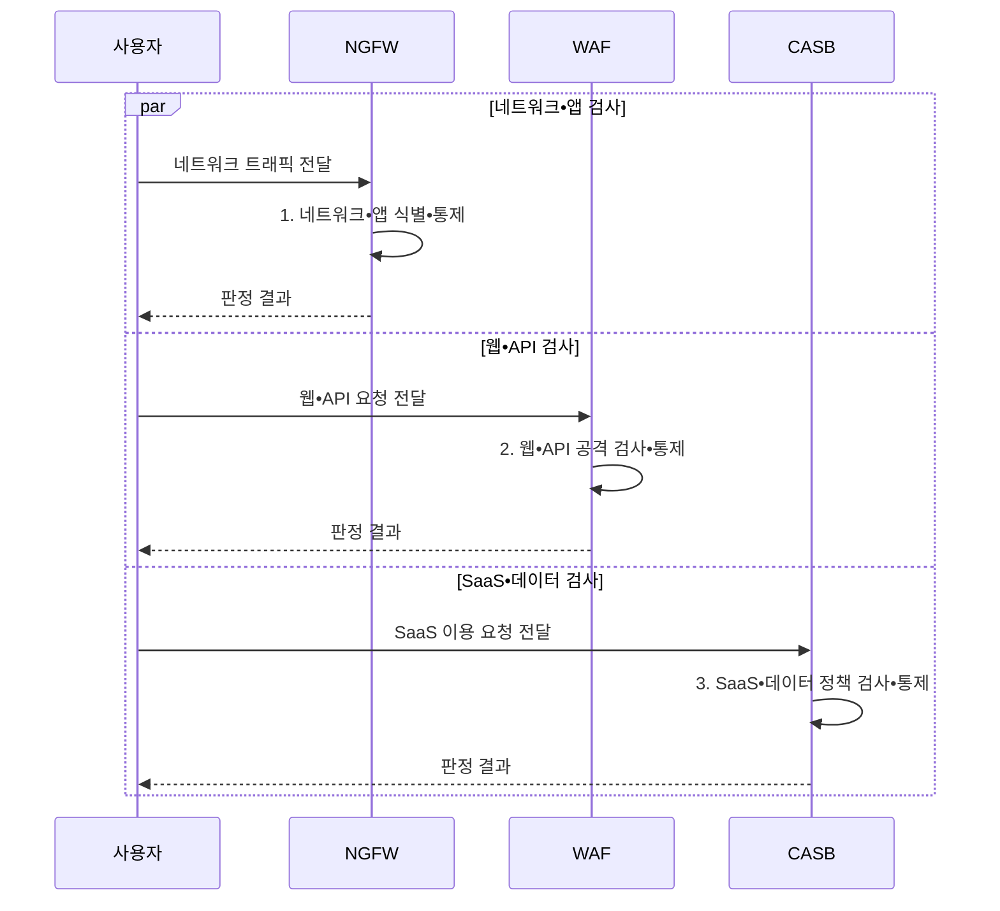

---
sidebar:
  order: 22
  label: "022. 차세대 방화벽 NGFW vs WAF vs CASB 비교 (NGFW WAF CASB Comparison)"
  badge:
    text: "기출 • 50%"
    variant: note
title: "차세대 방화벽 NGFW vs WAF vs CASB 비교 (NGFW WAF CASB Comparison)"
date: "2026-08-05T01:39:26+09:00"
tags:
  - "notes-security"
weight: 22
extra:
  question_no: "022"
  source_status: "기출"
  source_history: "137회"
  priority: 50
  priority_note: "137회 비교 기출로 계층별 보안제품 선택성이 분명함"
---

## Ⅰ. 개요

<details>
<summary>핵심 용어</summary>

- **차세대 방화벽(Next-Generation Firewall, NGFW)** 은 네트워크와 응용 흐름을 식별•통제한다.
- **웹 애플리케이션 방화벽(Web Application Firewall, WAF)** 은 웹•API 요청의 공격 문맥을 식별•통제한다.
- **클라우드 접근 보안 중개(Cloud Access Security Broker, CASB)** 는 클라우드 이용과 데이터 문맥을 식별•통제한다.

</details>

- 정의/개념: **NGFW•WAF•CASB** 는 각각 네트워크 흐름, 웹•API 요청, 클라우드 서비스 이용과 데이터 문맥을 검사•통제하는 **계층별 보안 수단**
- 배경/필요성: 단일 제품으로는 계층별 공격•데이터 이용 **문맥을 모두 식별 불가**

#### 한줄 요약

- NGFW는 네트워크 흐름, WAF는 웹 요청, CASB는 클라우드 이용과 데이터를 각각 식별하므로 보호 대상과 집행 위치가 다르다.

## Ⅱ. 특징

<details>
<summary>핵심 용어</summary>

- **App-ID** 는 포트와 무관하게 응용프로그램을 식별하는 기능이다.
- **서비스형 소프트웨어(Software as a Service, SaaS)** 는 응용 소프트웨어를 인터넷으로 제공하는 서비스 모델이다.

</details>

- NGFW의 **App-ID•사용자 식별**
- WAF의 **웹•API 공격 문맥 검사**
- CASB의 **SaaS 계정•데이터 통제**

#### 한줄 요약

- 동일한 통신도 네트워크•웹 응용•클라우드 서비스에서 관찰할 수 있는 문맥이 다르므로 통제 지점을 결합해야 한다.

## Ⅲ. 구조 및 구성요소

<details>
<summary>핵심 용어</summary>

- **데이터 유출 방지(Data Loss Prevention, DLP)** 는 민감 데이터의 저장•이동•사용을 식별하여 유출을 통제한다.
- **신원 제공자(Identity Provider, IdP)** 는 사용자를 인증하고 서비스에 신원•권한 정보를 제공한다.

</details>

```text
                 [사용자•데이터]
                        |
          +-------------+-------------+
          |             |             |
   [NGFW 계층]   [WAF•API 계층]   [CASB 계층]
          |             |             |
          +-------------+-------------+
                        |
                 [로그•정책 통합]
```

선의 의미: 공통 신원•데이터 문맥을 세 보안 계층이 함께 사용하고, 각 계층의 정보가 로그•정책 통합부에 연결되는 관계를 나타낸다.

| 구성요소 | 책임 |
|:---|:---|
| 사용자•데이터 | 공통 **신원•데이터 문맥** 제공 |
| NGFW 계층 | 네트워크와 **앱 흐름** 통제 |
| WAF•API 계층 | **HTTP•API 공격** 검사 |
| CASB 계층 | **SaaS 접근•공유** 통제 |
| 로그•정책 통합 | 사건과 **DLP 정책** 연결 |


#### 한줄 요약

- 공통 신원과 정책을 기준으로 NGFW•WAF•CASB의 탐지 정보를 연계하여 하나의 공격 흐름으로 분석한다.

## Ⅳ. 흐름도

<details>
<summary>핵심 용어</summary>

- **공통 정책 문맥** 은 계층별 판정을 같은 신원•자산•정책 기준으로 연결하여 일관된 허용•차단과 대응을 수행하게 한다.

</details>



**동작 원리**

1. **네트워크•앱 식별•통제**: 흐름•사용자•응용 기반 허용•차단
2. **웹•API 공격 검사•통제**: HTTP 문맥과 공격 징후 기반 허용•차단
3. **SaaS•데이터 정책 검사•통제**: 계정 행위와 데이터 유출 정책 집행


#### 한줄 요약

- 각 통제 지점의 판정 결과를 공통 신원•자산•정책 문맥으로 연결하여 탐지와 대응을 일관되게 수행한다.

## Ⅴ. 종류 및 비교

<details>
<summary>핵심 용어</summary>

- **하이퍼텍스트 전송 프로토콜(Hypertext Transfer Protocol, HTTP)** 은 웹 요청•응답을 전달한다.
- **응용 프로그래밍 인터페이스(Application Programming Interface, API)** 는 서비스 간 기능 호출과 데이터 형식을 정의한다.
- **전송 계층 보안(Transport Layer Security, TLS)** 은 통신의 기밀성과 무결성을 보호한다.

</details>

| 보안 통제 수단 | NGFW | WAF | CASB |
|:---|:---|:---|:---|
| 적용 기준 | **구역•앱 흐름** 통제 | **웹•API 공격** 통제 | **SaaS 이용•공유** 통제 |
| 핵심 특징 | **사용자•앱 흐름** 판단 | **웹 요청 문맥** 판단 | **SaaS 계정•데이터** 판단 |
| 한계 | **암호화 가시성** 부족 | **원본 서버 직접 경로** 노출 | **비연계 앱** 사각지대 |

> 요약: 문맥에 맞춰 솔루션 보완 배치함

#### 한줄 요약

- 세 제품은 관찰 계층과 통제 대상이 다르므로 단일 제품으로 대체하지 않고 상호 보완적으로 배치한다.

## Ⅵ. 실무 고려사항 및 대책

<details>
<summary>핵심 용어</summary>

- **섀도 IT(Shadow IT)** 는 조직 승인 없이 사용하는 정보기술•클라우드 서비스다.
- **미국 국립표준기술연구소(National Institute of Standards and Technology, NIST)** 는 미국의 기술 표준과 지침을 개발하는 기관이다.
- **특별 간행물(Special Publication, SP) 800-41 Rev. 1** 은 방화벽 종류와 정책•배치를 권고한다.

</details>

| 문제 | 대책 | 효과 |
|:---|:---|:---|
| **방화벽 종류•배치** | **NIST SP 800-41** 기반 배치 기준화 | **계층별 통제 기준** 확보 |
| **TLS•원본 직접 접속** | **복호화 정책•직접 접속 차단** | **검사 사각지대** 축소 |
| 승인되지 않은 **섀도 IT** | **CASB 앱 발견•승인 절차** 적용 | **SaaS 이용 가시성** 확보 |
| **분산 로그•신원** | **IdP•정책•사건 키** 통합 | **연계 공격 추적** 강화 |

#### 한줄 요약

- 승인되지 않은 SaaS와 우회 경로를 지속적으로 탐지하여 계정•데이터 보호정책을 동일하게 적용해야 한다.

## Ⅶ. 결론

- 네트워크•앱은 **NGFW**, 웹•API는 **WAF**, SaaS•데이터는 **CASB** 배치

#### 한줄 요약

- NGFW•WAF•CASB는 보호 계층과 문맥이 다른 상호 보완 수단이므로 공통 신원•정책•로그로 연계해야 한다.
