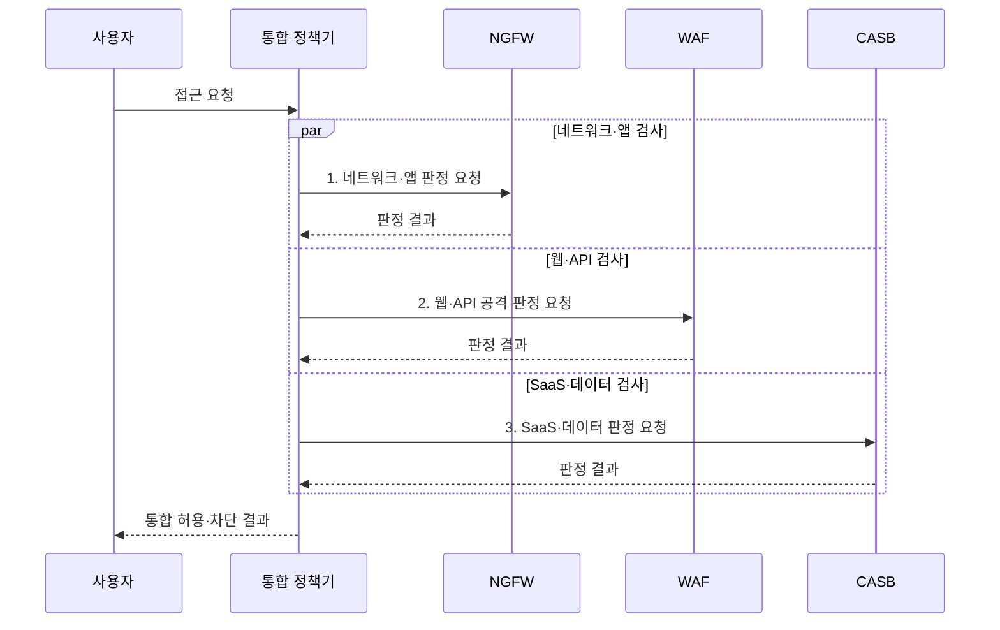

---
sidebar:
  order: 22
  label: "022. 차세대 방화벽 NGFW vs WAF vs CASB 비교 (NGFW WAF CASB Comparison)"
  badge:
    text: "기출 · 50%"
    variant: note
title: "차세대 방화벽 NGFW vs WAF vs CASB 비교 (NGFW WAF CASB Comparison)"
date: "2026-08-02T10:22:00+09:00"
tags:
  - "notes-security"
weight: 22
extra:
  question_no: "022"
  source_status: "기출"
  source_history: "137회"
  priority: 50
  priority_note: "137회 비교 기출로 계층별 보안제품 선택성이 분명함"
---

## Ⅰ. 개요

핵심 용어

- **NGFW**는 네트워크 흐름, **WAF**는 웹·API 요청, **CASB**는 클라우드 이용과 데이터 문맥을 중심으로 통제한다.

- 정의/개념: **NGFW•WAF•CASB**는 각각 네트워크 흐름, 웹•API 요청, 클라우드 서비스 이용과 데이터 문맥을 검사•통제하는 **계층별 보안 수단**
- 배경/필요성: 단일 제품으로는 계층별 공격·데이터 이용 **문맥을 모두 식별 불가**

#### 한줄 요약

- NGFW는 네트워크 흐름, WAF는 웹 요청, CASB는 클라우드 이용과 데이터를 각각 식별하므로 보호 대상과 집행 위치가 다르다.

## Ⅱ. 특징

핵심 용어

- **App-ID**는 포트와 무관하게 응용프로그램을 식별하는 기능이다.
- **SaaS**는 응용 소프트웨어를 인터넷으로 제공하고 구독하여 사용하는 서비스 모델이다.

- NGFW의 **App-ID·사용자 식별**
- WAF의 **웹·API 공격 문맥 검사**
- CASB의 **SaaS 계정·데이터 통제**

#### 한줄 요약

- 동일한 통신도 네트워크·웹 응용·클라우드 서비스에서 관찰할 수 있는 문맥이 다르므로 통제 지점을 결합해야 한다.

## Ⅲ. 구조 및 구성요소

핵심 용어

- **DLP**는 민감 데이터의 저장·이동·사용을 식별하여 유출을 탐지·통제하는 기술이다.
- **IdP**는 사용자를 인증하고 서비스에 신원·권한 정보를 제공하는 시스템이다.

| 구성요소 | 책임 |
|:---|:---|
| 사용자·데이터 | 공통 **신원·데이터 문맥** 제공 |
| NGFW 계층 | 네트워크와 **앱 흐름** 통제 |
| WAF·API 계층 | **HTTP·API 공격** 검사 |
| CASB 계층 | **SaaS 접근·공유** 통제 |
| 로그·정책 통합 | 사건과 **DLP 정책** 연결 |

#### 한줄 요약

- 공통 신원과 정책을 기준으로 NGFW·WAF·CASB의 탐지 정보를 연계하여 하나의 공격 흐름으로 분석한다.

## Ⅳ. 흐름도

핵심 용어

- **통합 정책기**는 계층별 판정을 공통 신원·자산·정책 문맥으로 연결하여 최종 허용·차단을 결정한다.

**동작 원리**

1. **네트워크·앱 판정 요청**: 흐름·사용자·응용 식별과 통제 요청
2. **웹·API 공격 판정 요청**: HTTP 요청 문맥과 공격 검사 요청
3. **SaaS·데이터 판정 요청**: 계정 행위와 데이터 유출 검사 요청

#### 한줄 요약

- 각 통제 지점의 판정 결과를 공통 신원·자산·정책 문맥으로 연결하여 탐지와 대응을 일관되게 수행한다.

## Ⅴ. 종류 및 비교

핵심 용어

- **HTTP**는 웹 요청·응답을 전달하고, **API**는 서비스 간 기능 호출과 데이터 형식을 정의한다.
- **TLS**는 통신을 보호하지만 보안 제품의 검사 가시성을 제한할 수 있다.

| 보안 통제 수단 | NGFW | WAF | CASB |
|:---|:---|:---|:---|
| 적용 기준 | **구역·앱 흐름** 통제 | **웹·API 공격** 통제 | **SaaS 이용·공유** 통제 |
| 핵심 특징 | **사용자·앱 흐름** 판단 | **웹 요청 문맥** 판단 | **SaaS 계정·데이터** 판단 |
| 한계 | **암호화 가시성** 부족 | **원본 서버 직접 경로** 노출 | **비연계 앱** 사각지대 |

> 요약: 문맥에 맞춰 솔루션 보완 배치함

#### 한줄 요약

- 세 제품은 관찰 계층과 통제 대상이 다르므로 단일 제품으로 대체하지 않고 상호 보완적으로 배치한다.

## Ⅵ. 실무 고려사항 및 대책

핵심 용어

- **섀도 IT(Shadow IT)**는 조직 승인 없이 사용하는 정보기술·클라우드 서비스다.
- **NIST SP 800-41 Rev. 1**은 방화벽 종류와 정책·배치 권고를 제시한다.

| 문제 | 대책 | 효과 |
|:---|:---|:---|
| **방화벽 종류·배치** | **NIST SP 800-41** 기반 배치 기준화 | **계층별 통제 기준** 확보 |
| **TLS·원본 직접 접속** | **복호화 정책·직접 접속 차단** | **검사 사각지대** 축소 |
| 승인되지 않은 **섀도 IT** | **CASB 앱 발견·승인 절차** 적용 | **SaaS 이용 가시성** 확보 |
| **분산 로그·신원** | **IdP·정책·사건 키** 통합 | **연계 공격 추적** 강화 |

#### 한줄 요약

- 승인되지 않은 SaaS와 우회 경로를 지속적으로 탐지하여 계정·데이터 보호정책을 동일하게 적용해야 한다.

## Ⅶ. 결론

핵심 용어

- **상호 보완 배치**는 NGFW·WAF·CASB를 공통 신원·정책·로그로 연결해 각 계층의 사각지대를 줄이는 방식이다.

- 네트워크·앱은 **NGFW**, 웹·API는 **WAF**, SaaS·데이터는 CASB 배치

#### 한줄 요약

- NGFW·WAF·CASB는 보호 계층과 문맥이 다른 상호 보완 수단이므로 공통 신원·정책·로그로 연계해야 한다.
