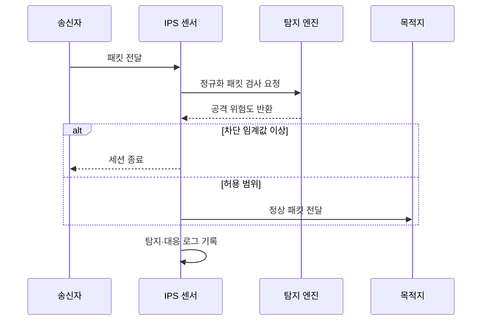

---
sidebar:
  order: 23
  label: "023. IDS·IPS 탐지 vs 차단 (IDS IPS)"
  badge:
    text: "기출 · 85%"
    variant: note
title: "IDS·IPS 탐지 vs 차단 (IDS IPS)"
date: "2026-07-27T23:59:59+09:00"
tags:
  - "notes-security"
weight: 23
extra:
  question_no: "023"
  source_status: "기출"
  source_history: "129회, 134회, 137회"
  priority: 85
  priority_note: "129·134·137회 반복된 탐지·차단 핵심 비교 주제임"
---

## 미리 알고가기

- **침입 탐지 시스템(Intrusion Detection System, IDS)**: 네트워크나 시스템의 침입 징후를 탐지하여 관리자에게 경보하는 보안 시스템
- **침입 방지 시스템(Intrusion Prevention System, IPS)**: 트래픽 경로에서 침입을 탐지하고 악성 패킷이나 세션을 즉시 차단하는 보안 시스템
- **인라인(Inline)**: 보안 장비를 실제 트래픽 전달 경로에 배치하여 직접 허용·차단하는 방식
- **오탐(False Positive)**: 정상 행위를 공격으로 잘못 판단한 탐지 결과
- **미탐(False Negative)**: 실제 공격을 정상 행위로 잘못 판단하여 탐지하지 못한 결과
- **시험 접근점(Test Access Point, TAP)**: 네트워크 트래픽의 사본을 손실 없이 센서에 전달하는 장비
- **교환 포트 분석기(Switched Port Analyzer, SPAN)**: 스위치의 특정 포트나 VLAN 트래픽을 분석 포트로 복제하는 기능
- **시그니처 탐지(Signature Detection)**: 관측 데이터와 알려진 공격의 패턴·규칙을 비교하는 탐지 방식
- **이상 탐지(Anomaly Detection)**: 정상 기준선에서 벗어난 행위나 트래픽을 식별하는 탐지 방식
- **정규화(Normalization)**: 서로 다른 패킷 표현을 일관된 해석 형태로 변환하는 처리
## Ⅰ. 개요

- 정의/개념: IDS는 **침입 탐지·경보**, IPS는 **인라인 탐지·차단**
- **배경/필요성**: 방화벽만으로는 **허용 통신 내부의 공격 행위 탐지 곤란**

### 쉽게 이해하기 (학습용)

- IDS는 복제 트래픽을 관찰하여 경보하고, IPS는 인라인 트래픽을 분석하여 고위험 통신을 차단한다.

## Ⅱ. 특징

- **IDS**는 TAP·SPAN의 복제 트래픽을 분석해 경보한다.
- **IPS**는 인라인에서 고위험 패킷·세션을 즉시 차단한다.
- **시그니처·이상 탐지**를 결합하나 암호화 트래픽은 가시성이 낮다.

### 쉽게 이해하기 (학습용)

- IPS의 오탐은 정상 서비스까지 차단하므로 검증된 고신뢰 규칙부터 단계적으로 차단 정책에 적용해야 한다.

## Ⅲ. 구성요소 및 구조

| 구성요소 | 역할 |
|:---|:---|
| 센서 인터페이스 | **패킷·이벤트 수집** |
| 정규화기 | **패킷 표현 통일** |
| 탐지 엔진 | **규칙·기준선 기반 판정** |
| 대응 모듈 | **경보·차단·격리 실행** |
| 로그 관리 | **증거 보존·규칙 보정** |

> 요약: 위험도 기반으로 탐지·대응함

### 쉽게 이해하기 (학습용)

- 종단 시스템과 센서의 패킷 해석이 다르면 공격이 우회할 수 있으므로 센서에서 트래픽을 정규화해야 한다.

## Ⅳ. 원리 및 절차 흐름도

| 메시지 | 처리 내용 |
|:---|:---|
| 패킷 전달 | 인라인 센서가 통신을 받음 |
| 정규화 패킷 검사 요청 | 표현을 통일해 탐지를 요청함 |
| 공격 위험도 반환 | 규칙과 기준선 결과를 알림 |
| 세션 종료 | 고위험 통신을 차단함 |
| 정상 패킷 전달 | 허용된 통신을 목적지로 보냄 |
| 탐지·대응 로그 기록 | 판정과 조치 근거를 남김 |

> 요약: 위험도에 따라 패킷 전달이나 차단을 결정함

### 쉽게 이해하기 (학습용)

- 센서는 정규화한 트래픽에 탐지 규칙을 적용하고 위험도와 정책에 따라 경보·전달·차단을 결정한다.

## Ⅴ. 종류 및 비교

| 침입 탐지·방지 | IDS | IPS |
|:---|:---|:---|
| 적용 기준 | 가시성과 규칙 검증 | 고신뢰 공격 즉시 통제 |
| 핵심 특징 | 복제 트래픽 탐지·경보 | 인라인 탐지·차단 |
| 한계 | 대응 지연 | 오탐에 의한 서비스 장애 |

> 요약: 경로와 차단 권한으로 구분함

### 쉽게 이해하기 (학습용)

- IDS와 IPS는 차단 권한과 서비스 영향이 다르므로 탐지 신뢰도와 가용성 요구에 따라 배치한다.

## Ⅵ. 실무 사례

1. 신규 규칙은 **IDS 경보 검증 후 IPS 차단 전환**

### 쉽게 이해하기 (학습용)

- 신규 탐지 규칙은 IDS 모드에서 오탐률과 업무 영향을 검증한 뒤 고신뢰 규칙만 IPS 차단으로 전환한다.

## Ⅶ. 결론

- 네트워크 공격을 탐지하고 피해를 줄이기 위해 배치 위치·탐지 신뢰도·오차단 영향·즉시성·우회 가능성을 검토하여, 관찰에는 IDS, 고신뢰 차단에는 IPS를 선택해야 한다.

### 쉽게 이해하기 (학습용)

- 실시간 차단 권한은 높은 탐지 정확도와 신속한 우회·복구 절차가 확보된 경우에만 부여해야 한다.
