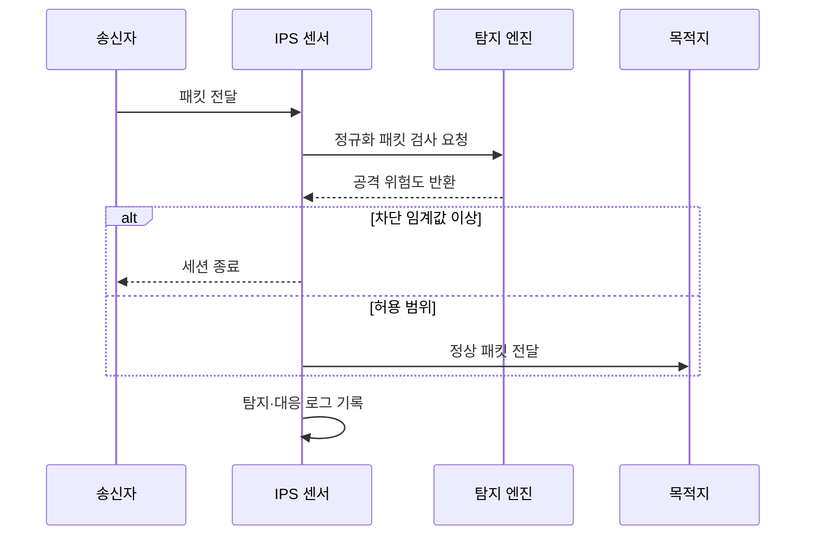

---
sidebar:
  order: 23
  label: "023. IDS·IPS 탐지 vs 차단 (IDS IPS)"
  badge:
    text: "기출 · 85%"
    variant: note
title: "IDS·IPS 탐지 vs 차단 (IDS IPS)"
date: "2026-07-25T01:05:00+09:00"
tags:
  - "notes-security"
weight: 23
extra:
  question_no: "023"
  source_status: "기출"
  source_history: "129회, 134회, 137회"
  priority: 85
  priority_note: "129·134·137회 반복된 탐지·차단 핵심 비교 주제임"
---

## 미리 알고가기

- **IDS(Intrusion Detection System)**: [읽기: 아이디에스; 표기 이유: 영문 머리글자와 구분 기호] 침입 징후를 탐지하고 알리는 시스템임
- **IPS(Intrusion Prevention System)**: [읽기: 아이피에스; 표기 이유: 영문 머리글자와 구분 기호] 침입을 탐지하고 통신을 차단하는 시스템임
- **인라인(Inline)**: [읽기: 아이엔엘아이엔이; 표기 이유: 영문 머리글자와 구분 기호] 실제 트래픽 경로에 장비를 배치함
- **오탐(False Positive)**: [읽기: 에프에이엘에스이; 표기 이유: 영문 머리글자와 구분 기호] 정상 행위를 공격으로 잘못 판단함
- **미탐(False Negative)**: [읽기: 에프에이엘에스이; 표기 이유: 영문 머리글자와 구분 기호] 공격을 정상으로 잘못 판단함
- **TAP(Test Access Point)**: [읽기: 티에이피; 표기 이유: 영문 머리글자와 구분 기호] 트래픽 사본을 센서에 전달하는 장치임
- **SPAN(Switched Port Analyzer)**: [읽기: 에스피에이엔; 표기 이유: 영문 머리글자와 구분 기호] 스위치 포트의 트래픽을 복제함
- **시그니처 탐지**: [읽기: 시그니처 탐지; 표기 이유: 한국어 통용어 표기] 알려진 공격 패턴과 비교하는 방식임
- **이상 탐지**: [읽기: 이상 탐지; 표기 이유: 한국어 통용어 표기] 정상 기준에서 벗어난 행위를 찾는 방식임
- **정규화**: [읽기: 정규화; 표기 이유: 한국어 통용어 표기] 서로 다른 패킷 표현을 같은 형태로 바꿈

- **흐름 기호(↓·→·-->)**: [읽기: 아래로·다음으로·연결; 표기 이유: 절차 방향 기호] 순서와 연결 방향을 나타냄
## Ⅰ. 개요

- **정의**: IDS는 경보하고 IPS는 경보·차단함
- **배경/필요성**: 침입 식별과 대응 시간 단축

### 쉽게 이해하기 (학습용)

- IDS 감시·경보, IPS 탐지·차단 장치

## Ⅱ. 특징

- IDS는 복제 트래픽으로 서비스 영향을 줄인다
- IPS는 인라인에서 패킷과 세션을 제어한다
- 시그니처와 이상 탐지를 함께 활용한다
- 암호화와 우회 표현은 가시성을 제한한다

### 쉽게 이해하기 (학습용)

- IPS의 오탐은 정상 서비스까지 끊을 수 있음

## Ⅲ. 구성요소 및 구조

| 구성요소 | 역할 |
|:---|:---|
| 센서 인터페이스 | 패킷과 이벤트를 수집함 |
| 정규화기 | 패킷 표현을 일관되게 바꿈 |
| 탐지 엔진 | 규칙과 기준선으로 판정함 |
| 대응 모듈 | 경보·차단·격리를 실행함 |
| 로그 관리 | 증거를 보존하고 규칙을 보정함 |

> 요약: 위험도 기반으로 탐지·대응함

### 쉽게 이해하기 (학습용)

- 종단과 센서가 다르게 읽으면 공격이 숨음

## Ⅳ. 원리 및 절차 흐름도

| 메시지 | 처리 내용 |
|:---|:---|
| 패킷 전달 | 인라인 센서가 통신을 받음 |
| 정규화 패킷 검사 요청 | 표현을 통일해 탐지를 요청함 |
| 공격 위험도 반환 | 규칙과 기준선 결과를 알림 |
| 세션 종료 | 고위험 통신을 차단함 |
| 정상 패킷 전달 | 허용된 통신을 목적지로 보냄 |
| 탐지·대응 로그 기록 | 판정과 조치 근거를 남김 |

> 요약: 위험도에 따라 패킷 전달이나 차단을 결정함

### 쉽게 이해하기 (학습용)

- 경비원이 위험도를 보고 통과 여부를 정함

## Ⅴ. 종류 및 비교

| 비교축 | IDS | IPS |
|:---|:---|:---|
| 핵심 특징 | 복제 트래픽 탐지 | 인라인 탐지·차단 |
| 적용 기준 | 가시성과 규칙 검증 | 고신뢰 공격 즉시 통제 |
| 주요 위험 | 대응 지연 | 오탐에 의한 서비스 장애 |

> 요약: 경로와 차단 권한으로 구분함

### 쉽게 이해하기 (학습용)

- 배치 형태에 따른 운영 위험 차이임

## Ⅵ. 실무 사례

- 신규 규칙은 탐지 후 단계적으로 차단함
- IPS 장애 시 우회 정책을 사전에 결정함

### 쉽게 이해하기 (학습용)

- 먼저 경보 정확도를 확인한 뒤 차단으로 올림
- 장애 때 보안과 가용성 중 기준을 적용함

## Ⅶ. 결론

- 배치·탐지 정확도·오탐 비용을 함께 관리함

### 쉽게 이해하기 (학습용)

- 차단 권한에는 정확도와 복구 능력이 필요함
