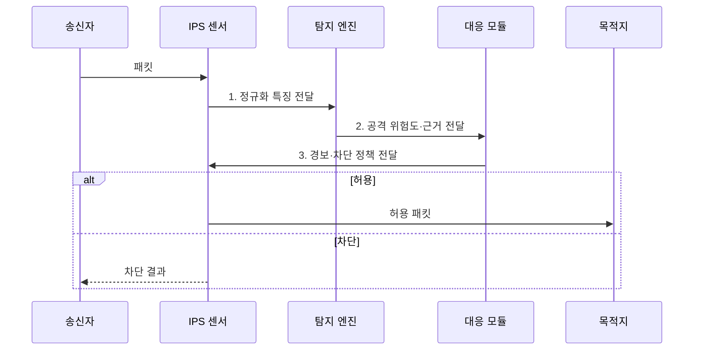

---
sidebar:
  order: 23
  label: "023. IDS·IPS 탐지 vs 차단 (IDS IPS)"
  badge:
    text: "기출 · 85%"
    variant: note
title: "IDS·IPS 탐지 vs 차단 (IDS IPS)"
date: "2026-08-02T10:24:00+09:00"
tags:
  - "notes-security"
weight: 23
extra:
  question_no: "023"
  source_status: "기출"
  source_history: "129회, 134회, 137회"
  priority: 85
  priority_note: "129·134·137회 반복된 탐지·차단 핵심 비교 주제임"
---

## Ⅰ. 개요

핵심 용어

- **IDS**는 침입 징후를 탐지해 경보하고, **IPS**는 트래픽 경로에서 악성 패킷이나 세션을 즉시 차단한다.

- 정의/개념: **IDS와 IPS**는 침입 징후를 분석하되 IDS는 복제 트래픽에서 탐지•경보하고 IPS는 인라인 경로에서 악성 통신을 차단하는 **침입 탐지•방지 시스템**
- 배경/필요성: 헤더 기반 허용 정책만으로는 정상 서비스 내부의 **공격 행위 식별 불가**

### 쉽게 이해하기 (학습용)

- IDS는 복제 트래픽을 관찰하여 경보하고, IPS는 인라인 트래픽을 분석하여 고위험 통신을 차단한다.

## Ⅱ. 특징

핵심 용어

- **인라인(Inline)**은 보안 장비를 실제 트래픽 전달 경로에 배치하여 직접 허용·차단하는 방식이다.
- **TAP·SPAN**은 네트워크 트래픽의 사본을 IDS 센서에 전달하는 수단이다.

- **IDS**는 **TAP·SPAN**의 복제 트래픽을 분석해 경보한다.
- **IPS**는 인라인에서 고위험 패킷·세션을 즉시 차단한다.
- **시그니처·이상 탐지**를 결합하나 암호화 트래픽은 가시성이 낮다.

### 쉽게 이해하기 (학습용)

- IPS의 오탐은 정상 서비스까지 차단하므로 검증된 고신뢰 규칙부터 단계적으로 차단 정책에 적용해야 한다.

## Ⅲ. 구조 및 구성요소

핵심 용어

- **정규화(Normalization)**는 서로 다른 패킷 표현을 일관된 해석 형태로 변환하는 처리다.
- **시그니처 탐지**는 알려진 공격 패턴을, **이상 탐지**는 정상 기준선에서 벗어난 행위를 식별한다.

| 구성요소 | 책임 |
|:---|:---|
| 센서 인터페이스 | **패킷·이벤트 수집** |
| 정규화기 | **패킷 표현 통일** |
| 탐지 엔진 | **규칙·기준선 기반 판정** |
| 대응 모듈 | **경보·차단·격리 실행** |
| 로그 관리 | **증거 보존·규칙 보정** |

### 쉽게 이해하기 (학습용)

- 종단 시스템과 센서의 패킷 해석이 다르면 센서가 공격을 놓칠 수 있으므로 트래픽을 정규화해야 한다.

## Ⅳ. 흐름도

핵심 용어

- **위험도 기반 대응**은 탐지 근거와 신뢰도에 따라 허용·경보·차단 조치를 구분하는 절차다.

**동작 원리**

1. **정규화 특징 전달**: 패킷 표현 통일 후 탐지 특징 제공
2. **공격 위험도·근거 전달**: 시그니처·기준선 기반 판정 정보 제공
3. **경보·차단 정책 전달**: 위험도별 허용·경보·차단 조치 지정

### 쉽게 이해하기 (학습용)

- 센서는 정규화한 트래픽에 탐지 규칙을 적용하고 위험도와 정책에 따라 경보·전달·차단을 결정한다.

## Ⅴ. 종류 및 비교

핵심 용어

- **오탐(False Positive)**은 정상 행위를 공격으로, **미탐(False Negative)**은 실제 공격을 정상으로 잘못 판단한 결과다.

| 침입 탐지·방지 | IDS | IPS |
|:---|:---|:---|
| 적용 기준 | **가시성·규칙 검증** | **고신뢰 공격** 즉시 통제 |
| 핵심 특징 | **복제 트래픽 탐지·경보** | **인라인 탐지·차단** |
| 한계 | **대응 지연** | **오탐**에 의한 서비스 장애 |

> 요약: 경로와 차단 권한으로 구분함

### 쉽게 이해하기 (학습용)

- IDS와 IPS는 차단 권한과 서비스 영향이 다르므로 탐지 신뢰도와 가용성 요구에 따라 배치한다.

## Ⅵ. 실무 고려사항 및 대책

핵심 용어

- **NIST SP 800-94**는 IDPS 유형·탐지 방식과 설계·운영·유지관리 권고를 제시한다.
- **단계적 차단 전환**은 신규 규칙을 IDS 모드에서 검증한 뒤 고신뢰 규칙만 IPS에 적용하는 방식이다.

| 문제 | 대책 | 효과 |
|:---|:---|:---|
| **IDPS 설계·운영** | **NIST SP 800-94 적용** | **유형·배치 기준** 일관화 |
| 신규 규칙의 **오탐·미탐** | **IDS 검증 후 IPS 전환** | 정상 서비스 **오차단 억제** |
| **암호화·패킷 해석 차이** | **복호화 지점·정규화 연계** | **탐지 사각지대** 축소 |

### 쉽게 이해하기 (학습용)

- 신규 탐지 규칙은 IDS 모드에서 오탐률과 업무 영향을 검증한 뒤 고신뢰 규칙만 IPS 차단으로 전환한다.

## Ⅶ. 결론

핵심 용어

- **차단 권한**은 탐지 정확도와 신속한 우회·복구 절차가 확보된 경우에만 부여해야 한다.

- 가시성·규칙 검증은 **IDS**, 고신뢰 즉시 차단은 **IPS** 선택

### 쉽게 이해하기 (학습용)

- 실시간 차단 권한은 높은 탐지 정확도와 신속한 우회·복구 절차가 확보된 경우에만 부여해야 한다.
