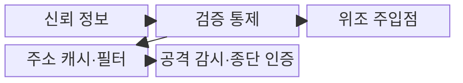
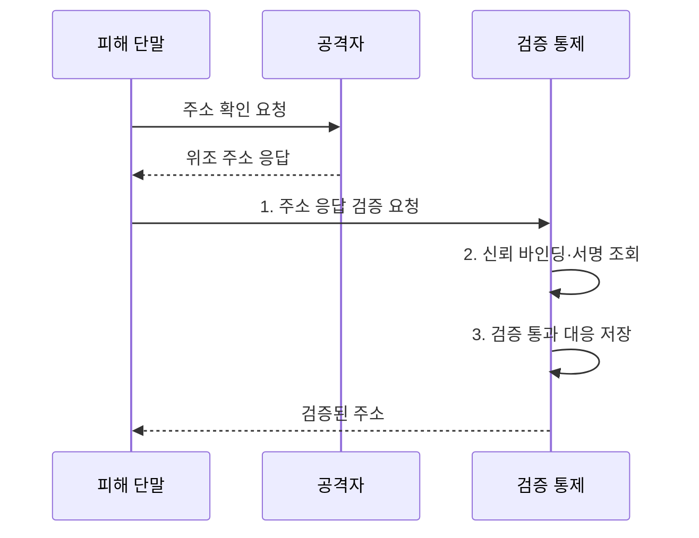

---
sidebar:
  order: 24
  label: "024. 네트워크 스푸핑 - ARP·IP·DNS (Network Spoofing)"
  badge:
    text: "기출 · 70%"
    variant: note
title: "네트워크 스푸핑 - ARP·IP·DNS (Network Spoofing)"
date: "2026-08-02T10:26:00+09:00"
tags:
  - "notes-security"
weight: 24
extra:
  question_no: "024"
  source_status: "기출"
  source_history: "128회, 134회"
  priority: 70
  priority_note: "128·134회 반복된 계층별 스푸핑 비교 주제임"
---

## Ⅰ. 개요

핵심 용어

- **스푸핑(Spoofing)**은 주소·신원·응답 정보를 위조하여 정상 통신 주체나 경로로 가장하는 공격이다.
- **중간자 공격**은 통신 사이에서 정상 상대인 것처럼 가장해 도청·변조하는 공격이다.

- 정의/개념: **네트워크 스푸핑**은 ARP•IP•DNS의 주소나 응답 정보를 위조해 정상 통신 주체 또는 경로로 가장하는 **네트워크 기만 공격**
- 배경/필요성: 인증 없는 주소·응답 수용으로는 **중간자·반사 공격 차단 불가**

#### 한줄 요약

- 주소록이나 발신인을 바꿔 정상 상대처럼 속이는 행위다

## Ⅱ. 특징

핵심 용어

- **ARP**는 IP에 대응하는 MAC 주소를 조회하고, **DNS**는 도메인 이름을 IP 주소 등의 자원 정보로 변환한다.
- **반사 공격**은 피해자의 출발지 주소를 위조해 다수 서버의 응답을 피해자에게 보내는 공격이다.

- **ARP 스푸핑**은 인접망의 IP·MAC 대응을 오염시킨다.
- **IP 스푸핑**은 출발지 주소를 위조해 반사·출발지 필터 회피를 유도한다.
- **DNS 스푸핑**은 이름 응답을 위조해 가짜 목적지로 유도한다.

#### 한줄 요약

- 주소가 정상처럼 보여도 최종 상대 인증을 별도로 확인해야 한다

## Ⅲ. 구조 및 구성요소

핵심 용어

- **DAI**는 신뢰된 DHCP 바인딩과 ARP 메시지를 대조하여 위조 응답을 차단한다.
- **uRPF**는 출발지 IP로 돌아가는 경로의 유효성을 검사하고, **DNSSEC**은 DNS 응답의 출처와 무결성을 검증한다.
- **TLS 종단 인증**은 주소 검증 뒤 인증서로 실제 통신 상대의 신원을 다시 확인한다.

| 구성요소 | 책임 |
|:---|:---|
| 신뢰 정보 | **ARP·IP·DNS 대응 제공** |
| 검증 통제 | **DAI·uRPF·DNSSEC 검증** |
| 위조 주입점 | **거짓 주소·응답 전달** |
| 주소 캐시·필터 | **검증된 대응 정보 사용** |
| 공격 감시·종단 인증 | **도청 탐지·TLS 상대 확인** |

#### 한줄 요약

- 주소 검증 뒤에도 TLS로 최종 상대를 다시 확인한다

## Ⅳ. 흐름도

핵심 용어

- **신뢰 바인딩**은 DHCP가 할당한 IP·MAC 대응처럼 주소 응답을 검증할 기준 정보다.
- **캐시(Cache)**는 검증된 주소 대응 정보를 일정 기간 임시 저장하는 공간이다.

**동작 원리**

1. **주소 응답 검증 요청**: 수신 응답의 출처·무결성 확인 요청
2. **신뢰 바인딩·서명 조회**: DHCP 바인딩·경로·DNSSEC 근거 조회
3. **검증 통과 대응 저장**: 유효한 주소·응답만 캐시에 반영

#### 한줄 요약

- 오염된 신뢰 정보는 피해자의 실제 통신 경로를 바꾼다

## Ⅴ. 종류 및 비교

핵심 용어

- **ARP·IP·DNS 스푸핑**은 각각 링크 주소 대응, 패킷 출발지, 이름 해석 응답을 위조한다.

| 네트워크 스푸핑 | ARP 스푸핑 | IP 스푸핑 | DNS 스푸핑 |
|:---|:---|:---|:---|
| 적용 기준 | **인접망 주소** 보호 | **경계 출발지** 검증 | **DNS 응답** 검증 |
| 핵심 특징 | **IP·MAC 대응 위조** | **출발지 IP 위조** | **도메인 응답 위조** |
| 한계 | **중간자 공격** | **반사·출발지 필터 회피** | **피싱·캐시 오염** |

> 요약: 스푸핑 유형별 검증 지점 분리함

#### 한줄 요약

- 위조하는 정보의 계층에 따라 방어 지점도 달라진다

## Ⅵ. 실무 고려사항 및 대책

핵심 용어

- **IETF BCP 84**는 uRPF 기반 출발지 주소 검증을, **RFC 4033~4035**는 DNSSEC 검증 절차를 규정한다.
- **TLS 종단 인증**은 경로 주소 검증 뒤에도 최종 통신 상대가 맞는지 확인한다.

| 문제 | 대책 | 효과 |
|:---|:---|:---|
| **출발지 IP 위조** | **IETF BCP 84 uRPF** | **반사·출발지 필터 회피** 억제 |
| **DNS 응답 위조** | **IETF RFC 4033~4035** | **출처·무결성** 검증 |
| **ARP 캐시 오염** | **DHCP 바인딩 기반 DAI** | 인접망 **중간자 공격** 차단 |
| 경로 위조 뒤 **종단 사칭** | **TLS 종단 인증** | **최종 상대 신원** 확인 |

#### 한줄 요약

- 잘못된 주소 목록을 쓰면 정상 단말까지 차단될 수 있다

## Ⅶ. 결론

핵심 용어

- **계층별 검증**은 ARP에 DAI, IP에 uRPF, DNS에 DNSSEC을 적용해 위조 지점별로 통제하는 원칙이다.
- **DAI·uRPF·DNSSEC 적용**은 링크 주소, 출발지 IP, 이름 응답의 위조를 각 계층의 신뢰 근거로 검증하는 판단이다.

- ARP 위조는 **DAI**, IP 위조는 **uRPF**, DNS 위조는 **DNSSEC** 적용

#### 한줄 요약

- 경로 주소와 최종 통신 상대를 모두 검증해야 안전하다
