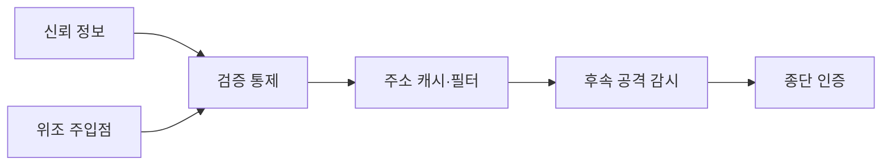
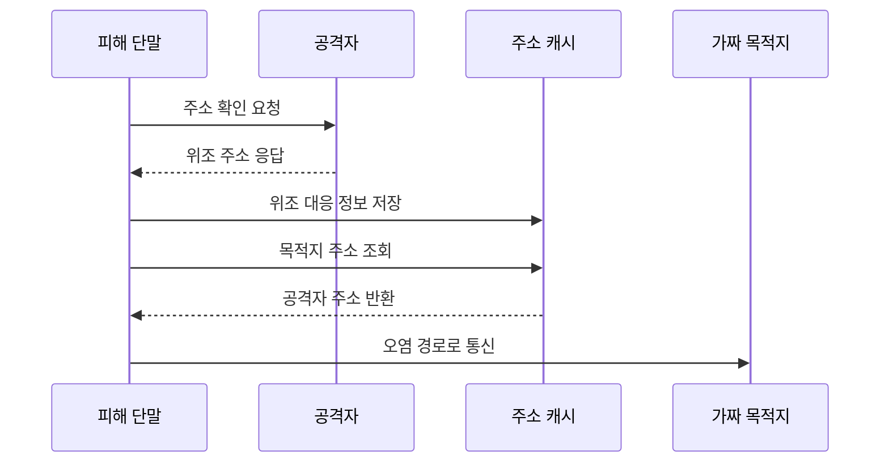

---
sidebar:
  order: 24
  label: "024. 네트워크 스푸핑 - ARP·IP·DNS (Network Spoofing)"
  badge:
    text: "기출 · 70%"
    variant: note
title: "네트워크 스푸핑 - ARP·IP·DNS (Network Spoofing)"
date: "2026-07-27T23:59:59+09:00"
tags:
  - "notes-security"
weight: 24
extra:
  question_no: "024"
  source_status: "기출"
  source_history: "128회, 134회"
  priority: 70
  priority_note: "128·134회 반복된 계층별 스푸핑 비교 주제임"
---

## 미리 알고가기

- **스푸핑(Spoofing)**: 주소·신원·응답 정보를 위조하여 정상 통신 주체나 경로로 가장하는 공격
- **인터넷 프로토콜(Internet Protocol, IP)**: 패킷의 출발지와 목적지 주소를 지정하여 네트워크 간 전달을 지원하는 규약
- **매체 접근 제어(Media Access Control, MAC)**: 동일한 링크 구간에서 네트워크 인터페이스를 식별하는 주소 체계
- **주소 결정 프로토콜(Address Resolution Protocol, ARP)**: 동일 네트워크에서 IP 주소에 대응하는 MAC 주소를 조회하는 프로토콜
- **도메인 이름 시스템(Domain Name System, DNS)**: 도메인 이름과 IP 주소 등의 자원 정보를 변환하는 분산 이름 체계
- **캐시(Cache)**: 반복 조회를 줄이기 위해 주소 대응 정보를 일정 기간 임시 저장하는 공간
- **동적 ARP 검사(Dynamic ARP Inspection, DAI)**: 신뢰된 DHCP 바인딩과 ARP 메시지를 대조하여 위조 응답을 차단하는 기능
- **동적 호스트 구성 프로토콜(Dynamic Host Configuration Protocol, DHCP)**: 단말에 IP 주소·게이트웨이·DNS 등 네트워크 설정을 자동 할당하는 프로토콜
- **유니캐스트 역방향 경로 전달(Unicast Reverse Path Forwarding, uRPF)**: 출발지 IP로 돌아가는 경로의 유효성을 검사하여 위조 패킷을 차단하는 기능
- **DNS 보안 확장(Domain Name System Security Extensions, DNSSEC)**: 전자서명으로 DNS 응답의 출처와 무결성을 검증하는 보안 확장
- **전송 계층 보안(Transport Layer Security, TLS)**: 통신 상대를 인증하고 전송 데이터의 기밀성과 무결성을 보호하는 프로토콜
- **중간자 공격(Man-in-the-Middle Attack)**: 두 통신자 사이에서 각각 정상 상대인 것처럼 가장하여 통신을 도청·변조하는 공격
- **반사 공격(Reflection Attack)**: 피해자의 출발지 주소를 위조하여 다수 서버의 응답이 피해자에게 전달되도록 하는 공격

## Ⅰ. 개요

- 정의/개념: ARP·IP·DNS의 **주소·응답을 위조해 통신 경로 기만**
- **배경/필요성**: 인증 없는 주소 정보는 **중간자·반사·가짜 목적지 유발**

### 쉽게 이해하기 (학습용)

- 주소록이나 발신인을 바꿔 정상 상대처럼 속이는 행위다

## Ⅱ. 특징

- **ARP 스푸핑**은 인접망의 IP·MAC 대응을 오염시킨다.
- **IP 스푸핑**은 출발지 주소를 위조해 반사·필터 우회를 유도한다.
- **DNS 스푸핑**은 이름 응답을 위조해 가짜 목적지로 유도한다.

### 쉽게 이해하기 (학습용)

- 주소가 정상처럼 보여도 최종 상대 인증을 별도로 확인해야 한다

## Ⅲ. 구성요소 및 구조

| 설계 요소 | 설명 |
|:---|:---|
| 신뢰 정보 | **ARP·IP·DNS 대응 제공** |
| 검증 통제 | **DAI·uRPF·DNSSEC 검증** |
| 위조 주입점 | **거짓 주소·응답 전달** |
| 주소 캐시·필터 | **검증된 대응 정보 사용** |
| 후속 공격 감시 | **도청·변조·반사 징후 탐지** |
| 종단 인증 | **TLS로 최종 상대 확인** |

> 요약: 주소 대응 위조로 경로 및 종단 기만함

### 쉽게 이해하기 (학습용)

- 주소 검증 뒤에도 TLS로 최종 상대를 다시 확인한다

## Ⅳ. 원리 및 절차 흐름도

| 메시지 | 처리 내용 |
|:---|:---|
| 주소 확인 요청 | 정상 목적지 주소를 질의함 |
| 위조 주소 응답 | 공격자가 거짓 대응을 보냄 |
| 위조 대응 정보 저장 | 검증 없이 캐시를 오염시킴 |
| 목적지 주소 조회 | 통신할 주소를 캐시에서 찾음 |
| 공격자 주소 반환 | 오염된 주소를 정상으로 제공함 |
| 오염 경로로 통신 | 공격자 경로로 데이터를 보냄 |

> 요약: 거짓 주소가 캐시를 오염시켜 경로를 바꿈

### 쉽게 이해하기 (학습용)

- 오염된 신뢰 정보는 피해자의 실제 통신 경로를 바꾼다

## Ⅴ. 종류 및 비교

| 네트워크 스푸핑 | ARP 스푸핑 | IP 스푸핑 | DNS 스푸핑 |
|:---|:---|:---|:---|
| 적용 기준 | 인접망 주소 보호 | 경계 출발지 검증 | DNS 응답 검증 |
| 핵심 특징 | IP·MAC 대응 위조 | 출발지 IP 위조 | 도메인 응답 위조 |
| 한계 | 중간자 공격 | 반사·필터 우회 | 피싱·캐시 오염 |

> 요약: 스푸핑 유형별 검증 지점 분리함

### 쉽게 이해하기 (학습용)

- 위조하는 정보의 계층에 따라 방어 지점도 달라진다

## Ⅵ. 실무 사례

1. 접속망은 **DHCP 바인딩 기반 DAI 적용**

### 쉽게 이해하기 (학습용)

- 잘못된 주소 목록을 쓰면 정상 단말까지 차단될 수 있다

## Ⅶ. 결론

- 네트워크 식별자 위조를 막기 위해 위조 대상·신뢰 원천·검증 위치·운영 영향을 검토하여, ARP에는 DAI, 출발지 IP에는 uRPF, DNS에는 DNSSEC을 적용해야 한다.

### 쉽게 이해하기 (학습용)

- 경로 주소와 최종 통신 상대를 모두 검증해야 안전하다
