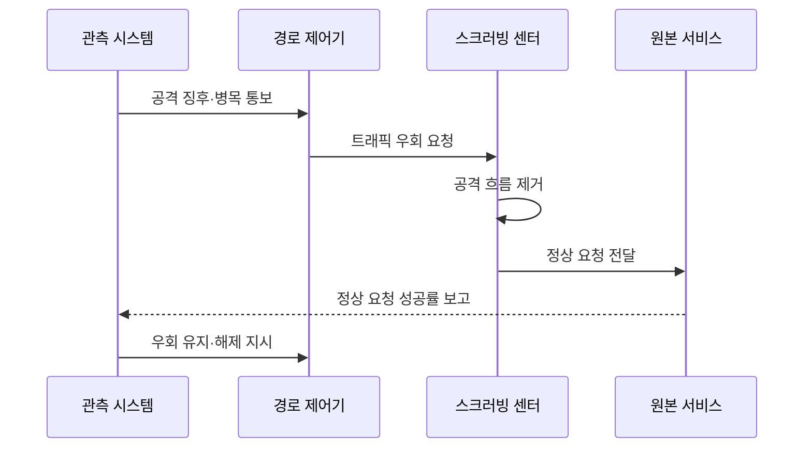

---
sidebar:
  order: 25
  label: "025. DDoS 공격·대응 - SYN Flood·반사 증폭 (DDoS Attack)"
  badge:
    text: "기출 · 30%"
    variant: note
title: "DDoS 공격·대응 - SYN Flood·반사 증폭 (DDoS Attack)"
date: "2026-07-27T23:59:59+09:00"
tags:
  - "notes-security"
weight: 25
extra:
  question_no: "025"
  source_status: "기출"
  source_history: "125회"
  priority: 30
  priority_note: "125회 기출이나 공격유형 단독 반복은 상대적으로 낮음"
---

## 미리 알고가기

- **분산 서비스 거부(Distributed Denial of Service, DDoS)**: '디도스'로 읽고 분산(Distributed)의 D를 DoS 앞에 붙여 여러 공격원의 서비스 자원 고갈을 표시
- **인터넷 프로토콜(Internet Protocol, IP)**: '아이피'로 읽고 영문 머리글자로 네트워크 주소 규약임을 표시하며 패킷의 출발지·목적지를 지정
- **전송 제어 프로토콜(Transmission Control Protocol, TCP)**: '티시피'로 읽고 영문 머리글자로 연결형 전송 규약임을 표시하며 순서·재전송·상태를 관리
- **동기화(Synchronize, SYN)**: '신'으로 읽고 영문 축약으로 순서 번호 동기화를 표시하며 TCP 연결 시작을 요청하는 플래그
- **4계층(Layer 4, L4)**: '엘 포'로 읽고 계층(Layer)의 L과 번호 4로 전송 계층을 표시하며 포트·연결 상태를 처리
- **7계층(Layer 7, L7)**: '엘 세븐'으로 읽고 계층의 L과 번호 7로 응용 계층을 표시하며 서비스 요청 내용을 처리
- **봇넷(Botnet)**: 공격자가 원격 조종하는 감염 단말 집단임
- **반사 증폭**: 위조 주소로 큰 응답을 피해자에게 보냄
- **스크러빙(Scrubbing)**: 공격 트래픽을 걸러 정상 흐름만 전달함
- **애니캐스트(Anycast)**: 같은 주소의 트래픽을 여러 거점으로 분산함
- **콘텐츠 전송 네트워크(Content Delivery Network, CDN)**: '시디엔'으로 읽고 영문 머리글자로 분산 콘텐츠 망임을 표시하며 여러 거점에서 요청을 흡수
- **웹 응용 방화벽(Web Application Firewall, WAF)**: '와프'로 읽고 영문 머리글자로 웹 요청 검사 방화벽임을 표시하며 공격 문맥을 차단
- **SYN 쿠키**: 서버 상태 저장 없이 연결 요청을 검증함
- **서비스 수준 지표(Service Level Indicator, SLI)**: '에스엘아이'로 읽고 영문 머리글자로 서비스 수준 측정값임을 표시하며 정상 요청 성공률을 관측
- **하이퍼텍스트 전송 프로토콜(Hypertext Transfer Protocol, HTTP)**: '에이치티티피'로 읽고 영문 머리글자로 웹 요청 규약임을 표시하며 응용형 공격의 대상 기능을 전달
- **중앙 처리 장치(Central Processing Unit, CPU)·데이터베이스(Database, DB)**: '시피유·디비'로 읽고 영문 머리글자로 응용 연산·데이터 저장 병목을 표시

## Ⅰ. 개요

- 정의/개념: 다수 공격원이 **회선·상태·응용 자원을 분산 고갈**
- **배경/필요성**: 원본 앞단 장비만으로는 **상류 회선 포화 방어 불가**

### 쉽게 이해하기 (학습용)

- 가짜 요청이 자원을 선점해 정상 서비스를 막는 공격이다

## Ⅱ. 특징

- **대역폭형**은 봇넷·반사 증폭으로 회선을 포화시킨다.
- **프로토콜형**은 SYN 등 연결 상태표를 고갈시킨다.
- **응용형**은 고비용 HTTP 기능을 반복해 CPU·DB를 고갈시킨다.

### 쉽게 이해하기 (학습용)

- 공격량보다 정상 요청의 성공률을 지키는 것이 중요하다

## Ⅲ. 구성요소 및 구조

| 설계 요소 | 설명 |
|:---|:---|
| 봇넷·반사원 | **분산 공격 트래픽 생성** |
| 상류 스크러빙 | **원본 회선 전 공격 제거** |
| CDN·애니캐스트 | **트래픽을 다수 거점에 분산** |
| WAF·연결 보호 | **웹 요청·연결 상태 선별** |
| 원본 서비스 | **정상 요청 최종 처리** |

> 요약: 상류 공격 흡수 및 서비스 전단 요청 선별함

### 쉽게 이해하기 (학습용)

- 서비스 앞단에서 공격을 걷어내고 정상 요청만 전달한다

## Ⅳ. 원리 및 절차 흐름도

| 메시지 | 처리 내용 |
|:---|:---|
| 공격 징후·병목 통보 | 공격 계층과 고갈 자원을 알림 |
| 트래픽 우회 요청 | 상류 경로를 스크러빙으로 바꿈 |
| 공격 흐름 제거 | 공격 패턴을 식별해 폐기함 |
| 정상 요청 전달 | 선별된 통신만 원본에 보냄 |
| 정상 요청 성공률 보고 | 서비스 회복 수준을 측정함 |
| 우회 유지·해제 지시 | 성공률에 따라 경로를 조정함 |

> 요약: 상류에서 공격을 걸러 정상 요청을 보존함

### 쉽게 이해하기 (학습용)

- 병목보다 앞선 상류 구간에서 공격량을 먼저 줄여야 한다

## Ⅴ. 종류 및 비교

| DDoS 공격 유형 | 대역폭형 | 프로토콜형 | 응용형 |
|:---|:---|:---|:---|
| 적용 기준 | 대량 반사 공격 | SYN 연결 공격 | HTTP 기능 반복 |
| 핵심 특징 | 회선 용량 고갈 | 연결 상태 고갈 | 응용 연산 고갈 |
| 한계 | 상류 회선 포화 | 상태표 고갈 | CPU·DB 병목 |

> 요약: 상류 흡수 및 서비스 요청 선별함

### 쉽게 이해하기 (학습용)

- 회선 공격은 상류망에서 트래픽을 우회·흡수해야 한다

## Ⅵ. 실무 사례

1. 평시에 **스크러빙 우회·복귀 절차 검증**

### 쉽게 이해하기 (학습용)

- 공격 중 처음 전환하면 경로 오류가 피해를 더 키울 수 있다

## Ⅶ. 결론

- 대량 요청으로 인한 서비스 자원 고갈을 줄이기 위해 공격 계층·회선 용량·연결 상태·응용 비용·정상 트래픽을 검토하여, 상류 스크러빙·SYN 보호·WAF를 계층별로 적용해야 한다.

### 쉽게 이해하기 (학습용)

- 대응의 최종 목표는 공격량 감소보다 정상 서비스 유지다
