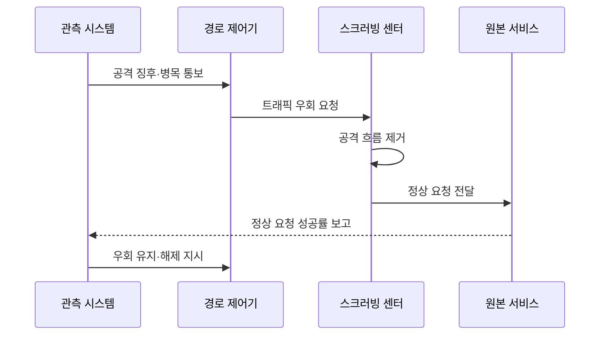

---
sidebar:
  order: 25
  label: "025. DDoS 공격·대응 - SYN Flood·반사 증폭 (DDoS Attack)"
  badge:
    text: "기출 · 30%"
    variant: note
title: "DDoS 공격·대응 - SYN Flood·반사 증폭 (DDoS Attack)"
date: "2026-07-27T23:59:59+09:00"
tags:
  - "notes-security"
weight: 25
extra:
  question_no: "025"
  source_status: "기출"
  source_history: "125회"
  priority: 30
  priority_note: "125회 기출이나 공격유형 단독 반복은 상대적으로 낮음"
---

## 미리 알고가기

- **분산 서비스 거부(Distributed Denial of Service, DDoS)**: 다수의 공격원이 대역폭·연결 상태·응용 자원을 고갈시켜 정상 서비스 제공을 방해하는 공격
- **인터넷 프로토콜(Internet Protocol, IP)**: 패킷의 출발지와 목적지 주소를 지정하여 네트워크 간 전달을 지원하는 규약
- **전송 제어 프로토콜(Transmission Control Protocol, TCP)**: 연결 상태·순서·재전송을 관리하여 신뢰성 있는 데이터 전송을 제공하는 규약
- **동기화 플래그(Synchronize, SYN)**: TCP 연결을 시작하고 초기 순서 번호를 동기화하도록 요청하는 제어 비트
- **4계층(Layer 4, L4)**: 포트와 연결 상태를 처리하는 전송 계층
- **7계층(Layer 7, L7)**: HTTP 등 서비스 요청과 응답의 내용을 처리하는 응용 계층
- **봇넷(Botnet)**: 공격자가 원격으로 제어하여 공격에 동원하는 감염 단말 집단
- **반사 증폭(Reflection Amplification)**: 피해자의 출발지 주소를 위조하여 요청보다 큰 응답을 피해자에게 집중시키는 공격
- **스크러빙(Scrubbing)**: 대규모 트래픽에서 공격 흐름을 제거하고 정상 트래픽만 원본 서비스로 전달하는 처리
- **애니캐스트(Anycast)**: 동일한 IP 주소의 트래픽을 네트워크상 여러 거점으로 분산하는 라우팅 방식
- **콘텐츠 전송 네트워크(Content Delivery Network, CDN)**: 여러 지역 거점에 콘텐츠와 요청 처리를 분산하여 원본 서버의 부하를 줄이는 네트워크
- **웹 응용 방화벽(Web Application Firewall, WAF)**: HTTP 요청의 웹·API 공격 문맥을 분석하여 차단하는 방화벽
- **SYN 쿠키(SYN Cookie)**: 서버가 연결 상태를 미리 저장하지 않고도 TCP 연결 요청의 정당성을 검증하는 기법
- **서비스 수준 지표(Service Level Indicator, SLI)**: 정상 요청 성공률·응답시간 등 실제 서비스 수준을 측정하는 지표
- **하이퍼텍스트 전송 프로토콜(Hypertext Transfer Protocol, HTTP)**: 웹 클라이언트와 서버 사이에서 요청과 응답을 전달하는 응용 계층 프로토콜
- **중앙 처리 장치(Central Processing Unit, CPU)·데이터베이스(Database, DB)**: 응용 요청 처리와 데이터 조회 과정에서 고갈될 수 있는 핵심 자원

## Ⅰ. 개요

- 정의/개념: 다수 공격원이 **회선·상태·응용 자원을 분산 고갈**
- **배경/필요성**: 원본 앞단 장비만으로는 **상류 회선 포화 방어 불가**

### 쉽게 이해하기 (학습용)

- 가짜 요청이 자원을 선점해 정상 서비스를 막는 공격이다

## Ⅱ. 특징

- **대역폭형**은 봇넷·반사 증폭으로 회선을 포화시킨다.
- **프로토콜형**은 SYN 등 연결 상태표를 고갈시킨다.
- **응용형**은 고비용 HTTP 기능을 반복해 CPU·DB를 고갈시킨다.

### 쉽게 이해하기 (학습용)

- 공격량보다 정상 요청의 성공률을 지키는 것이 중요하다

## Ⅲ. 구성요소 및 구조

| 설계 요소 | 설명 |
|:---|:---|
| 봇넷·반사원 | **분산 공격 트래픽 생성** |
| 상류 스크러빙 | **원본 회선 전 공격 제거** |
| CDN·애니캐스트 | **트래픽을 다수 거점에 분산** |
| WAF·연결 보호 | **웹 요청·연결 상태 선별** |
| 원본 서비스 | **정상 요청 최종 처리** |

> 요약: 상류 공격 흡수 및 서비스 전단 요청 선별함

### 쉽게 이해하기 (학습용)

- 서비스 앞단에서 공격을 걷어내고 정상 요청만 전달한다

## Ⅳ. 원리 및 절차 흐름도

| 메시지 | 처리 내용 |
|:---|:---|
| 공격 징후·병목 통보 | 공격 계층과 고갈 자원을 알림 |
| 트래픽 우회 요청 | 상류 경로를 스크러빙으로 바꿈 |
| 공격 흐름 제거 | 공격 패턴을 식별해 폐기함 |
| 정상 요청 전달 | 선별된 통신만 원본에 보냄 |
| 정상 요청 성공률 보고 | 서비스 회복 수준을 측정함 |
| 우회 유지·해제 지시 | 성공률에 따라 경로를 조정함 |

> 요약: 상류에서 공격을 걸러 정상 요청을 보존함

### 쉽게 이해하기 (학습용)

- 병목보다 앞선 상류 구간에서 공격량을 먼저 줄여야 한다

## Ⅴ. 종류 및 비교

| DDoS 공격 유형 | 대역폭형 | 프로토콜형 | 응용형 |
|:---|:---|:---|:---|
| 적용 기준 | 대량 반사 공격 | SYN 연결 공격 | HTTP 기능 반복 |
| 핵심 특징 | 회선 용량 고갈 | 연결 상태 고갈 | 응용 연산 고갈 |
| 한계 | 상류 회선 포화 | 상태표 고갈 | CPU·DB 병목 |

> 요약: 상류 흡수 및 서비스 요청 선별함

### 쉽게 이해하기 (학습용)

- 회선 공격은 상류망에서 트래픽을 우회·흡수해야 한다

## Ⅵ. 실무 사례

1. 평시에 **스크러빙 우회·복귀 절차 검증**

### 쉽게 이해하기 (학습용)

- 공격 중 처음 전환하면 경로 오류가 피해를 더 키울 수 있다

## Ⅶ. 결론

- 대량 요청으로 인한 서비스 자원 고갈을 줄이기 위해 공격 계층·회선 용량·연결 상태·응용 비용·정상 트래픽을 검토하여, 상류 스크러빙·SYN 보호·WAF를 계층별로 적용해야 한다.

### 쉽게 이해하기 (학습용)

- 대응의 최종 목표는 공격량 감소보다 정상 서비스 유지다
