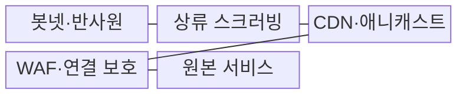
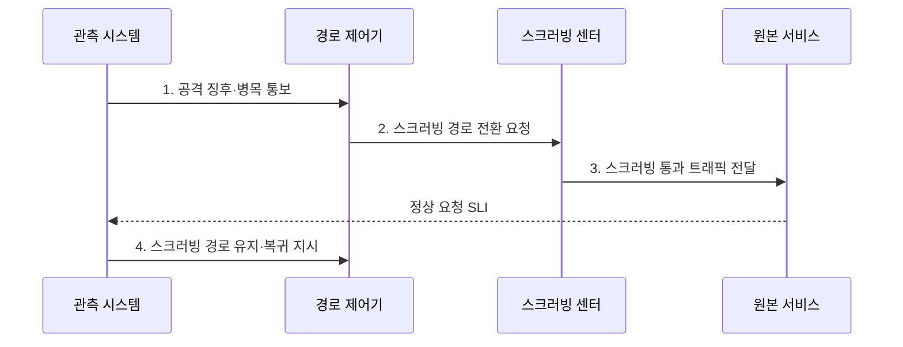

---
sidebar:
  order: 25
  label: "025. DDoS 공격·대응 - SYN Flood·반사 증폭 (DDoS Attack)"
  badge:
    text: "기출 · 30%"
    variant: note
title: "DDoS 공격·대응 - SYN Flood·반사 증폭 (DDoS Attack)"
date: "2026-08-02T10:28:00+09:00"
tags:
  - "notes-security"
weight: 25
extra:
  question_no: "025"
  source_status: "기출"
  source_history: "125회"
  priority: 30
  priority_note: "125회 기출이나 공격유형 단독 반복은 상대적으로 낮음"
---

## Ⅰ. 개요

핵심 용어

- **DDoS**는 다수 공격원이 대역폭·연결 상태·응용 자원을 고갈시켜 정상 서비스 제공을 방해하는 공격이다.
- **봇넷(Botnet)**은 공격자가 원격으로 제어하여 공격에 동원하는 감염 단말 집단이다.

- 정의/개념: 다수 공격원이 **회선·연결 상태·응용 자원**을 고갈시켜 서비스를 방해하는 공격
- 배경/필요성: 원본 앞단 장비만으로는 **상류 회선 포화 방어 불가**

### 쉽게 이해하기 (학습용)

- 가짜 요청이 자원을 선점해 정상 서비스를 막는 공격이다

## Ⅱ. 특징

핵심 용어

- **반사 증폭**은 피해자 주소를 위조해 요청보다 큰 응답을 피해자에게 집중시키는 공격이다.
- **L4**는 포트·연결 상태를, **L7**은 HTTP 등 서비스 요청 내용을 처리하는 계층이다.

- **대역폭형**은 **봇넷·반사 증폭**으로 회선을 포화시킨다.
- **프로토콜형**은 SYN 등 연결 상태표를 고갈시킨다.
- **응용형**의 고비용 HTTP 반복과 CPU·DB 고갈

### 쉽게 이해하기 (학습용)

- 공격량보다 정상 요청의 성공률을 지키는 것이 중요하다

## Ⅲ. 구조 및 구성요소

핵심 용어

- **스크러빙**은 대규모 트래픽에서 공격 흐름을 제거하고 정상 트래픽만 원본으로 전달한다.
- **애니캐스트·CDN**은 트래픽과 요청 처리를 여러 네트워크 거점으로 분산한다.
- **WAF**는 HTTP 요청의 웹·API 공격 문맥을 분석하여 차단한다.

| 구성요소 | 책임 |
|:---|:---|
| 봇넷·반사원 | **분산 공격 트래픽 생성** |
| 상류 스크러빙 | **원본 회선 전 공격 제거** |
| CDN·애니캐스트 | **트래픽을 다수 거점에 분산** |
| WAF·연결 보호 | **웹 요청·연결 상태 선별** |
| 원본 서비스 | **정상 요청 최종 처리** |

### 쉽게 이해하기 (학습용)

- 서비스 앞단에서 공격을 걷어내고 정상 요청만 전달한다

## Ⅳ. 흐름도

핵심 용어

- **SLI**는 정상 요청 성공률·응답시간 등 실제 서비스 수준을 측정하는 지표다.

**동작 원리**

1. **공격 징후·병목 통보**: 공격 계층과 고갈 자원 정보 제공
2. **스크러빙 경로 전환 요청**: 상류 경로를 스크러빙 센터로 전환
3. **스크러빙 통과 트래픽 전달**: 공격 흐름 제거 후 정상 요청 제공
4. **스크러빙 경로 유지·복귀 지시**: 정상 요청 SLI에 따른 경로 조정

### 쉽게 이해하기 (학습용)

- 병목보다 앞선 상류 구간에서 공격량을 먼저 줄여야 한다

## Ⅴ. 종류 및 비교

핵심 용어

- **대역폭형·프로토콜형·응용형**은 각각 회선 용량, TCP 연결 상태, CPU·DB 같은 응용 자원을 고갈시킨다.

| DDoS 공격 유형 | 대역폭형 | 프로토콜형 | 응용형 |
|:---|:---|:---|:---|
| 적용 기준 | **대량 반사 공격** | **SYN 연결 공격** | **HTTP 기능 반복** |
| 핵심 특징 | **회선 용량 고갈** | **연결 상태 고갈** | **응용 연산 고갈** |
| 한계 | **상류 회선 포화** | **상태표 고갈** | **CPU·DB 병목** |

> 요약: 상류 흡수 및 서비스 요청 선별함

### 쉽게 이해하기 (학습용)

- 회선 공격은 상류망에서 트래픽을 스크러빙 경로로 전환해 흡수해야 한다

## Ⅵ. 실무 고려사항 및 대책

핵심 용어

- **SYN 쿠키**는 서버가 연결 상태를 미리 저장하지 않고 TCP 연결 요청의 정당성을 검증한다.
- **IETF BCP 38**은 출발지 위조 방지 필터링을, **RFC 4732**는 DoS에 견고한 설계 고려사항을 제시한다.

| 문제 | 대책 | 효과 |
|:---|:---|:---|
| **출발지 위조·반사** | **IETF BCP 38 필터링** | **증폭 트래픽** 생성 억제 |
| **자원 고갈 설계** | **IETF RFC 4732 검토** | **대체 공격 경로** 완화 |
| **상류 회선 포화** | **스크러빙 경로 전환·복귀 훈련** | 정상 요청 **가용성** 확보 |
| **SYN 상태표** 고갈 | **SYN 쿠키·연결률 제한** | **연결 자원** 소진 방지 |
| **대응 종료 기준** 부재 | **SLI 성공률·지연 임계치** | 성급한 **원본 경로 복귀** 방지 |

### 쉽게 이해하기 (학습용)

- 공격 중 처음 전환하면 경로 오류가 피해를 더 키울 수 있다

## Ⅶ. 결론

핵심 용어

- **대응 목표**는 단순한 공격량 감소가 아니라 정상 요청의 성공률과 응답시간을 유지하는 것이다.

- 회선은 **상류 스크러빙**, SYN 상태는 **SYN 쿠키**, HTTP는 WAF 적용

### 쉽게 이해하기 (학습용)

- 대응의 최종 목표는 공격량 감소보다 정상 서비스 유지다
