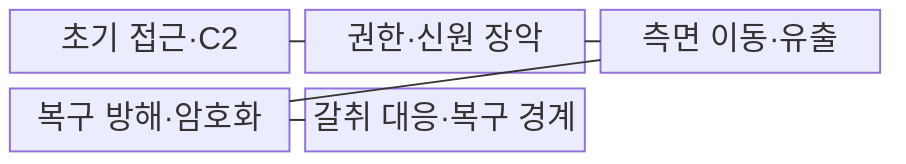
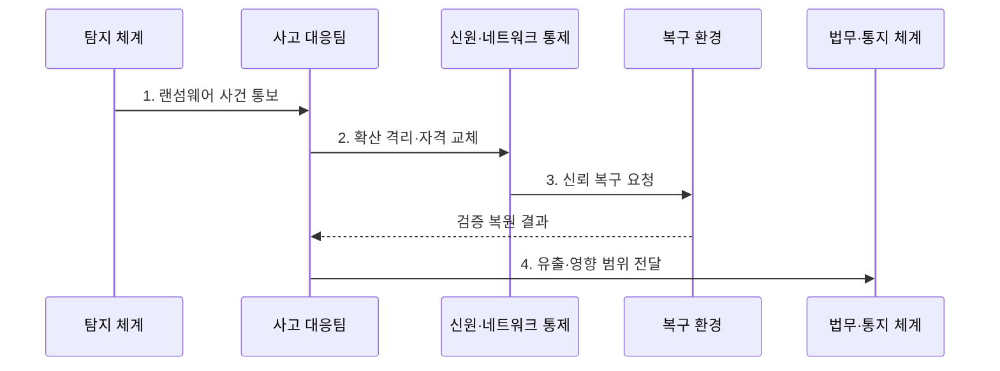

---
sidebar:
  order: 26
  label: "026. 랜섬웨어 공격 분석·대응 (Ransomware)"
  badge:
    text: "기출 · 70%"
    variant: note
title: "랜섬웨어 공격 분석·대응 (Ransomware)"
date: "2026-08-02T10:30:00+09:00"
tags:
  - "notes-security"
weight: 26
extra:
  question_no: "026"
  source_status: "기출"
  source_history: "138회"
  priority: 70
  priority_note: "138회 최신 기출이며 복구·갈취 대응 설계로 확장됨"
---

## Ⅰ. 개요

핵심 용어

- **랜섬웨어(Ransomware)**는 데이터 암호화·유출·서비스 방해를 이용해 금전을 요구하는 악성코드와 침해 활동이다.

- 정의/개념: **랜섬웨어**는 데이터 암호화•유출과 서비스 방해를 이용해 피해 조직에 금전을 요구하는 **악성코드 기반 갈취 침해 활동**
- 배경/필요성: 파일 백업만으로는 탈취 신원과 **유출 피해 해소 불가**

#### 한줄 요약

- 랜섬웨어는 파일을 잠그는 순간 시작되는 공격이 아니라 그전에 관리자 계정과 백업을 장악하고 데이터를 빼낸 뒤 마지막에 잠금 화면을 보여 주는 침해다.

## Ⅱ. 특징

핵심 용어

- **초기 접근·권한 상승·측면 이동**은 내부 진입에서 관리자 권한 획득과 다른 자원으로의 확산까지 이어지는 공격 단계다.
- **C2**는 공격자가 침해 장비에 원격 명령을 전달하고 실행 결과를 받는 통신이다.

- **초기 접근·권한 상승·측면 이동**으로 관리·백업 권한을 장악한다.
- **유출 후 암호화**로 복구와 공개 협박을 동시에 압박한다.
- **보안 도구·로그·섀도 복사본** 선제 무력화로 탐지·복구를 방해한다.

#### 한줄 요약

- 백업으로 파일을 되살려도 공격자가 가져간 문서와 계정 비밀은 되돌아오지 않으므로 유출과 신원 침해를 별도로 처리해야 한다.

## Ⅲ. 구조 및 구성요소

핵심 용어

- **복구 신뢰 경계**는 운영 계정·관리면과 분리해 백업과 복구 권한을 보호하는 영역이다.
- **불변 백업**은 보존 기간 동안 수정·삭제할 수 없고, **오프라인 백업**은 평상시 운영망과 연결되지 않는다.

| 구성요소 | 책임 |
|:---|:---|
| 초기 접근·C2 | **침투 경로·원격 명령 유지** |
| 권한·신원 장악 | **관리자·서비스 계정 탈취** |
| 측면 이동·유출 | **중요 자산 탐색·데이터 반출** |
| 복구 방해·암호화 | **보안·백업 훼손 후 자산 잠금** |
| 갈취 대응·복구 경계 | **통지·수사·불변 백업** 보호 |

#### 한줄 요약

- 공격자는 진입점에서 관리자와 백업까지 이동하고 방어자는 운영 환경과 분리된 복구 경계로 그 확산을 끊고 시스템을 되살린다.

## Ⅳ. 흐름도

핵심 용어

- **IOC**는 악성 파일·주소·계정 행위 등 시스템 침해를 식별하는 관측 흔적이다.
- **신뢰 복구**는 공격 통신과 탈취 자격을 먼저 끊은 뒤 검증된 백업을 깨끗한 관리면에서 복원하는 절차다.

**동작 원리**

1. **랜섬웨어 사건 통보**: 암호화·유출·C2 **IOC** 확인
2. **확산 격리·자격 교체**: C2 차단과 관리자 비밀 폐기
3. **신뢰 복구 요청**: 깨끗한 관리면과 백업 선택
4. **유출·영향 범위 전달**: 통지·수사·고객 대응용 증거 제공

#### 한줄 요약

- 감염 장비만 복원하면 공격 계정이 다시 암호화할 수 있으므로 먼저 통신과 자격을 끊고 깨끗한 관리면에서 검증된 백업을 복원한다.

## Ⅴ. 종류 및 비교

핵심 용어

- **암호화 갈취**는 데이터 잠금, **이중 갈취**는 잠금과 유출 협박, **다중 갈취**는 서비스 방해·고객 압박까지 결합한다.

| 랜섬웨어 갈취 방식 | 랜섬웨어 공통 | 암호화 갈취 | 이중 갈취 | 다중 갈취 |
|:---|:---|:---|:---|:---|
| 적용 기준 | **사고 통합 대응** | **복원 가능성** 중심 분석 | **유출·통지** 동시 대응 | **법무·평판·가용성** 통합 |
| 핵심 특징 | **업무 중단·금전 요구** | **데이터 잠금** 중심 | **잠금·유출 협박** | **방해·고객 압박** 결합 |
| 한계 | **신원·백업** 동시 침해 | **복호화 실패·재감염** | 유출 데이터 **회수 불가** | **제3자 피해·압박** 확대 |

> 요약: 암호화·유출·방해가 갈취 범위를 확장

#### 한줄 요약

- 암호화형은 복구를 막고 이중형은 공개 협박을 더하며 다중형은 서비스 방해와 고객 압박까지 더해 지불 압력을 키운다.

## Ⅵ. 실무 고려사항 및 대책

핵심 용어

- **NIST IR 8374 Rev. 1**은 CSF 2.0 기반 랜섬웨어 위험 관리 성과를 제시한다.
- **NIST SP 800-61 Rev. 3**은 탐지·대응·복구를 위험 관리에 통합하는 사고대응 지침이다.

| 문제 | 대책 | 효과 |
|:---|:---|:---|
| **랜섬웨어 위험 관리** | **NIST IR 8374 Rev. 1** | **CSF 2.0 전주기 대응** |
| **사고 대응·복구** | **NIST SP 800-61 Rev. 3** | **탐지·격리·복구** 연계 |
| **운영·백업 동시 장악** | **복구 계정 분리·불변 백업** | **신뢰 복구 기반** 보존 |
| **백업의 운영망 노출** | **오프라인 백업 격리** | 원격 **삭제·암호화** 차단 |

#### 한줄 요약

- 운영 관리자 계정이 탈취돼도 같은 권한으로 백업을 삭제하지 못하게 복구 계정을 분리한다.

## Ⅶ. 결론

핵심 용어

- **갈취 대응**은 파일 복구뿐 아니라 유출 범위 확인, 법적 통지, 수사와 고객 대응을 함께 수행한다.

- C2·계정 격리 후 **신뢰 백업 복원**, 유출 증거는 **통지·수사** 연계

#### 한줄 요약

- 랜섬웨어 대응은 잠긴 파일을 푸는 작업이 아니라 공격자가 차지한 신뢰를 걷어 내고 깨끗한 환경에서 업무와 데이터 책임을 함께 복구하는 과정이다.
