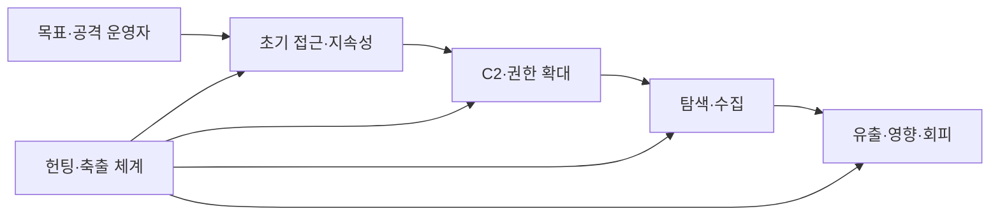
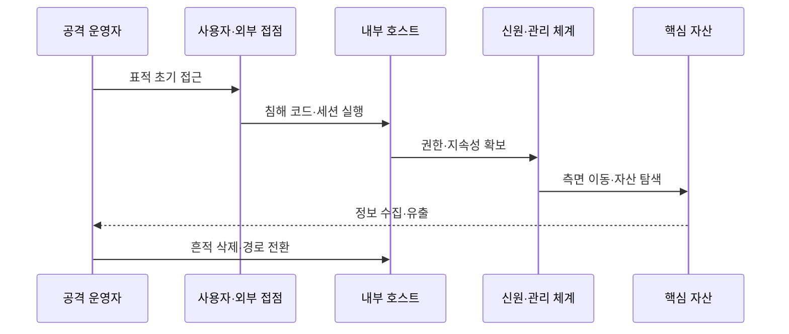

---
sidebar:
  order: 27
  label: "027. APT 고급 지속 위협 (Advanced Persistent Threat)"
  badge:
    text: "기출 · 70%"
    variant: note
title: "APT 고급 지속 위협 (Advanced Persistent Threat)"
date: "2026-07-27T23:59:59+09:00"
tags:
  - "notes-security"
weight: 27
extra:
  question_no: "027"
  source_status: "기출"
  source_history: "128회, 134회"
  priority: 70
  priority_note: "128·134회 반복과 장기 공격 분석 활용성이 높음"
---

## 미리 알고가기

- **고급 지속 위협(Advanced Persistent Threat, APT)**: '에이피티'로 읽고 영문 머리글자로 고도화된 장기 표적 침해임을 표시하며 정보 탈취·영향을 시도
- **캠페인(Campaign)**: 하나의 목적 아래 여러 침투·정찰·수집 활동을 장기간 묶어 수행하는 공격 작전
- **초기 접근(Initial Access)**: 공격자가 피싱·취약점·탈취 계정으로 내부에 처음 진입하는 단계
- **지속성(Persistence)**: 시스템이 재시작되거나 자격이 바뀌어도 공격자가 다시 접근하도록 통로를 유지하는 성질
- **권한 상승(Privilege Escalation)**: 일반 권한에서 관리자 등 더 높은 권한을 얻는 공격 행위
- **측면 이동(Lateral Movement)**: 침해한 장비에서 다른 내부 자원으로 공격 범위를 넓히는 행위
- **명령·제어(Command and Control, C2)**: '시 투'로 읽고 영문 머리글자 C가 두 번임을 숫자 2로 표시하며 침해 장비에 원격 명령을 전달
- **침해지표(Indicator of Compromise, IoC)**: '아이오시'로 읽고 영문 머리글자로 침해 흔적임을 표시하며 악성 파일·주소·계정 행위를 식별
- **전술·기법·절차(Tactics, Techniques, and Procedures, TTP)**: '티티피'로 읽고 세 영문 머리글자로 공격자가 목적을 달성하는 반복 행동 패턴을 표시
- **마이터 공격 전술·기법 지식 기반(MITRE Adversarial Tactics, Techniques, and Common Knowledge, MITRE ATT&CK)**: '마이터 어택'으로 읽고 `&`로 전술·기법을 연결한 표기로 실제 공격 행동 분류를 표시
- **위협 헌팅(Threat Hunting)**: 기존 경보를 기다리지 않고 가설을 세워 숨은 침해 증거를 능동적으로 찾는 활동
- **귀속(Attribution)**: 공격 인프라·도구·행동·정보를 종합해 배후 주체를 추정하는 분석
- **축출(Eradication)**: 공격자의 계정·악성코드·지속 통로를 환경에서 제거하는 사고 대응 단계
- **핵심 자산(Crown Jewel)**: 조직 임무에 가장 큰 영향을 주는 중요 데이터·시스템·신원

## Ⅰ. 개요

- 정의/개념: 특정 목표를 향해 **장기간 은밀하게 지속하는 표적 침해**
- **배경/필요성**: 단일 IoC·사건 분석은 **반복 TTP·대체 경로 연결 곤란**

### 쉽게 이해하기 (학습용)

- APT는 한 번 침입하고 떠나는 공격이 아니라 목표 정보를 얻을 때까지 계정과 통로를 바꾸며 오래 숨어 있는 작전이다.

## Ⅱ. 특징

- **표적 정찰·맞춤 초기 접근**으로 특정 핵심 자산을 겨냥한다.
- **지속성·권한 상승·측면 이동**을 반복해 장기 체류한다.
- **다중 C2·계정·정상 도구**로 탐지를 회피하고 경로를 전환한다.

### 쉽게 이해하기 (학습용)

- 유명 악성코드 하나보다 같은 목적을 향해 계정·서버·관리 도구를 반복 사용하는 행동의 연결이 더 중요한 단서다.

## Ⅲ. 구성요소 및 구조

| 설계 요소 | 설명 |
|:---|:---|
| 목표·공격 운영자 | **표적별 인프라·계정 준비** |
| 초기 접근·지속성 | **침투·재접속 통로 확보** |
| C2·권한 확대 | **원격 명령·관리자 권한 획득** |
| 탐색·수집 | **핵심 자산 발견·정보 집계** |
| 유출·영향·회피 | **반출·파괴·흔적 삭제** |
| 헌팅·축출 체계 | **연결 행동 탐지·동시 제거** |

> 요약: 공격 경로와 방어 축출 체계를 함께 연결

### 쉽게 이해하기 (학습용)

- 공격자는 진입점에서 신원과 호스트를 거쳐 핵심 자산으로 이동하고 방어자는 각 단계의 흔적을 하나의 시간선으로 묶어 본다.

## Ⅳ. 원리 및 절차 흐름도

| 절차 | 설명 |
|:---|:---|
| 표적 초기 접근 | 피싱·취약점·탈취 계정 사용 |
| 침해 코드·세션 실행 | 내부 거점과 C2 연결 생성 |
| 권한·지속성 확보 | 관리자 권한과 재접속 수단 획득 |
| 측면 이동·자산 탐색 | 계정·서버를 거쳐 목표 발견 |
| 정보 수집·유출 | 자료를 모아 외부로 반출 |
| 흔적 삭제·경로 전환 | 탐지 회피와 대체 통로 유지 |

> 요약: APT는 경로를 바꾸며 핵심 자산까지 반복 이동한다.

### 쉽게 이해하기 (학습용)

- 한 서버를 막아도 공격자는 이미 만든 다른 계정과 관리 통로로 이동할 수 있으므로 모든 단계를 연결해 동시에 제거해야 한다.

## Ⅴ. 종류 및 비교

| 위협 행위 유형 | APT | 기회주의 범죄 | 내부자 위협 |
|:---|:---|:---|:---|
| 적용 기준 | 반복 TTP와 캠페인 추적 | 대량 피싱·노출 취약점 대응 | 사용자 행위와 업무 맥락 분석 |
| 핵심 특징 | 특정 목표·장기 맞춤 침투 | 다수 대상·단기 공격 | 합법 권한 내부 오용 |
| 한계 | 은닉·경로 전환·장기 체류 | 빠른 대량 피해 | 정상 행위와 구분 곤란 |

> 요약: 목표·기간·권한 출처로 위협을 구분

### 쉽게 이해하기 (학습용)

- 기회주의 공격은 열린 문을 많이 찾고 APT는 정한 목표에 맞는 길을 오래 만들며 내부자는 원래 가진 열쇠를 악용한다.

## Ⅵ. 실무 사례

1. 핵심 자산은 **신원·호스트·C2 장기 로그 연결**
2. 축출 시 **계정·호스트·C2 통로 동시 제거**

### 쉽게 이해하기 (학습용)

- 장기 로그를 연결해 수개월 전 초기 접근과 현재의 C2·유출 행동을 같은 캠페인으로 추적한다.
- 악성 파일만 지우지 않고 공격자가 확보한 계정·호스트·C2 통로를 같은 시점에 제거한다.

## Ⅶ. 결론

- 반복 TTP·대체 경로는 **APT 캠페인 단위로 추적**

### 쉽게 이해하기 (학습용)

- APT 방어의 핵심은 공격자 이름을 맞히는 것이 아니라 핵심 자산으로 이어지는 반복 행동과 대체 경로를 찾아 한 번에 끊는 것이다.
