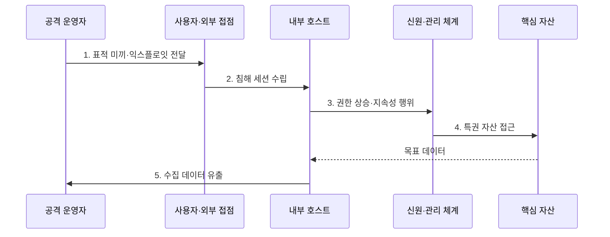

---
sidebar:
  order: 27
  label: "027. APT 고급 지속 위협 (Advanced Persistent Threat)"
  badge:
    text: "기출 · 70%"
    variant: note
title: "APT 고급 지속 위협 (Advanced Persistent Threat)"
date: "2026-08-02T10:32:00+09:00"
tags:
  - "notes-security"
weight: 27
extra:
  question_no: "027"
  source_status: "기출"
  source_history: "128회, 134회"
  priority: 70
  priority_note: "128·134회 반복과 장기 공격 분석 활용성이 높음"
---

## Ⅰ. 개요

핵심 용어

- **APT**는 특정 목표를 대상으로 장기간 은밀하게 접근을 유지하며 정보 탈취나 시스템 영향을 시도하는 침해 활동이다.
- **캠페인**은 하나의 목적 아래 여러 침투·정찰·수집 활동을 장기간 묶어 수행하는 공격 작전이다.

- 정의/개념: **APT**는 특정 조직이나 자산을 목표로 장기간 은밀한 접근을 유지하며 정보를 탈취하거나 시스템에 영향을 주는 **표적 침해 활동**
- 배경/필요성: 단일 IoC·호스트 대응으로는 **반복 TTP·대체 경로 연결 불가**

#### 한줄 요약

- APT는 한 번 침입하고 떠나는 공격이 아니라 목표 정보를 얻을 때까지 계정과 통로를 바꾸며 오래 숨어 있는 작전이다.

## Ⅱ. 특징

핵심 용어

- **지속성·권한 상승·측면 이동**은 재접속 통로 확보, 관리자 권한 획득, 다른 내부 자원으로의 확산 행동이다.
- **C2**는 공격자가 침해 장비에 원격 명령을 전달하고 실행 결과를 받는 통신이다.

- **표적 정찰·맞춤 초기 접근**으로 특정 핵심 자산을 겨냥한다.
- **지속성·권한 상승·측면 이동**을 반복해 장기 체류한다.
- **다중 C2·계정·정상 도구**로 탐지를 회피하고 경로를 전환한다.

#### 한줄 요약

- 유명 악성코드 하나보다 같은 목적을 향해 계정·서버·관리 도구를 반복 사용하는 행동의 연결이 더 중요한 단서다.

## Ⅲ. 구조 및 구성요소

핵심 용어

- **핵심 자산(Crown Jewel)**은 조직 임무에 가장 큰 영향을 주는 중요 데이터·시스템·신원이다.
- **위협 헌팅**은 기존 경보를 기다리지 않고 가설을 세워 숨은 침해 증거를 능동적으로 찾는 활동이다.

| 구성요소 | 책임 |
|:---|:---|
| 공격자 인프라 | **전달지·C2·유출 거점 운영** |
| C2·전달 채널 | **외부 명령과 도구·결과 교환** |
| 침해 계정·호스트 | **내부 접근·지속성·측면 이동 거점** |
| 핵심 업무 자산 | **공격자가 수집·유출·파괴하려는 대상** |
| 가시성·헌팅·축출 | **공격 시간선 연결·거점 제거** |

#### 한줄 요약

- 공격자는 진입점에서 신원과 호스트를 거쳐 핵심 자산으로 이동하고 방어자는 각 단계의 흔적을 하나의 시간선으로 묶어 본다.

## Ⅳ. 흐름도

핵심 용어

- **초기 접근**은 피싱·취약점·탈취 계정으로 내부에 처음 진입하는 단계다.
- **축출(Eradication)**은 공격자의 계정·악성코드·지속 통로를 환경에서 제거하는 대응 단계다.

**동작 원리**

1. **표적 미끼·익스플로잇 전달**: 피싱·취약점·탈취 계정 기반 진입
2. **침해 세션 수립**: 내부 거점과 C2 연결 생성
3. **권한 상승·지속성 행위**: 관리자 권한과 재접속 수단 확보
4. **특권 자산 접근**: 침해 계정으로 핵심 데이터 접근
5. **수집 데이터 유출**: 내부 거점에서 공격자 인프라로 정보 반출

#### 한줄 요약

- 한 서버를 막아도 공격자는 이미 만든 다른 계정과 관리 통로로 이동할 수 있으므로 모든 단계를 연결해 동시에 제거해야 한다.

## Ⅴ. 종류 및 비교

핵심 용어

- **APT·기회주의 범죄·내부자 위협**은 각각 장기 표적 침투, 다수 대상 단기 공격, 합법 권한의 내부 오용을 뜻한다.

| 위협 행위 유형 | APT | 기회주의 범죄 | 내부자 위협 |
|:---|:---|:---|:---|
| 적용 기준 | **반복 TTP·캠페인** 추적 | **대량 피싱·노출 취약점** 대응 | **사용자 행위·업무 맥락** 분석 |
| 핵심 특징 | **특정 목표·장기 침투** | **다수 대상·단기 공격** | **합법 권한 내부 오용** |
| 한계 | **은닉·경로 전환** | **빠른 대량 피해** | 정상 행위와 **구분 곤란** |

> 요약: 목표·기간·권한 출처로 위협을 구분

#### 한줄 요약

- 기회주의 공격은 열린 문을 많이 찾고 APT는 정한 목표에 맞는 길을 오래 만들며 내부자는 원래 가진 열쇠를 악용한다.

## Ⅵ. 실무 고려사항 및 대책

핵심 용어

- **IoC**는 관측된 침해 흔적이고, **TTP**는 공격자가 목적 달성을 위해 반복적으로 사용하는 행동 방식이다.
- **MITRE ATT&CK**은 실제 공격 행동을 TTP로 분류하며, **NIST SP 800-61 Rev. 3**은 사고 대응을 위험 관리에 통합한다.

| 문제 | 대책 | 효과 |
|:---|:---|:---|
| **반복 공격 행동** | **IoC·ATT&CK TTP 매핑** | 경로 변경에도 **캠페인 추적** |
| **장기 사고 대응** | **NIST SP 800-61 Rev. 3** | **탐지·축출·복구** 연계 |
| **대체 계정·C2** | **신원·호스트·망 로그 연결** | **잔존 통로** 동시 제거 |

#### 한줄 요약

- 장기 로그를 연결해 수개월 전 초기 접근과 현재의 C2·유출 행동을 같은 캠페인으로 추적한다.

## Ⅶ. 결론

핵심 용어

- **동시 축출**은 대체 계정·C2·지속 통로를 하나의 공격 시간선으로 연결해 함께 제거하는 원칙이다.

- 반복 TTP로 **캠페인 추적**, 대체 계정·C2는 **동시 축출**

#### 한줄 요약

- APT 방어의 핵심은 공격자 이름을 맞히는 것이 아니라 핵심 자산으로 이어지는 반복 행동과 대체 경로를 찾아 한 번에 끊는 것이다.
