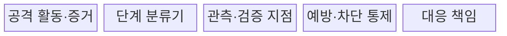
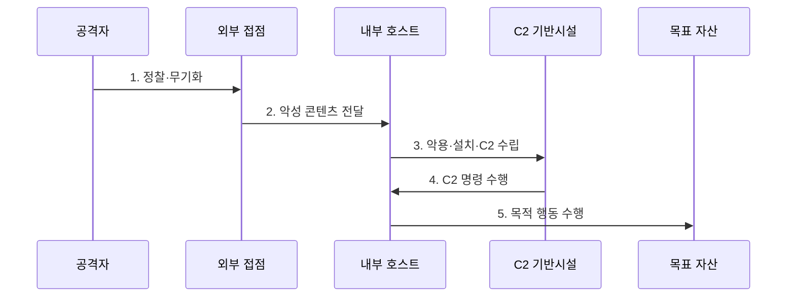

---
sidebar:
  order: 28
  label: "028. 사이버 킬체인 (Cyber Kill Chain)"
  badge:
    text: "기출 · 50%"
    variant: note
title: "사이버 킬체인 (Cyber Kill Chain)"
date: "2026-07-27T23:59:59+09:00"
tags:
  - "notes-security"
weight: 28
extra:
  question_no: "028"
  source_status: "기출"
  source_history: "137회"
  priority: 50
  priority_note: "137회 기출이며 ATT&CK 비교·대응설계에 재사용됨"
---

## 미리 알고가기

- **록히드마틴 사이버 킬체인(Lockheed Martin Cyber Kill Chain)**: 침해 캠페인을 정찰부터 목적 달성까지 7단계로 구분하여 단계별 차단 지점을 찾는 공식 공격 분석 모델이다.
- **정찰(Reconnaissance)**: 공격 대상의 사람·기술·자산·노출 정보를 조사하는 단계다.
- **무기화(Weaponization)**: 취약점 악용 코드와 악성 실행 파일을 공격 목적에 맞게 결합하는 단계다.
- **전달(Delivery)**: 악성 파일·링크·웹 콘텐츠를 목표 환경에 보내는 단계다.
- **악용(Exploitation)**: 사용자 실행이나 취약점으로 공격 코드를 작동시키는 단계다.
- **설치(Installation)**: 악성코드와 지속성 수단을 침해 시스템에 배치하는 단계다.
- **명령·제어(Command and Control, C2)**: 공격자가 침해 장비에 원격 명령을 전달하고 실행 결과를 수신하는 단계다.
- **목적 달성(Actions on Objectives)**: 정보 유출·파괴·감시 등 최종 공격 목표를 수행하는 단계다.
- **MITRE ATT&CK(Adversarial Tactics, Techniques, and Common Knowledge)**: 실제 관찰된 공격 행동을 전술·기법·절차로 분류한 공식 지식체계다.
- **전술·기법·절차(Tactics, Techniques, and Procedures, TTP)**: 공격자가 목적을 달성하기 위해 반복적으로 사용하는 행동 방식이다.
- **캠페인(Campaign)**: 하나의 목적 아래 여러 침투·정찰·수집 활동을 묶어 수행하는 공격 작전이다.
- **사고 대응 수명주기(Incident Response Lifecycle)**: 준비·탐지·격리·제거·복구·개선을 이어 수행하는 대응 과정이다.
- **유효 계정(Valid Account)**: 정상적으로 발급됐지만 공격자가 탈취하거나 오용하는 계정이다.

## Ⅰ. 개요

- 정의/개념: 공격 캠페인을 **정찰부터 목적 달성까지 7단계로 분석**
- **배경/필요성**: **공격 문맥·다단계 차단 설계**

### 쉽게 이해하기 (학습용)

- 공격 준비부터 정보 유출까지 여러 관문으로 나눠 앞 관문을 놓쳐도 다음 관문에서 다시 발견하고 끊도록 설계한다.

## Ⅱ. 특징

- **7단계 공격 흐름**으로 캠페인의 진행 문맥을 연결한다.
- **단계별 예방·탐지·대응**을 배치해 독립 차단 기회를 만든다.
- **선형 모델**이므로 유효 계정·반복·우회 경로는 별도 보완한다.

### 쉽게 이해하기 (학습용)

- 공격자가 항상 일곱 칸을 순서대로 한 번만 지나지는 않으므로 킬체인은 절대 순서표가 아니라 방어 기회를 찾는 지도다.

## Ⅲ. 구조 및 구성요소

| 설계 요소 | 설명 |
|:---|:---|
| 공격 활동·증거 | **로그·파일·통신에서 공격 행동 관측** |
| 단계 분류기 | **행동을 킬체인 단계와 공격 목표에 연결** |
| 관측·검증 지점 | 단계별 로그·통제 효과 확인 |
| 예방·차단 통제 | **단계 진행을 끊을 보안 통제 배치** |
| 대응 책임 | **경보 검증·차단·복구 담당과 승인 지정** |

> 요약: 공격 단계를 관측 지점·차단 통제·대응 책임에 연결

### 쉽게 이해하기 (학습용)

- 공격 흐름의 각 묶음에 실제 로그와 차단 수단을 연결해 한 단계의 실패가 바로 최종 피해가 되지 않게 한다.

## Ⅳ. 흐름도

| 절차 | 설명 |
|:---|:---|
| 정찰·무기화 | 표적 조사·공격 도구 결합 |
| 악성 콘텐츠 전달 | 메일·웹·매체로 목표에 전송 |
| 악용·설치·C2 수립 | 실행·지속성·외부 통로 확보 |
| C2 명령 수행 | 원격 명령과 결과 교환 |
| 목적 행동 수행 | 수집·유출·파괴 목표 달성 |

> 요약: 각 공격 단계에 독립된 차단 기회를 둔다.

### 쉽게 이해하기 (학습용)

- 악성 메일을 놓쳐도 실행 통제에서 막고 그것도 놓치면 외부 C2 통신이나 데이터 유출 단계에서 다시 끊을 수 있어야 한다.

## Ⅴ. 종류 및 비교

| 보안 분석 모델 | 사이버 킬체인 | MITRE ATT&CK | 사고 대응 수명주기 |
|:---|:---|:---|:---|
| 적용 기준 | 조기 차단 지점 설계 | 헌팅·탐지 규칙 설계 | 격리·제거·복구 운영 |
| 핵심 특징 | **캠페인 단계 흐름 분석** | **세부 공격 행동 분류** | 탐지 후 대응 활동 관리 |
| 한계 | 선형 순서 과도한 단순화 | 시간·캠페인 문맥 부족 | 공격 기법 세부성 부족 |

> 요약: 흐름·행동·대응 관점에 따라 도구 선택

### 쉽게 이해하기 (학습용)

- 킬체인은 범행 순서 지도, ATT&CK은 수법 사전, 대응 수명주기는 사고를 수습하는 작업 절차다.

## Ⅵ. 실무 고려사항 및 대책

| 고려사항 | 대책 | 효과 |
|:---|:---|:---|
| 공격 캠페인 흐름 | **록히드마틴 킬체인 7단계** | 단계별 차단 기회 식별 |
| 세부 공격 행동 | **MITRE ATT&CK TTP 매핑** | 선형 모델 사각지대 보완 |
| 통제 실효성 | **로그·차단·소유자 모의훈련** | 미탐·책임 공백 개선 |

### 쉽게 이해하기 (학습용)

- 각 단계에 제품 이름만 적지 않고 어떤 증거를 누가 보고 어디서 차단할지 책임을 연결한다.

## Ⅶ. 결론

- **공격흐름·TTP세부성·대응목적**으로 분석모델을 결정한다.

### 쉽게 이해하기 (학습용)

- 사이버 킬체인은 공격 순서를 외우는 표가 아니라 여러 지점에서 공격 진행을 끊고 놓친 관문을 실제 시험으로 찾는 설계 도구다.
