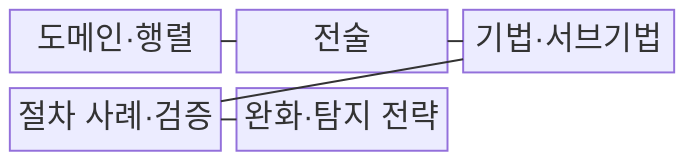
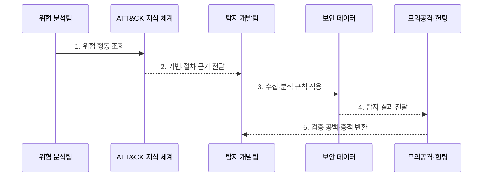

---
sidebar:
  order: 29
  label: "029. MITRE ATT&CK 프레임워크 (MITRE ATT&CK)"
  badge:
    text: "기출 · 50%"
    variant: note
title: "MITRE ATT&CK 프레임워크 (MITRE ATT&CK)"
date: "2026-07-30T19:00:00+09:00"
tags:
  - "notes-security"
weight: 29
extra:
  question_no: "029"
  source_status: "기출"
  source_history: "137회"
  priority: 50
  priority_note: "137회 기출이며 탐지규칙·헌팅 운영으로 확장 가능함"
---

## 미리 알고가기

- **MITRE ATT&CK(Adversarial Tactics, Techniques, and Common Knowledge)**: 실제 관찰된 공격 행동을 전술·기법·절차와 대응 정보로 분류한 공식 지식체계다.
- **전술(Tactic)**: 공격자가 특정 시점에 달성하려는 목적이다.
- **기법(Technique)**: 전술의 목적을 달성하기 위해 사용하는 공격 행위다.
- **서브기법(Sub-Technique)**: 하나의 기법을 더 구체적인 수법으로 나눈 단위다.
- **절차 사례(Procedure Example)**: 특정 공격 그룹·도구·캠페인이 기법을 실제 사용한 관찰 사례다.
- **완화(Mitigation)**: 공격 행위의 성공 가능성이나 피해를 줄이는 예방 통제다.
- **탐지 전략(Detection Strategy)**: 특정 공격 행동을 어떤 관점과 데이터로 찾을지 정한 방어 접근이다.
- **분석 규칙(Analytics)**: 로그 조건·상관관계·통계로 공격 행동을 판별하는 구현 논리다.
- **기업 도메인(Enterprise Domain)**: 기업 단말·서버·신원·클라우드 환경의 공격 행동을 분류한 지식 영역이다.
- **모바일 도메인(Mobile Domain)**: 모바일 기기와 응용의 공격 행동을 분류한 지식 영역이다.
- **산업제어시스템 도메인(Industrial Control Systems Domain, ICS Domain)**: 산업 공정과 제어 설비의 공격 행동을 분류한 지식 영역이다.
- **정보기술(Information Technology, IT)**: 정보의 생성·처리·저장과 업무 서비스를 지원하는 기술 환경이다.
- **운영기술(Operational Technology, OT)**: 물리 공정과 설비를 감시·제어하는 기술 환경이다.
- **위협 헌팅(Threat Hunting)**: 기존 경보를 기다리지 않고 가설을 세워 숨은 침해 증거를 능동적으로 찾는 활동이다.
- **커버리지(Coverage)**: 선정한 공격 행동 중 실제 데이터·탐지·대응으로 검증한 범위다.

## Ⅰ. 개요

- 정의/개념: 실제 관찰 기반의 **공격 전술·기법·절차 지식 체계**
- 배경/필요성: **행동 기반 탐지 커버리지 검증**

### 쉽게 이해하기 (학습용)

- ATT&CK은 공격자가 실제로 사용한 수법을 같은 언어로 정리해 위협 분석가와 탐지 개발자 및 대응팀이 연결해서 일하게 한다.

## Ⅱ. 특징

- **전술→기법→서브기법**으로 공격 목적과 행동을 계층화한다.
- **절차 사례·완화·탐지 전략**을 기법별로 연결한다.
- **Enterprise·Mobile·ICS**의 환경별 범위·관찰 편향

### 쉽게 이해하기 (학습용)

- 기법 번호 옆에 보안 제품 이름만 적어서는 실제로 잡는지 알 수 없고 필요한 로그와 판별 조건 및 대응 결과까지 확인해야 한다.

## Ⅲ. 구조 및 구성요소

| 구성요소 | 책임 |
|:---|:---|
| 도메인·행렬 | **환경별 공격 목적·기법 배치** |
| 전술 | **공격자가 달성하려는 목적** |
| 기법·서브기법 | **목적을 이루는 공격 행동** |
| 절차 사례·검증 | 실제 사용 근거·시험 증적 |
| 완화·탐지 전략 | **예방·관측 접근 연결** |

### 쉽게 이해하기 (학습용)

- 환경과 공격 목적에서 세부 행동을 고르고 실제 사례를 근거로 필요한 통제·로그·탐지 규칙과 시험 결과를 연결한다.

## Ⅳ. 흐름도

1. **위협 행동 조회**: 자산·시나리오에 맞는 기법 선택
2. **기법·절차 근거 전달**: 실제 사용 사례와 변형 확인
3. **수집·분석 규칙 적용**: 필요한 로그와 상관조건 구현
4. **탐지 결과 전달**: 경보·시간선·대응 근거 제공
5. **검증 공백·증적 반환**: 미탐·지연과 시험 결과 기록

### 쉽게 이해하기 (학습용)

- 관심 기법을 고른 뒤 그 행동이 남기는 로그로 규칙을 만들고 공격을 재현해 실제로 잡히는지 확인해야 커버리지로 인정할 수 있다.

## Ⅴ. 종류 및 비교

| ATT&CK 도메인 | 공통 | Enterprise | Mobile | ICS |
|:---|:---|:---|:---|:---|
| 적용 기준 | 위협·탐지 공통 언어 | 단말·서버·신원 방어 | 모바일 권한·센서 방어 | OT 가시성·안전 방어 |
| 핵심 특징 | **전술·기법·절차 분류** | 기업 IT·클라우드 행동 | 모바일 기기·앱 행동 | **공정·제어 설비 행동** |
| 한계 | 목록 채우기식 운영 | 플랫폼별 로그 공백 | 기기 파편화·관측 제한 | 가용성·안전 영향 |

> 요약: 환경별 행동·증거·영향에 맞는 도메인 선택

### 쉽게 이해하기 (학습용)

- 기업 단말과 스마트폰과 공장 제어기는 공격 행동과 남는 증거 및 실패 영향이 다르므로 맞는 도메인을 선택해야 한다.

## Ⅵ. 실무 고려사항 및 대책

| 고려사항 | 대책 | 효과 |
|:---|:---|:---|
| 행동 공통 분류 | **MITRE ATT&CK 기법 ID** | 분석·탐지팀 언어 통일 |
| 목록식 커버리지 | **모의공격 탐지·대응 증적** | 실제 통제 작동 검증 |
| 관찰 편향·로그 공백 | **자사 위협·데이터 우선순위** | 무관한 기법 과투자 방지 |

### 쉽게 이해하기 (학습용)

- 규칙 존재만 확인하지 않고 모의공격으로 경보·조사·차단까지 실제 작동하는지 검증한다.

## Ⅶ. 결론

- **자사위협·데이터·분석규칙·증적**으로 커버리지를 결정한다.

### 쉽게 이해하기 (학습용)

- ATT&CK의 가치는 행렬을 많이 채우는 데 있지 않고 중요한 공격 행동을 실제 데이터에서 찾아 대응할 수 있음을 시험으로 증명하는 데 있다.
