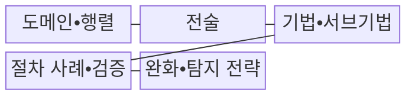
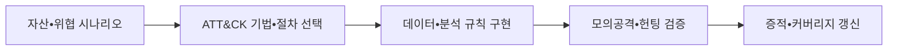

---
sidebar:
  order: 29
  label: "029. MITRE ATT&CK 프레임워크 (MITRE ATT&CK)"
  badge:
    text: "기출 • 50%"
    variant: note
title: "MITRE ATT&CK 프레임워크 (MITRE ATT&CK)"
date: "2026-08-03T08:48:47+09:00"
tags:
  - "notes-security"
weight: 29
extra:
  question_no: "029"
  source_status: "기출"
  source_history: "137회"
  priority: 50
  priority_note: "137회 기출이며 탐지규칙•헌팅 운영으로 확장 가능함"
---

## Ⅰ. 개요

핵심 용어

- **MITRE ATT&CK** 은 실제 관찰된 공격 행동을 전술•기법•절차와 대응 정보로 분류한 공식 지식체계다.
- **커버리지** 는 선정한 공격 행동 중 실제 데이터•탐지•대응으로 검증한 범위다.

- 정의/개념: **MITRE ATT&CK** 은 실제 관찰된 공격 행동을 전술•기법•서브기법•절차 사례와 대응 정보로 분류한 **공격 행동 지식 체계**
- 배경/필요성: 제품•규칙 목록만으로는 실제 공격 행동의 **탐지 커버리지 검증 불가**

#### 한줄 요약

- ATT&CK은 공격자가 실제로 사용한 수법을 같은 언어로 정리해 위협 분석가와 탐지 개발자 및 대응팀이 연결해서 일하게 한다.

## Ⅱ. 특징

핵심 용어

- **전술** 은 공격 목적, **기법** 은 목적 달성 행동, **서브기법** 은 기법을 더 구체화한 수법이다.
- **절차 사례** 는 특정 공격 그룹•도구•캠페인이 기법을 실제 사용한 관찰 사례다.
- **Enterprise•Mobile•ICS** 는 기업 IT•클라우드, 모바일 기기•앱, 산업 제어 환경의 공격 행동을 나눈 ATT&CK 도메인이다.

- **전술→기법→서브기법** 으로 공격 목적과 행동을 계층화한다.
- **절차 사례•완화•탐지 전략** 을 기법별로 연결한다.
- **Enterprise•Mobile•ICS** 의 환경별 범위•관찰 편향

#### 한줄 요약

- 기법 번호 옆에 보안 제품 이름만 적어서는 실제로 잡는지 알 수 없고 필요한 로그와 판별 조건 및 대응 결과까지 확인해야 한다.

## Ⅲ. 구조 및 구성요소

핵심 용어

- **완화** 는 공격 성공 가능성을 낮추는 예방 통제이고, **탐지 전략** 은 공격 행동을 어떤 데이터와 관점으로 찾을지 정한다.
- **분석 규칙** 은 로그 조건•상관관계•통계로 공격 행동을 판별하는 구현 논리다.

| 구성요소 | 책임 |
|:---|:---|
| 도메인•행렬 | **환경별 공격 목적•기법 배치** |
| 전술 | **공격자가 달성하려는 목적** |
| 기법•서브기법 | **목적을 이루는 공격 행동** |
| 절차 사례•검증 | 실제 **사용 근거•시험 증적** |
| 완화•탐지 전략 | **예방•관측 접근 연결** |

#### 한줄 요약

- 환경과 공격 목적에서 세부 행동을 고르고 실제 사례를 근거로 필요한 통제•로그•탐지 규칙과 시험 결과를 연결한다.

## Ⅳ. 흐름도

핵심 용어

- **위협 헌팅** 은 기존 경보를 기다리지 않고 가설을 세워 숨은 침해 증거를 능동적으로 찾는 활동이다.
- **모의공격 검증** 은 공격 행동을 재현해 데이터•규칙•대응이 실제 작동하는지 확인한다.

**동작 원리**

- **위협 행동 선택**: 자산•시나리오에 맞는 기법•절차 선정
- **데이터•분석 규칙 구현**: 필요한 로그와 상관 조건 구성
- **모의공격•헌팅 검증**: 행동 재현 기반 탐지•대응 작동 확인
- **증적•커버리지 갱신**: 미탐•지연•시험 결과와 보완 책임 기록

#### 한줄 요약

- 관심 기법을 고른 뒤 그 행동이 남기는 로그로 규칙을 만들고 공격을 재현해 실제로 잡히는지 확인해야 커버리지로 인정할 수 있다.

## Ⅴ. 종류 및 비교

핵심 용어

- **Enterprise•Mobile•ICS 도메인** 은 각각 기업 IT•클라우드, 모바일 기기•앱, 산업 공정•제어 설비의 공격 행동을 분류한다.
- **OT** 는 물리 공정과 설비를 감시•제어하는 기술 환경이다.

| ATT&CK 도메인 | 공통 | Enterprise | Mobile | ICS |
|:---|:---|:---|:---|:---|
| 적용 기준 | **위협•탐지 공통 언어** | **단말•서버•신원** 방어 | **모바일 권한•센서** 방어 | **OT 가시성•안전** 방어 |
| 핵심 특징 | **전술•기법•절차 분류** | **기업 IT•클라우드 행동** | **모바일 기기•앱 행동** | **공정•제어 설비 행동** |
| 한계 | **목록 채우기식 운영** | 플랫폼별 **로그 공백** | **기기 파편화•관측 제한** | **가용성•안전 영향** |

> 요약: 환경별 행동•증거•영향에 맞는 도메인 선택

#### 한줄 요약

- 기업 단말과 스마트폰과 공장 제어기는 공격 행동과 남는 증거 및 실패 영향이 다르므로 맞는 도메인을 선택해야 한다.

## Ⅵ. 실무 고려사항 및 대책

핵심 용어

- **ATT&CK 기법 ID** 는 분석•탐지•대응팀이 공격 행동을 같은 기준으로 식별하게 하는 공통 언어다.
- **관찰 편향** 은 지식체계에 많이 보고된 행동이 실제 조직의 우선 위협처럼 과대평가되는 문제다.

| 문제 | 대책 | 효과 |
|:---|:---|:---|
| **행동 공통 분류** | **MITRE ATT&CK 기법 ID** | 분석•탐지팀 **언어 통일** |
| **목록식 커버리지** | **모의공격 탐지•대응 증적** | 실제 **통제 작동** 검증 |
| **관찰 편향•로그 공백** | **자사 위협•데이터 우선순위** | 무관한 기법 **과투자 방지** |

#### 한줄 요약

- 규칙 존재만 확인하지 않고 모의공격으로 경보•조사•차단까지 실제 작동하는지 검증한다.

## Ⅶ. 결론

핵심 용어

- **커버리지 인정 기준** 은 규칙 존재가 아니라 자사 데이터에서 모의공격의 탐지•조사•대응까지 검증한 증적이다.

- 자사 위협의 **데이터•분석 규칙** 을 모의공격으로 검증한 기법만 **커버리지 인정**

#### 한줄 요약

- ATT&CK의 가치는 행렬을 많이 채우는 데 있지 않고 중요한 공격 행동을 실제 데이터에서 찾아 대응할 수 있음을 시험으로 증명하는 데 있다.
