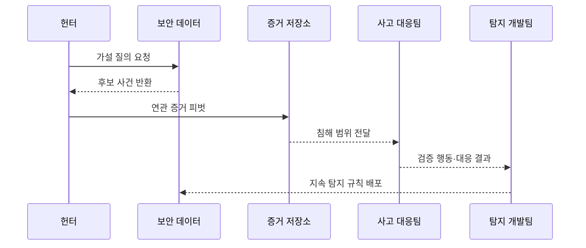

---
sidebar:
  order: 30
  label: "030. 위협 헌팅 (Threat Hunting)"
  badge:
    text: "기출 · 70%"
    variant: note
title: "위협 헌팅 (Threat Hunting)"
date: "2026-07-25T01:05:00+09:00"
tags:
  - "notes-security"
weight: 30
extra:
  question_no: "030"
  source_status: "기출"
  source_history: "138회"
  priority: 70
  priority_note: "138회 최신 기출이며 가설 기반 탐지 절차가 독립적임"
---

## 미리 알고가기

- **위협 헌팅(Threat Hunting)**: [읽기: 위협 헌팅; 표기 이유: 한글명 뒤 영문 원어 병기] 기존 경보를 기다리지 않고 가설을 세워 숨은 침해 증거를 능동적으로 찾는 활동
- **가설(Hypothesis)**: [읽기: 가설; 표기 이유: 한글명 뒤 영문 원어 병기] 예상 공격 행동·증거·반증·종료 조건을 포함한 검증 가능한 설명
- **CTI(Cyber Threat Intelligence)**: [읽기: 씨티아이; 표기 이유: 영문 머리글자와 구분 기호] 공격 주체·동기·능력·인프라·행동에 관한 분석된 위협 정보
- **MITRE ATT&CK**: [읽기: 엠아이티알이; 표기 이유: 영문 머리글자와 구분 기호] 실제 관찰된 공격자의 전술·기법·절차를 체계적으로 분류한 지식 기반
- **TTP(Tactics, Techniques, and Procedures)**: [읽기: 티티피; 표기 이유: 영문 머리글자와 구분 기호] 공격자가 목적을 달성하는 전술·기법·절차의 행동 패턴
- **IoC(Indicator of Compromise)**: [읽기: 아이오씨; 표기 이유: 영문 머리글자와 구분 기호] 악성 파일·주소·계정 행위처럼 침해를 식별하는 흔적
- **텔레메트리(Telemetry)**: [읽기: 텔레메트리; 표기 이유: 한글명 뒤 영문 원어 병기] 단말·신원·네트워크·클라우드에서 지속 수집한 관측 데이터
- **EDR(Endpoint Detection and Response)**: [읽기: 이디알; 표기 이유: 영문 머리글자와 구분 기호] 단말·서버의 프로세스·파일·행위를 수집하고 탐지·대응하는 체계
- **NDR(Network Detection and Response)**: [읽기: 엔디알; 표기 이유: 영문 머리글자와 구분 기호] 네트워크 통신을 분석해 위협을 탐지·대응하는 체계
- **피벗(Pivot)**: [읽기: 피벗; 표기 이유: 한글명 뒤 영문 원어 병기] 하나의 지표에서 연관 계정·호스트·프로세스·통신으로 조사 범위를 이동하는 분석
- **기준선(Baseline)**: [읽기: 기준선; 표기 이유: 한글명 뒤 영문 원어 병기] 정상 업무의 일반적인 행위·빈도·관계를 나타내는 비교 기준
- **탐지 공학(Detection Engineering)**: [읽기: 탐지 공학; 표기 이유: 한글명 뒤 영문 원어 병기] 공격 행동을 지속적으로 찾도록 데이터·분석 규칙·검증·운영을 설계하는 활동
- **플레이북(Playbook)**: [읽기: 플레이북; 표기 이유: 한글명 뒤 영문 원어 병기] 경보 조사와 대응 절차를 단계별로 정리한 실행 지침
- **허니토큰(Honeytoken)**: [읽기: 허니토큰; 표기 이유: 한글명 뒤 영문 원어 병기] 정상 업무에는 쓰이지 않아 사용 자체가 침해를 강하게 뜻하도록 만든 미끼 자격이나 데이터
- **외부 반격(Hack Back)**: [읽기: 외부 반격; 표기 이유: 한글명 뒤 영문 원어 병기] 피해 조직이 공격자의 외부 시스템에 침입하거나 방해하는 행위

- **흐름 기호(↓·→·-->)**: [읽기: 아래로·다음으로·연결; 표기 이유: 절차 방향 기호] 순서와 연결 방향을 나타냄
## Ⅰ. 개요

- **정의**: 가설로 숨은 침해 증거를 능동 탐색
- **배경/필요성**: 기존 탐지의 데이터·분석 공백 축소

### 쉽게 이해하기 (학습용)

- 경보가 없다고 안전하다고 보지 않고 공격자가 남겼을 법한 흔적을 먼저 정해 여러 로그에서 직접 찾아 연결한다.

## Ⅱ. 특징

- 자산 위험·CTI·사고 사례에서 가설을 만든다
- 시간·신원·호스트·프로세스로 피벗한다
- 원본 증거와 업무 문맥으로 후보를 검증한다
- 반증과 종료 조건으로 확증 편향을 제한한다
- 결과를 탐지 규칙·수집·대응에 환류한다

### 쉽게 이해하기 (학습용)

- 의심을 확인하는 증거만 찾지 않고 정상 업무라면 보여야 할 반대 증거도 확인해야 잘못된 결론을 줄일 수 있다.

## Ⅲ. 구성요소 및 구조

| 설계 요소 | 설명 |
|:---|:---|
| 위험·위협 가설 | 자산·행동·예상 증거 정의 |
| 텔레메트리 | 단말·신원·망·클라우드 데이터 |
| 질의·피벗 | 연관 계정·호스트·시간선 확장 |
| 증거 검증·범위화 | 원본·업무 문맥으로 침해 판정 |
| 대응·탐지 환류 | 격리와 지속 분석으로 전환 |
| 반증·종료 조건 | 가설 기각과 조사 종료 기준 |

### 쉽게 이해하기 (학습용)

- 검증 가능한 질문을 만들고 필요한 로그를 따라가 침해 범위를 확인한 뒤 같은 행동은 다음부터 자동으로 찾게 만든다.

## Ⅳ. 원리 및 절차 흐름도

| 절차 | 설명 |
|:---|:---|
| 가설 질의 요청 | 행동·증거·반증·기간 정의 |
| 후보 사건 반환 | 데이터 적합성과 이상 후보 확인 |
| 연관 증거 피벗 | 계정·호스트·프로세스 범위 확장 |
| 침해 범위 전달 | 원본 증거와 업무 문맥 판정 |
| 검증 행동·대응 결과 | 격리·제거와 유효 신호 정리 |
| 지속 탐지 규칙 배포 | 분석·수집·플레이북에 반영 |

> 요약: 수작업으로 검증한 행동을 지속 탐지로 바꾼다.

### 쉽게 이해하기 (학습용)

- 헌터가 숨은 공격을 한 번 찾아내는 데서 끝나지 않고 유효한 흔적을 규칙과 대응 절차로 만들어 다음 공격은 자동으로 발견하게 한다.

## Ⅴ. 종류 및 비교

| 비교축 | 위협 헌팅 공통 | 지표 기반 | TTP 기반 | 이상 기반 |
|:---|:---|:---|:---|:---|
| 핵심 특징 | 가설로 숨은 침해 탐색 | 해시·주소·계정 흔적 검색 | 공격 행동 관계 추적 | 정상 기준선 이탈 분석 |
| 적용 기준 | 기존 탐지 공백 검증 | 알려진 침해 범위 확인 | 지표가 바뀌는 공격 추적 | 미지·내부자 행동 발견 |
| 주요 위험 | 가설 편향·데이터 공백 | 지표 수명 짧음 | 문맥·로그 요구량 큼 | 오탐·기준선 오염 |

### 쉽게 이해하기 (학습용)

- 지표형은 차량 번호, TTP형은 운전 습관, 이상형은 평소와 다른 이동을 찾는 방식이라 서로 놓치는 대상을 보완한다.

## Ⅵ. 실무 사례

- **사례 1**: 정상 관리 도구를 사용자·대상 문맥으로 헌팅
- **사례 2**: 필요한 로그가 없으면 관측 공백으로 기록
- **사례 3**: 허니토큰 사용을 고신뢰 가설로 조사
- **사례 4**: 검증 행동을 탐지 규칙과 플레이북으로 전환
- **사례 5**: 개인 행위 분석에 최소 수집·보존 적용

### 쉽게 이해하기 (학습용)

- 사례 1은 정상 명령 이름만 보지 않고 평소와 다른 계정이 다른 서버에서 실행한 관계로 악용을 찾는다.
- 사례 2는 검색 결과가 없을 때 침해가 없다고 결론 내리지 않고 필요한 데이터가 실제 수집됐는지 먼저 확인한다.
- 사례 3은 정상 사용 이유가 없는 미끼 자격의 사용을 단순 이상치보다 강한 침해 신호로 조사한다.
- 사례 4는 같은 수작업을 반복하지 않고 다음 발생부터 경보·조사·격리가 일관되게 이어지게 한다.
- 사례 5는 내부자와 계정 탈취를 찾더라도 직원의 모든 활동을 무제한 수집하는 새로운 프라이버시 위험을 막는다.

## Ⅶ. 결론

- 헌팅으로 검증한 행동이면 지속 탐지로 전환한다.

### 쉽게 이해하기 (학습용)

- 위협 헌팅의 성과는 찾은 사건 수가 아니라 보이지 않던 공격 경로를 데이터와 규칙으로 바꿔 같은 침해를 더 빨리 잡게 하는 데 있다.
