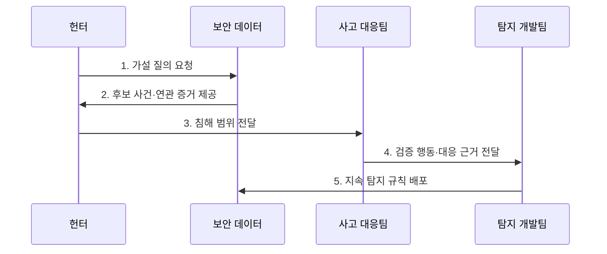

---
sidebar:
  order: 30
  label: "030. 위협 헌팅 (Threat Hunting)"
  badge:
    text: "기출 · 70%"
    variant: note
title: "위협 헌팅 (Threat Hunting)"
date: "2026-08-02T10:38:00+09:00"
tags:
  - "notes-security"
weight: 30
extra:
  question_no: "030"
  source_status: "기출"
  source_history: "138회"
  priority: 70
  priority_note: "138회 최신 기출이며 가설 기반 탐지 절차가 독립적임"
---

## Ⅰ. 개요

핵심 용어

- **위협 헌팅**은 기존 경보를 기다리지 않고 가설을 세워 숨은 침해 증거를 능동적으로 탐색하는 활동이다.
- **가설**은 예상 공격 행동·관측 증거·반증·종료 조건을 포함한 검증 가능한 설명이다.

- 정의/개념: **위협 헌팅**은 기존 경보를 기다리지 않고 검증 가능한 공격 가설을 세워 여러 보안 데이터에서 숨은 침해 증거를 찾는 **능동 위협 탐색 활동**
- 배경/필요성: 기존 시그니처·경보만으로는 **미지·변형 공격과 데이터 공백 식별 불가**

#### 한줄 요약

- 경보가 없다고 안전하다고 보지 않고 공격자가 남겼을 법한 흔적을 먼저 정해 여러 로그에서 직접 찾아 연결한다.

## Ⅱ. 특징

핵심 용어

- **CTI**는 공격 주체·기반시설·의도·행동을 분석한 위협 정보이고, **TTP**는 공격자가 반복 사용하는 행동 방식이다.
- **피벗**은 한 지표에서 연관 계정·호스트·프로세스·통신으로 조사 범위를 이동하는 분석이다.
- **탐지 공학·플레이북 환류**는 검증된 공격 행동을 지속 탐지 규칙과 단계별 조사·대응 절차로 전환하는 활동이다.

- **자산 위험·CTI·TTP** 기반 반증 가능 가설
- **텔레메트리 질의·피벗**으로 계정·호스트·프로세스를 연결한다.
- **검증 결과를 탐지 공학·플레이북**으로 환류한다.

#### 한줄 요약

- 의심을 확인하는 증거만 찾지 않고 정상 업무라면 보여야 할 반대 증거도 확인해야 잘못된 결론을 줄일 수 있다.

## Ⅲ. 구조 및 구성요소

핵심 용어

- **텔레메트리**는 단말·신원·네트워크·클라우드에서 지속 수집한 관측 데이터다.
- **EDR·NDR**은 각각 단말 행위와 네트워크 통신을 지속 분석해 위협을 탐지·조사·대응한다.

| 구성요소 | 책임 |
|:---|:---|
| 가설·반증·종료 조건 | **자산·행동·기각 기준** 정의 |
| 텔레메트리 | **EDR·NDR·신원·클라우드 데이터** |
| 질의·피벗 | **계정·호스트·시간선 확장** |
| 증거 검증·범위화 | **원본·업무 문맥으로 판정** |
| 대응·탐지 환류 | **격리·지속 분석으로 전환** |

#### 한줄 요약

- 검증 가능한 질문을 만들고 필요한 로그를 따라가 침해 범위를 확인한 뒤 같은 행동은 다음부터 자동으로 찾게 만든다.

## Ⅳ. 흐름도

핵심 용어

- **탐지 공학**은 공격 행동을 지속 탐지하도록 데이터·분석 규칙·검증·운영을 설계하는 활동이다.
- **플레이북**은 경보 조사와 대응 절차를 단계별로 정리한 실행 지침이다.

**동작 원리**

1. **가설 질의 요청**: 행동·증거·반증·기간 조건 전달
2. **후보 사건·연관 증거 제공**: 이상 후보와 피벗 증거를 헌터에게 제공
3. **침해 범위 전달**: 원본 증거와 업무 문맥 기반 범위 제공
4. **검증 행동·대응 근거 전달**: 격리·제거와 유효 신호 제공
5. **지속 탐지 규칙 배포**: 분석·수집·플레이북에 검증 결과 반영

#### 한줄 요약

- 헌터가 숨은 공격을 한 번 찾아내는 데서 끝나지 않고 유효한 흔적을 규칙과 대응 절차로 만들어 다음 공격은 자동으로 발견하게 한다.

## Ⅴ. 종류 및 비교

핵심 용어

- **지표(IoC) 기반**은 알려진 흔적, **TTP 기반**은 반복 행동, **이상 기반**은 정상 기준선 이탈을 탐색한다.
- **기준선**은 정상 업무의 일반적인 행위·빈도·관계를 나타내는 비교 기준이다.

| 위협 헌팅 방식 | 공통 | 지표 기반 | TTP 기반 | 이상 기반 |
|:---|:---|:---|:---|:---|
| 적용 기준 | 기존 **탐지 공백** 검증 | 알려진 **침해 범위** 확인 | 지표가 바뀌는 **공격 추적** | **미지·내부자 행동** 발견 |
| 핵심 특징 | **가설 기반 침해 탐색** | **해시·주소·계정** 검색 | **공격 행동 관계 추적** | **정상 기준선 이탈** 분석 |
| 한계 | **가설 편향·데이터 공백** | **지표 수명** 짧음 | **문맥·로그 요구량** 과다 | **오탐·기준선 오염** |

#### 한줄 요약

- 지표형은 차량 번호, TTP형은 운전 습관, 이상형은 평소와 다른 이동을 찾는 방식이라 서로 놓치는 대상을 보완한다.

## Ⅵ. 실무 고려사항 및 대책

핵심 용어

- **MITRE ATT&CK**은 실제 공격 행동을 TTP로 분류하고, **NIST SP 800-61 Rev. 3**은 발견·격리·개선의 연계를 안내한다.
- **허니토큰**은 정상 업무에서 쓰지 않아 사용 자체가 침해를 강하게 뜻하는 미끼 자격·데이터다.

| 문제 | 대책 | 효과 |
|:---|:---|:---|
| **행동 가설** 수립 | **MITRE ATT&CK TTP 활용** | 지표 변경 **공격 추적** |
| **사고 대응 환류** | **NIST SP 800-61 Rev. 3** | **발견·격리·개선** 연결 |
| **확증 편향·로그 공백** | **반증 조건·데이터 적합성 검증** | **오판·무의미 조사** 억제 |
| **고신뢰 신호 부족** | **허니토큰·미끼 자격 배치** | 은밀한 **자격 오용** 식별 |

#### 한줄 요약

- 정상 명령 이름만 보지 않고 평소와 다른 사용자·대상·시간의 관계로 관리 도구 악용을 찾는다.

## Ⅶ. 결론

핵심 용어

- **헌팅 성과**는 발견 건수보다 새로 확인한 공격 경로를 지속 탐지 규칙과 대응 절차로 전환했는지로 평가한다.
- **지표·TTP·이상 기반 선택**은 알려진 흔적, 변형된 반복 행동, 미지·내부자 행동 중 찾을 대상에 맞춰 헌팅 방식을 정하는 판단이다.

- 알려진 IoC는 **지표 기반**, 변형 공격은 **TTP 기반**, 미지·내부자는 **이상 기반** 헌팅

#### 한줄 요약

- 위협 헌팅의 성과는 찾은 사건 수가 아니라 보이지 않던 공격 경로를 데이터와 규칙으로 바꿔 같은 침해를 더 빨리 잡게 하는 데 있다.
