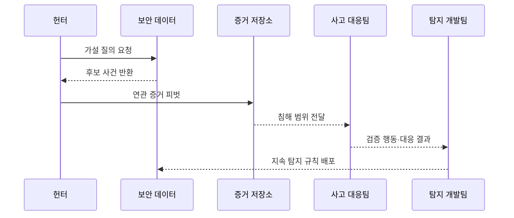

---
sidebar:
  order: 30
  label: "030. 위협 헌팅 (Threat Hunting)"
  badge:
    text: "기출 · 70%"
    variant: note
title: "위협 헌팅 (Threat Hunting)"
date: "2026-07-27T23:59:59+09:00"
tags:
  - "notes-security"
weight: 30
extra:
  question_no: "030"
  source_status: "기출"
  source_history: "138회"
  priority: 70
  priority_note: "138회 최신 기출이며 가설 기반 탐지 절차가 독립적임"
---

## 미리 알고가기

- **위협 헌팅(Threat Hunting)**: 기존 경보를 기다리지 않고 가설을 세워 숨은 침해 증거를 능동적으로 찾는 활동임
- **가설(Hypothesis)**: 예상 공격 행동·증거·반증·종료 조건을 포함한 검증 가능한 설명임
- **사이버 위협 인텔리전스(Cyber Threat Intelligence, CTI)**: ‘씨티아이’로 읽고 세 영문 핵심어의 머리글자를 딴 표기이며 공격 주체·인프라·행동을 분석한 위협 정보임
- **MITRE ATT&CK**: ‘마이터 어택’으로 읽고 ATT, `&`, CK를 결합한 표기이며 실제 공격자의 전술·기법·절차를 분류한 지식 기반임
- **전술·기법·절차(Tactics, Techniques, and Procedures, TTP)**: ‘티티피’로 읽고 세 영문 핵심어의 머리글자를 딴 표기이며 공격자의 반복 행동 패턴임
- **침해지표(Indicator of Compromise, IoC)**: ‘아이오시’로 읽고 영문 핵심어의 머리글자를 딴 표기이며 악성 파일·주소·계정 행위 같은 침해 흔적임
- **텔레메트리(Telemetry)**: 단말·신원·네트워크·클라우드에서 지속 수집한 관측 데이터임
- **단말 탐지·대응(Endpoint Detection and Response, EDR)**: ‘이디알’로 읽고 세 영문 핵심어의 머리글자를 딴 표기이며 단말의 프로세스·파일·행위를 수집·대응함
- **네트워크 탐지·대응(Network Detection and Response, NDR)**: ‘엔디알’로 읽고 세 영문 핵심어의 머리글자를 딴 표기이며 네트워크 통신을 분석·대응함
- **피벗(Pivot)**: 한 지표에서 연관 계정·호스트·프로세스·통신으로 조사 범위를 이동하는 분석임
- **기준선(Baseline)**: 정상 업무의 일반적인 행위·빈도·관계를 나타내는 비교 기준임
- **탐지 공학(Detection Engineering)**: 공격 행동을 지속 탐지하도록 데이터·분석 규칙·검증·운영을 설계하는 활동임
- **플레이북(Playbook)**: 경보 조사와 대응 절차를 단계별로 정리한 실행 지침임
- **허니토큰(Honeytoken)**: 정상 업무에서 쓰지 않아 사용 자체가 침해를 강하게 뜻하는 미끼 자격·데이터임
## Ⅰ. 개요

- 정의/개념: 검증 가능한 가설로 **숨은 침해 증거를 능동 탐색**
- **배경/필요성**: 기존 경보·IoC는 **미지·변형 공격과 데이터 공백 탐지 곤란**

### 쉽게 이해하기 (학습용)

- 경보가 없다고 안전하다고 보지 않고 공격자가 남겼을 법한 흔적을 먼저 정해 여러 로그에서 직접 찾아 연결한다.

## Ⅱ. 특징

- **자산 위험·CTI·TTP**로 반증·종료 조건이 있는 가설을 세운다.
- **텔레메트리 질의·피벗**으로 계정·호스트·프로세스를 연결한다.
- **검증 결과를 탐지 규칙·수집·플레이북**으로 환류한다.

### 쉽게 이해하기 (학습용)

- 의심을 확인하는 증거만 찾지 않고 정상 업무라면 보여야 할 반대 증거도 확인해야 잘못된 결론을 줄일 수 있다.

## Ⅲ. 구성요소 및 구조

| 설계 요소 | 설명 |
|:---|:---|
| 위험·위협 가설 | **자산·행동·예상 증거 정의** |
| 텔레메트리 | **단말·신원·망·클라우드 데이터** |
| 질의·피벗 | **계정·호스트·시간선 확장** |
| 증거 검증·범위화 | **원본·업무 문맥으로 판정** |
| 대응·탐지 환류 | **격리·지속 분석으로 전환** |
| 반증·종료 조건 | **가설 기각·조사 종료 기준** |

### 쉽게 이해하기 (학습용)

- 검증 가능한 질문을 만들고 필요한 로그를 따라가 침해 범위를 확인한 뒤 같은 행동은 다음부터 자동으로 찾게 만든다.

## Ⅳ. 원리 및 절차 흐름도

| 절차 | 설명 |
|:---|:---|
| 가설 질의 요청 | 행동·증거·반증·기간 정의 |
| 후보 사건 반환 | 데이터 적합성과 이상 후보 확인 |
| 연관 증거 피벗 | 계정·호스트·프로세스 범위 확장 |
| 침해 범위 전달 | 원본 증거와 업무 문맥 판정 |
| 검증 행동·대응 결과 | 격리·제거와 유효 신호 정리 |
| 지속 탐지 규칙 배포 | 분석·수집·플레이북에 반영 |

> 요약: 수작업으로 검증한 행동을 지속 탐지로 바꾼다.

### 쉽게 이해하기 (학습용)

- 헌터가 숨은 공격을 한 번 찾아내는 데서 끝나지 않고 유효한 흔적을 규칙과 대응 절차로 만들어 다음 공격은 자동으로 발견하게 한다.

## Ⅴ. 종류 및 비교

| 위협 헌팅 방식 | 공통 | 지표 기반 | TTP 기반 | 이상 기반 |
|:---|:---|:---|:---|:---|
| 적용 기준 | 기존 탐지 공백 검증 | 알려진 침해 범위 확인 | 지표가 바뀌는 공격 추적 | 미지·내부자 행동 발견 |
| 핵심 특징 | 가설로 숨은 침해 탐색 | 해시·주소·계정 검색 | 공격 행동 관계 추적 | 정상 기준선 이탈 분석 |
| 한계 | 가설 편향·데이터 공백 | 지표 수명 짧음 | 문맥·로그 요구량 큼 | 오탐·기준선 오염 |

### 쉽게 이해하기 (학습용)

- 지표형은 차량 번호, TTP형은 운전 습관, 이상형은 평소와 다른 이동을 찾는 방식이라 서로 놓치는 대상을 보완한다.

## Ⅵ. 실무 사례

1. 정상 관리 도구는 **사용자·대상·시간 문맥으로 헌팅**
2. 검증된 행동은 **탐지 규칙·플레이북으로 전환**

### 쉽게 이해하기 (학습용)

- 정상 명령 이름만 보지 않고 평소와 다른 사용자·대상·시간의 관계로 관리 도구 악용을 찾는다.
- 검증된 행동을 규칙과 플레이북으로 만들어 다음 발생부터 경보·조사·격리가 이어지게 한다.

## Ⅶ. 결론

- 알려진 흔적은 **IoC**, 변형 행동은 **TTP**, 미지는 **이상 기반**

### 쉽게 이해하기 (학습용)

- 위협 헌팅의 성과는 찾은 사건 수가 아니라 보이지 않던 공격 경로를 데이터와 규칙으로 바꿔 같은 침해를 더 빨리 잡게 하는 데 있다.
