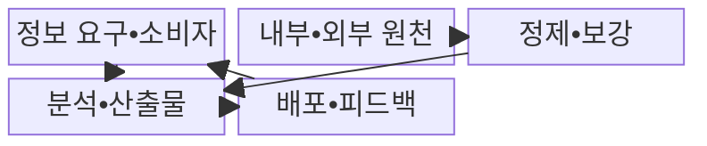
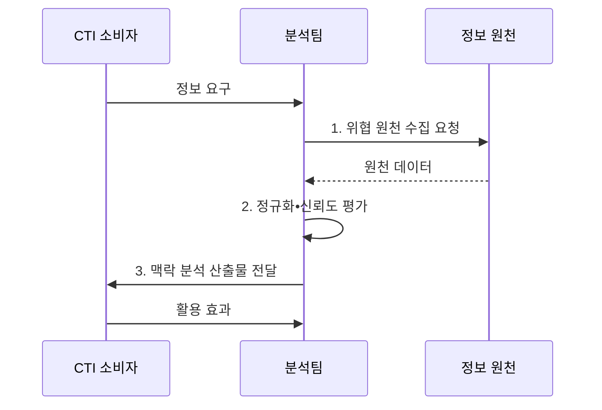

---
sidebar:
  order: 31
  label: "031. 사이버 위협 인텔리전스 CTI (Cyber Threat Intelligence)"
  badge:
    text: "기출 • 70%"
    variant: note
title: "사이버 위협 인텔리전스 CTI (Cyber Threat Intelligence)"
date: "2026-08-03T08:48:47+09:00"
tags:
  - "notes-security"
weight: 31
extra:
  question_no: "031"
  source_status: "기출"
  source_history: "123회, 138회"
  priority: 70
  priority_note: "123•138회 반복과 AI 기반 CTI 확장성이 높음"
---

## Ⅰ. 개요

핵심 용어

- **사이버 위협 인텔리전스(Cyber Threat Intelligence, CTI)** 는 위협 데이터에 공격자•의도•TTP•대상•신뢰도 맥락을 부여하여 방어 의사결정을 지원하는 정보다.
- **IoC** 는 악성 IP•도메인•파일 해시 등 시스템 침해를 식별하는 관측 흔적이다.

- 정의/개념: IoC 등 위협 데이터에 공격자•TTP•대상•신뢰도 **맥락을 부여한 방어 정보**
- 배경/필요성: 출처•시점 없는 단순 지표로는 **차단 우선순위 판단 불가**

#### 한줄 요약

- 단순한 악성 IP 목록에 공격 대상•관측 시점•출처•신뢰도를 결합하여 차단과 조사 우선순위를 결정한다.

## Ⅱ. 특징

핵심 용어

- **TTP** 는 공격자가 목적 달성을 위해 반복적으로 사용하는 전술•기법•절차다.
- **신뢰도 평가** 는 출처•관측 시점•근거를 검증해 대응 확신 수준을 정하는 절차다.

- 공격자•TTP•대상을 연결한 **위협 맥락**
- 출처•근거에 따른 **신뢰도 평가**
- 관측 시점•만료•철회 기반 **수명 관리**

#### 한줄 요약

- 공격 기반시설은 빠르게 변경되므로 지표의 최초•최근 관측 시각과 만료•철회 상태를 관리해야 한다.

## Ⅲ. 구조 및 구성요소

핵심 용어

- **정보 요구** 는 소비자가 내려야 할 방어 결정과 필요한 산출물을 먼저 정의한다.
- **피드백** 은 배포한 정보가 탐지•차단•헌팅에 미친 효과를 분석 과정으로 돌려보낸다.

| 구성요소 | 책임 |
|:---|:---|
| 정보 요구•소비자 | 필요한 **방어 결정•산출물** 정의 |
| 내부•외부 원천 | **사고•로그•공개•상용 정보** 제공 |
| 정제•보강 | **자산•시간•위협 관계** 연결 |
| 분석•산출물 | **근거•확신 수준별 정보** 생산 |
| 배포•피드백 | **취급 정책•행동 효과** 환류 |

#### 한줄 요약

- 분석 결과에는 담당자가 차단•헌팅•관찰 중 적절한 행동을 선택할 수 있도록 근거와 신뢰도를 함께 제공한다.

## Ⅳ. 흐름도

핵심 용어

- **정규화•보강** 은 여러 원천의 데이터를 공통 형식으로 바꾸고 자산•시간•위협 관계를 연결한다.
- **오탐** 은 정상 활동을 위협으로 잘못 판단한 결과다.

**동작 원리**

1. **위협 원천 수집 요청**: 내부•외부 데이터의 범위•시점 지정
2. **정규화•신뢰도 평가**: 출처•관측 시점•근거 검증
3. **맥락 분석 산출물 전달**: 자산•TTP•확신 수준을 연결한 정보 제공

#### 한줄 요약

- 분석가는 판단의 확신 수준과 출처•관측 근거를 함께 전달하여 과잉 대응과 오탐을 줄인다.

## Ⅴ. 종류 및 비교

핵심 용어

- **전술•운영•전략 CTI** 는 각각 단기 탐지, 캠페인 조사, 경영 위험 결정의 시간 범위에 맞춘 위협 정보다.
- **SOC** 는 보안 이벤트를 지속 관제하고 CTI를 탐지•분석•대응에 활용하는 조직이다.

| CTI 활용 수준 | 전술 CTI | 운영 CTI | 전략 CTI |
|:---|:---|:---|:---|
| 적용 기준 | SOC의 **단기 탐지•차단** | 사고 대응팀의 **조사•헌팅** | 경영진의 **투자•위험 수용** 결정 |
| 핵심 특징 | **IoC•탐지 패턴** 중심 | **캠페인•TTP•경로** 중심 | **공격 의도•사업 영향** 중심 |
| 한계 | **지표 노후화•오차단** | **불완전한 맥락•조사 왜곡** | **추상 전망•실행 분리** |

> 요약: CTI는 결정의 시간 범위•깊이에 맞춰 구분됨

#### 한줄 요약

- 탐지 담당자•사고 대응자•경영진의 의사결정 시간과 범위에 맞는 정보 깊이를 제공해야 한다.

## Ⅵ. 실무 고려사항 및 대책

핵심 용어

- **NIST SP 800-150** 은 사이버 위협 정보의 공유 목표•규칙•교환•사용 권고를 제시한다.
- **지표 수명 관리** 는 최초•최근 관측, 유효기간, 철회 상태를 추적해 노후 지표의 오차단을 막는다.

| 문제 | 대책 | 효과 |
|:---|:---|:---|
| **위협 정보 공유** | **NIST SP 800-150 적용** | **공유•사용 규칙** 일관화 |
| **지표 노후화•철회** | **관측 시점•유효기간 관리** | 정상 자산 **오차단 억제** |
| **출처•확신 수준** | **근거•신뢰도•자산 맥락** | 대응 **우선순위 정확화** |

#### 한줄 요약

- CTI로 받은 악성 IP도 출처•신뢰도•관측 시점•만료 여부를 확인한 뒤 방화벽 차단 목록에 반영한다.

## Ⅶ. 결론

핵심 용어

- **CTI 가치** 는 수집량보다 탐지•차단•대응 우선순위 결정에 실제로 기여했는지로 평가한다.
- **전술•운영•전략 CTI 선택** 은 각각 단기 IoC 차단, 캠페인 조사, 투자•위험 수용의 의사결정 범위에 맞춘 판단이다.

- IoC 차단은 **전술 CTI**, 캠페인은 **운영 CTI**, 투자•위험은 **전략 CTI** 선택

#### 한줄 요약

- 위협 정보의 가치는 수집량이 아니라 탐지•차단•대응 우선순위 결정에 실제로 기여했는지로 평가해야 한다.
