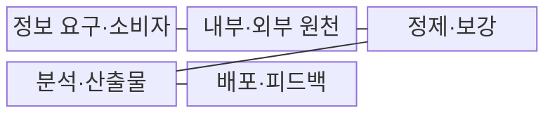
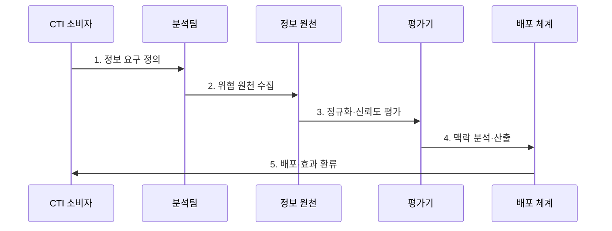

---
sidebar:
  order: 31
  label: "031. 사이버 위협 인텔리전스 CTI (Cyber Threat Intelligence)"
  badge:
    text: "기출 · 70%"
    variant: note
title: "사이버 위협 인텔리전스 CTI (Cyber Threat Intelligence)"
date: "2026-07-30T19:00:00+09:00"
tags:
  - "notes-security"
weight: 31
extra:
  question_no: "031"
  source_status: "기출"
  source_history: "123회, 138회"
  priority: 70
  priority_note: "123·138회 반복과 AI 기반 CTI 확장성이 높음"
---

## 미리 알고가기

- **사이버 위협 인텔리전스(Cyber Threat Intelligence, CTI)**: 위협 데이터에 공격자·의도·TTP·대상·신뢰도 맥락을 부여하여 방어 의사결정을 지원하는 정보다.
- **침해 지표(Indicator of Compromise, IoC)**: 악성 IP 주소·도메인·파일 해시 등 시스템 침해를 식별하는 관측 흔적이다.
- **전술·운영·전략 인텔리전스(Tactical·Operational·Strategic Intelligence)**: 탐지·사고 대응·경영 결정의 시간 범위와 깊이에 맞춘 위협 정보다.
- **전술·기법·절차(Tactics, Techniques, and Procedures, TTP)**: 공격자가 목적을 달성하기 위해 반복적으로 사용하는 행동 방식이다.
- **보안 운영 센터(Security Operations Center, SOC)**: 보안 이벤트를 지속 관제하고 CTI를 탐지·분석·대응에 활용하는 조직이다.
- **사고 대응(Incident Response, IR)**: 보안사고를 식별·격리·제거·복구하고 재발을 방지하는 활동이다.
- **인터넷 프로토콜 주소(Internet Protocol Address, IP Address)**: 네트워크에서 통신 주체의 위치를 식별하는 논리 주소다.
- **위협 헌팅(Threat Hunting)**: 자동 경보를 기다리지 않고 가설을 세워 로그에서 공격 흔적을 능동적으로 찾는 활동이다.
- **오탐(False Positive)**: 정상 활동을 위협으로 잘못 판단한 탐지 결과다.
- **NIST SP 800-150**: 사이버 위협 정보의 공유 목표·규칙·교환·사용 권고를 제시한 공식 지침이다.

## Ⅰ. 개요

- 정의/개념: 위협 데이터의 **맥락 기반 방어 정보화**
- 배경/필요성: 단순 지표의 **우선순위 판단 곤란**

### 쉽게 이해하기 (학습용)

- 단순한 악성 IP 목록에 공격 대상·관측 시점·출처·신뢰도를 결합하여 차단과 조사 우선순위를 결정한다.

## Ⅱ. 특징

- 공격자·TTP·대상을 연결한 **위협 맥락**
- 출처·근거에 따른 **신뢰도 평가**
- 관측 시점·만료·철회 기반 **수명 관리**

### 쉽게 이해하기 (학습용)

- 공격 기반시설은 빠르게 변경되므로 지표의 최초·최근 관측 시각과 만료·철회 상태를 관리해야 한다.

## Ⅲ. 구조 및 구성요소

| 구성요소 | 책임 |
|:---|:---|
| 정보 요구·소비자 | 필요한 방어 결정·산출물 정의 |
| 내부·외부 원천 | 사고·로그·공개·상용 정보 수집 |
| 정제·보강 | 자산·시간·위협 관계 연결 |
| 분석·산출물 | 근거·확신 수준별 정보 생산 |
| 배포·피드백 | 취급 정책 전달·효과 환류 |

### 쉽게 이해하기 (학습용)

- 분석 결과에는 담당자가 차단·헌팅·관찰 중 적절한 행동을 선택할 수 있도록 근거와 신뢰도를 함께 제공한다.

## Ⅳ. 흐름도

1. **정보 요구 정의**: 의사결정과 산출물 범위 설정
2. **위협 원천 수집**: 내부·외부 데이터를 확보함
3. **정규화·신뢰도 평가**: 출처·시점·근거를 판정함
4. **맥락 분석·산출**: 자산·TTP·확신 수준 연결
5. **배포·효과 환류**: 행동 결과를 다음 요구에 반영

### 쉽게 이해하기 (학습용)

- 분석가는 판단의 확신 수준과 출처·관측 근거를 함께 전달하여 과잉 대응과 오탐을 줄인다.

## Ⅴ. 종류 및 비교

| CTI 활용 수준 | 전술 CTI | 운영 CTI | 전략 CTI |
|:---|:---|:---|:---|
| 적용 기준 | SOC의 단기 탐지·차단 | 사고 대응팀의 조사·헌팅 | 경영진의 투자·위험 수용 결정 |
| 핵심 특징 | **IoC·탐지 패턴 중심** | **캠페인·TTP·경로 중심** | 공격 의도·사업 영향 중심 |
| 한계 | 지표 노후화·오차단 | 불완전한 맥락·조사 왜곡 | 추상 전망·실행 분리 |

> 요약: CTI는 결정의 시간 범위·깊이에 맞춰 구분됨

### 쉽게 이해하기 (학습용)

- 탐지 담당자·사고 대응자·경영진의 의사결정 시간과 범위에 맞는 정보 깊이를 제공해야 한다.

## Ⅵ. 실무 고려사항 및 대책

| 고려사항 | 대책 | 효과 |
|:---|:---|:---|
| 위협 정보 공유 | **NIST SP 800-150 적용** | 공유·사용 규칙 일관화 |
| 지표 노후화·철회 | **관측 시점·유효기간 관리** | 정상 자산 오차단 억제 |
| 출처·확신 수준 | **근거·신뢰도·자산 맥락** | 대응 우선순위 정확화 |

### 쉽게 이해하기 (학습용)

- CTI로 받은 악성 IP도 출처·신뢰도·관측 시점·만료 여부를 확인한 뒤 방화벽 차단 목록에 반영한다.

## Ⅶ. 결론

- **출처·신뢰도·유효기간·행동효과**로 CTI를 평가한다.

### 쉽게 이해하기 (학습용)

- 위협 정보의 가치는 수집량이 아니라 탐지·차단·대응 우선순위 결정에 실제로 기여했는지로 평가해야 한다.
