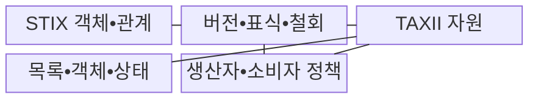
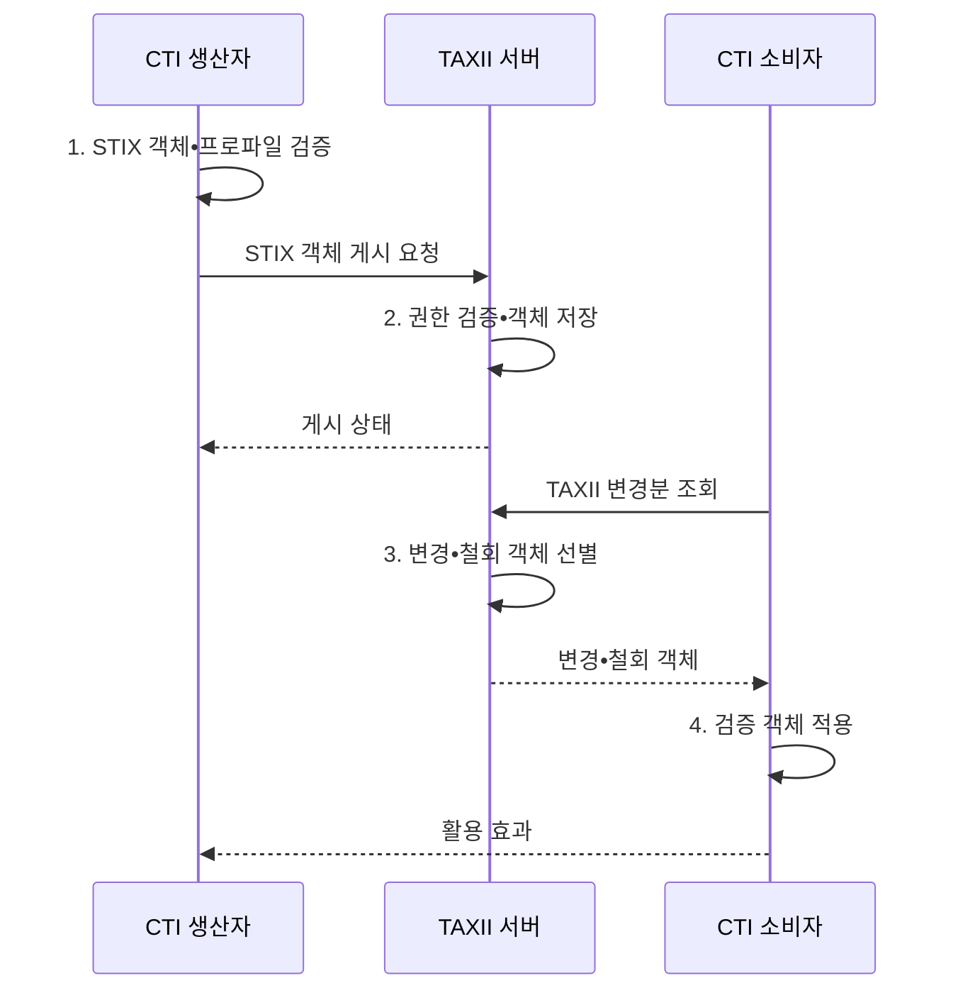

---
sidebar:
  order: 32
  label: "032. STIX•TAXII 위협 공유 (STIX TAXII)"
  badge:
    text: "기출 • 70%"
    variant: note
title: "STIX•TAXII 위협 공유 (STIX TAXII)"
date: "2026-08-05T08:24:00+09:00"
tags:
  - "notes-security"
weight: 32
extra:
  question_no: "032"
  source_status: "기출"
  source_history: "123회, 138회"
  priority: 70
  priority_note: "123•138회 반복된 구조화 공유 표준 핵심 주제임"
---

## Ⅰ. 개요

핵심 용어

- **구조화 위협 정보 표현(Structured Threat Information eXpression, STIX)** 은 위협 객체와 관계를 기계 판독 가능한 형식으로 표현하는 표준이다.
- **신뢰 정보 자동 교환(Trusted Automated eXchange of Intelligence Information, TAXII)** 은 STIX 객체를 조회•게시•교환하는 전송 규약이다.

- 정의/개념: STIX **위협 표현** 과 TAXII **객체 교환**
- 배경/필요성: 비정형 문서로는 위협 객체•관계의 **자동 연계 불가**

#### 한줄 요약

- STIX는 위협 정보의 객체•관계 표현 형식을 정의하고, TAXII는 해당 정보를 조회•게시•동기화하는 절차를 제공한다.

## Ⅱ. 특징

핵심 용어

- **사이버 위협 인텔리전스(Cyber Threat Intelligence, CTI)** 는 위협 데이터에 공격자•의도•행동•신뢰도 맥락을 부여한 정보다.
- **TAXII 컬렉션** 은 권한과 주제에 따라 STIX 객체를 묶어 조회•게시하는 논리 저장소다.
- **표식•철회** 는 정보의 취급 범위와 더 이상 사용하지 않아야 할 상태를 전달한다.

- STIX 객체•관계 기반 **위협 맥락 표현**
- TAXII 컬렉션 기반 **조회•게시•동기화**
- 버전•표식•철회 기반 **수명•권한 통제**

#### 한줄 요약

- 받은 정보의 신뢰성 및 필요성 판단 필수

## Ⅲ. 구조 및 구성요소

핵심 용어

- **응용 프로그래밍 인터페이스(Application Programming Interface, API)** 는 TAXII 컬렉션과 객체를 조회•게시하기 위한 호출 규약이다.

| 구성요소 | 책임 |
|:---|:---|
| STIX 객체•관계 | **지표•악성코드•행위자 관계** 표현 |
| 버전•표식•철회 | **변경•취급 범위•폐기 상태** 전달 |
| TAXII 자원 | **API 루트•컬렉션** 구성 |
| 목록•객체•상태 | **객체 내용•게시 상태** 교환 |
| 생산자•소비자 정책 | **신뢰•권한•필터** 정의 |

#### 한줄 요약

- 변경분•철회 여부 확인 후 최신 정보 반영

## Ⅳ. 흐름도

핵심 용어

- **변경분 조회** 는 객체 식별자와 수정 시각을 이용해 중복 없이 최신•철회 상태를 동기화하는 절차다.
- **STIX 프로파일** 은 조직이 교환할 객체•관계•속성과 필수 검증 규칙의 범위를 정한 사용 약속이다.

**동작 원리**

1. **STIX 객체•프로파일 검증**: 객체•관계•표식•허용 범위 확인
2. **권한 검증•객체 저장**: 게시 권한과 스키마 확인 후 저장
3. **변경•철회 객체 선별**: 수정 시각 이후 객체와 상태 추출
4. **검증 객체 적용**: 중복•철회•자산 적합성 확인 후 통제 반영

#### 한줄 요약

- 식별자와 수정 시각으로 중복 여부 판별

## Ⅴ. 종류 및 비교

| 표준 | 역할 | 연계 결과 |
|:---|:---|:---|
| **STIX 2.1** | **위협 객체•관계 표현** | 도구가 해석할 공통 위협 정보 생성 |
| **TAXII 2.1** | **컬렉션 기반 조회•게시** | 권한에 맞는 STIX 객체 자동 전송 |

> 요약: STIX는 표현, TAXII는 전송 담당

#### 한줄 요약

- 문법 일치 및 권한 적절성 확보 필요

## Ⅵ. 실무 고려사항 및 대책

핵심 용어

- **구조화 정보 표준 발전 기구(Organization for the Advancement of Structured Information Standards, OASIS)** 는 개방형 정보 표준을 개발하는 조직이다.
- **OASIS STIX 2.1 Errata 01** 은 CTI 표현 규칙을 규정한다.
- **OASIS TAXII 2.1** 은 컬렉션 교환 API를 규정한다.
- **하이퍼텍스트 전송 프로토콜 보안(Hypertext Transfer Protocol Secure, HTTPS)** 은 TAXII 교환 경로를 암호화한다.
- **전송 계층 보안(Transport Layer Security, TLS) 상호 인증** 은 접속 주체를 양방향으로 검증한다.

| 문제 | 대책 | 효과 |
|:---|:---|:---|
| **CTI 객체•관계** | **OASIS STIX 2.1 Errata 01** | 의미•버전 **상호운용성** 확보 |
| **자동 교환 API** | **OASIS TAXII 2.1 적용** | **컬렉션 교환** 일관화 |
| **지표 철회•권한** | **표식•버전•접근정책 검증** | **오차단•정보 노출** 억제 |
| **API 도청•무단 접근** | **HTTPS•TLS 상호 인증** | 교환 정보의 **기밀성•무결성** 보호 |

#### 한줄 요약

- SOC는 TAXII 서버에서 STIX 형식의 악성 IP•도메인을 받아 유효성과 자사 로그 적중 여부를 검증한 뒤 탐지 규칙으로 변환한다.

## Ⅶ. 결론

핵심 용어

- **신뢰 검증** 은 표준 형식 여부와 별개로 출처•접근 권한•유효기간•활용 기준을 확인하는 절차다.

- 위협 의미•관계는 **STIX**, 자동 컬렉션 교환은 **TAXII**, 표식•철회 검증 병행

#### 한줄 요약

- 표준 형식으로 교환했다는 사실만 신뢰하지 말고 출처•접근 권한•유효기간•활용 기준을 함께 통제해야 한다.
