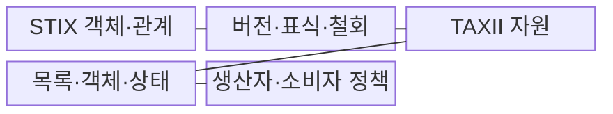
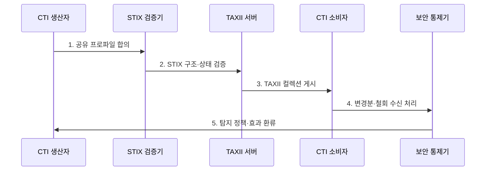

---
sidebar:
  order: 32
  label: "032. STIX·TAXII 위협 공유 (STIX TAXII)"
  badge:
    text: "기출 · 70%"
    variant: note
title: "STIX·TAXII 위협 공유 (STIX TAXII)"
date: "2026-07-30T19:00:00+09:00"
tags:
  - "notes-security"
weight: 32
extra:
  question_no: "032"
  source_status: "기출"
  source_history: "123회, 138회"
  priority: 70
  priority_note: "123·138회 반복된 구조화 공유 표준 핵심 주제임"
---

## 미리 알고가기

- **사이버 위협 인텔리전스(Cyber Threat Intelligence, CTI)**: 위협 데이터에 공격자·의도·TTP·대상·신뢰도 맥락을 부여한 방어 정보다.
- **구조화된 위협 정보 표현(Structured Threat Information Expression, STIX)**: CTI 객체와 관계를 기계 판독 가능한 형식으로 표현하는 표준이다.
- **신뢰 정보 자동 교환(Trusted Automated Exchange of Intelligence Information, TAXII)**: STIX 기반 CTI 컬렉션을 조직과 보안도구 사이에서 교환하는 응용 프로토콜이다.
- **응용 프로그래밍 인터페이스(Application Programming Interface, API)**: TAXII 컬렉션과 객체를 조회·게시하기 위한 호출 규약이다.
- **악성코드 정보 공유 플랫폼(Malware Information Sharing Platform, MISP)**: 침해지표와 위협 정보를 분석·공유하는 오픈소스 플랫폼이다.
- **보안 하이퍼텍스트 전송 프로토콜(Hypertext Transfer Protocol Secure, HTTPS)**: HTTP 통신을 TLS로 암호화하여 TAXII 데이터를 보호하는 프로토콜이다.
- **전송 계층 보안(Transport Layer Security, TLS)**: 통신 상대를 인증하고 TAXII 연결의 기밀성과 무결성을 보호하는 프로토콜이다.
- **OASIS STIX 2.1 Errata 01**: CTI 객체·관계·패턴·직렬화 규칙을 보정한 최신 공식 표준이다.
- **OASIS TAXII 2.1**: CTI 컬렉션의 조회·게시를 위한 RESTful API와 자원을 규정한 표준이다.


## Ⅰ. 개요

- 정의/개념: STIX **위협 표현**과 TAXII **객체 교환**
- 배경/필요성: 비정형 문서의 **자동 연계 불가**

### 쉽게 이해하기 (학습용)

- STIX는 위협 정보의 객체·관계 표현 형식을 정의하고, TAXII는 해당 정보를 조회·게시·동기화하는 절차를 제공한다.

## Ⅱ. 특징

- STIX 객체·관계 기반 **위협 맥락 표현**
- TAXII 컬렉션 기반 **조회·게시·동기화**
- 버전·표식·철회 기반 **수명·권한 통제**

### 쉽게 이해하기 (학습용)

- 받은 정보의 신뢰성 및 필요성 판단 필수

## Ⅲ. 구조 및 구성요소



| 구성요소 | 책임 |
|:---|:---|
| STIX 객체·관계 | 지표·악성코드·행위자 관계 표현 |
| 버전·표식·철회 | 변경·취급 범위·폐기 상태 전달 |
| TAXII 자원 | API 루트·컬렉션 구성 |
| 목록·객체·상태 | 객체 내용·게시 상태 교환 |
| 생산자·소비자 정책 | 신뢰·권한·필터 정의 |


### 쉽게 이해하기 (학습용)

- 변경분·철회 여부 확인 후 최신 정보 반영

## Ⅳ. 흐름도


```

1. **공유 프로파일 합의**: 대상·표식·허용 범위 결정
2. **STIX 구조·상태 검증**: 스키마·버전·철회를 확인
3. **TAXII 컬렉션 게시**: 인증된 API 자원에 게시
4. **변경분·철회 수신 처리**: 중복 제거·최신 상태 반영
5. **탐지 정책·효과 환류**: 활용 결과를 생산자에 전달


### 쉽게 이해하기 (학습용)

- 식별자와 수정 시각으로 중복 여부 판별

## Ⅴ. 종류 및 비교

| 위협 정보 표준 | STIX 2.1 | TAXII 2.1 |
|:---|:---|:---|
| 적용 기준 | 위협 정보 의미와 관계를 통일할 때 | 조직·플랫폼 사이 자동 전송이 필요할 때 |
| 핵심 특징 | **CTI 객체·관계 표현** | **API 컬렉션 객체 교환** |
| 한계 | 관계·버전 오류 전파 | 권한 오류·정보 노출 |

> 요약: STIX는 표현, TAXII는 전송 담당

### 쉽게 이해하기 (학습용)

- 문법 일치 및 권한 적절성 확보 필요

## Ⅵ. 실무 고려사항 및 대책

| 고려사항 | 대책 | 효과 |
|:---|:---|:---|
| CTI 객체·관계 | **OASIS STIX 2.1 Errata 01** | 의미·버전 상호운용성 확보 |
| 자동 교환 API | **OASIS TAXII 2.1 적용** | 컬렉션 교환 일관화 |
| 지표 철회·권한 | **표식·버전·접근정책 검증** | 오차단·정보 노출 억제 |

### 쉽게 이해하기 (학습용)

- SOC는 TAXII 서버에서 STIX 형식의 악성 IP·도메인을 받아 유효성과 자사 로그 적중 여부를 검증한 뒤 탐지 규칙으로 변환한다.

## Ⅶ. 결론

- **표현의미·교환방식·권한·상태**로 공유체계를 결정한다.

### 쉽게 이해하기 (학습용)

- 표준 형식으로 교환했다는 사실만 신뢰하지 말고 출처·접근 권한·유효기간·활용 기준을 함께 통제해야 한다.
