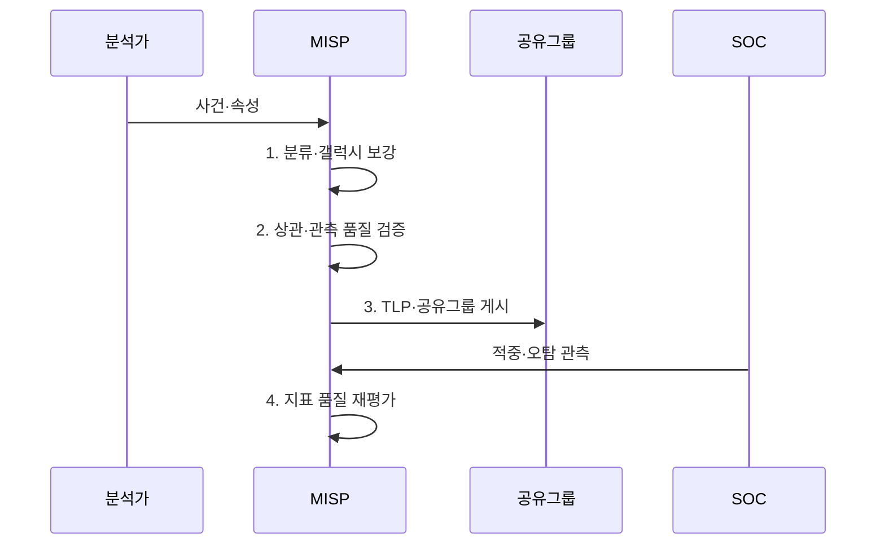

---
sidebar:
  order: 33
  label: "033. MISP 위협 공유 플랫폼 (MISP)"
  badge:
    text: "기출 · 50%"
    variant: note
title: "MISP 위협 공유 플랫폼 (MISP)"
date: "2026-08-02T23:43:00+09:00"
tags:
  - "notes-security"
weight: 33
extra:
  question_no: "033"
  source_status: "기출"
  source_history: "138회"
  priority: 50
  priority_note: "138회 기출이나 특정 플랫폼 단독 답안 비중은 낮음"
---

## Ⅰ. 개요

핵심 용어

- **MISP 위협 공유 플랫폼**은 사이버 위협 사건·지표·관측 정보를 수집·상관분석하고 배포 범위에 따라 조직 간 공유하는 플랫폼이다.
- **CTI**는 위협 데이터에 공격자·전술·신뢰도·영향 등의 맥락을 부여한 정보다.

- 정의/개념: CTI 사건·지표·관측을 **상관 분석하고 권한별 공유**하는 플랫폼
- 배경/필요성: 단순 지표 목록만으로는 **사건 맥락·공유 권한 관리 불가**

#### 한줄 요약

- 여러 사건 지표 연결 및 조직 간 공유 플랫폼

## Ⅱ. 특징

핵심 용어

- **분류체계(Taxonomy)**는 취급 등급·신뢰 수준을 태그로 부여하고, **갤럭시(Galaxy)**는 위협 행위자·기법·산업군 문맥을 제공한다.
- **관측(Sighting)**은 공유 지표의 실제 탐지 여부와 오탐 결과를 기록한다.

- 이벤트 기반 **사건·지표 맥락 통합**
- **분류체계·갤럭시** 기반 위협 분류
- 상관·관측 기반 **적중·오탐 추적**

#### 한줄 요약

- 지표 의미 부여를 위한 관측 검증 필요

## Ⅲ. 구조 및 구성요소

핵심 용어

- **이벤트**는 사건 맥락과 관련 속성·객체를 하나의 분석 단위로 묶는다.
- **공유그룹**은 위협 정보를 조회·재배포할 수 있는 허용 조직을 지정한다.

| 구성요소 | 책임 |
|:---|:---|
| 이벤트·분석 | **사건 맥락·분석 자료** 통합 |
| 속성·객체 | **구조화 지표·관측 정보** 표현 |
| 분류·갤럭시 | **위협 문맥·취급 태그** 부여 |
| 상관·관측 | 지표 **적중·오탐** 확인 |
| 공유 정책 | **API·공유그룹 동기화** 통제 |

#### 한줄 요약

- 공유 지표의 권한 및 근거 통합 관리

## Ⅳ. 흐름도

핵심 용어

- **경고목록(Warninglist)**은 정상 서비스 주소처럼 위협 지표로 오인하기 쉬운 값을 관리해 오탐을 줄인다.
- **API**는 MISP와 외부 보안 시스템이 위협 정보를 자동 조회·등록하는 연동 규격이다.

**동작 원리**

1. **분류·갤럭시 보강**: 위협 문맥·취급 태그를 사건에 추가
2. **상관·관측 품질 검증**: 중복·오탐·신뢰도를 확인
3. **TLP·공유그룹 게시**: 재배포 경계와 허용 대상을 적용해 배포
4. **지표 품질 재평가**: 적중·오탐 관측을 바탕으로 상태 갱신

#### 한줄 요약

- 공유 전 실제 관측 및 정상 주소 대조

## Ⅴ. 종류 및 비교

핵심 용어

- **STIX**는 위협 객체·관계를 표현하고, **TAXII**는 STIX 기반 정보를 서버 간 자동 교환한다.

| 위협 정보 공유 | 문서 공유 | STIX/TAXII | MISP |
|:---|:---|:---|:---|
| 적용 기준 | **소규모 비정형 정보** 전달 | 기관 간 **표준 자동 교환** | **분석·권한·동기화** 통합 |
| 핵심 특징 | 사람이 읽는 **지표·설명** | **표준 객체·자동 교환** | **사건·상관·관측 운영** |
| 한계 | **수동 파싱·갱신 누락** | 형식만으로 **품질 보장 불가** | **태그·권한 오류** 확산 |

> 요약: MISP는 분석·상관 기반 공유 플랫폼

#### 한줄 요약

- 플랫폼 운영을 통한 검토 및 권한 관리

## Ⅵ. 실무 고려사항 및 대책

핵심 용어

- **FIRST TLP 2.0**은 RED·AMBER·GREEN·CLEAR로 수신자의 공유 경계를 표시한다.
- **OASIS STIX 2.1**은 사이버 위협 객체와 관계를 기계 판독 형식으로 표현하는 공식 표준이다.

| 문제 | 대책 | 효과 |
|:---|:---|:---|
| **공유 경계 표시** | **FIRST TLP 2.0 적용** | **재배포 범위** 명확화 |
| **외부 객체 교환** | **OASIS STIX 2.1 변환** | CTI **상호운용성** 확보 |
| **정상 지표 오탐** | **Warninglist·Sighting 검증** | **오차단·품질 저하** 억제 |
| **플랫폼 간 동기화** | **API·TAXII 권한 검증** | 무단 **조회·게시** 차단 |

#### 한줄 요약

- 분석가는 랜섬웨어의 파일 해시·도메인·공격자 정보를 하나의 MISP 이벤트로 묶고 허가된 관계 기관에만 공유한다.

## Ⅶ. 결론

핵심 용어

- **운영 품질**은 지표 수보다 사건 맥락·관측 결과·공유 권한을 정확히 연결하고 갱신하는 능력으로 결정된다.

- 사건·관측·권한 운영은 **MISP**, 기관 간 자동 교환은 **STIX·TAXII** 연계

#### 한줄 요약

- 믿을 지표를 연결하고 순환시키는 체계
