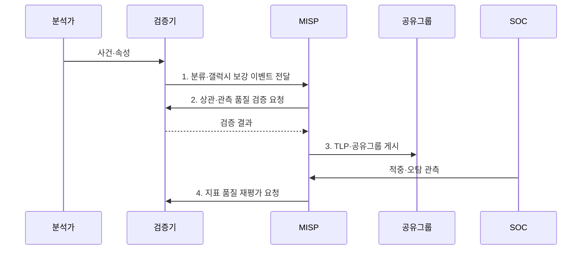

---
sidebar:
  order: 33
  label: "033. MISP 위협 공유 플랫폼 (MISP)"
  badge:
    text: "기출 · 50%"
    variant: note
title: "MISP 위협 공유 플랫폼 (MISP)"
date: "2026-07-31T03:08:00+09:00"
tags:
  - "notes-security"
weight: 33
extra:
  question_no: "033"
  source_status: "기출"
  source_history: "138회"
  priority: 50
  priority_note: "138회 기출이나 특정 플랫폼 단독 답안 비중은 낮음"
---

## 미리 알고가기

- **악성코드 정보 공유 플랫폼(Malware Information Sharing Platform, MISP)**: 사이버 위협 정보를 수집·상관분석하고 조직 간 공유하는 플랫폼이다.
- **사이버 위협 인텔리전스(Cyber Threat Intelligence, CTI)**: 위협 데이터에 공격자·전술·신뢰도·영향 등의 맥락을 부여한 정보이다.
- **구조화된 위협 정보 표현(Structured Threat Information Expression, STIX)**: 위협 객체와 객체 간 관계를 구조화하여 표현하는 표준이다.
- **신뢰 정보 자동 교환(Trusted Automated Exchange of Intelligence Information, TAXII)**: STIX 기반 위협 정보를 서버 간 자동 교환하는 전송 표준이다.
- **응용 프로그래밍 인터페이스(Application Programming Interface, API)**: MISP와 외부 보안 시스템이 위협 정보를 자동 조회·등록하는 연동 규격이다.
- **분류체계(Taxonomy)**: 위협 정보에 취급 등급과 신뢰 수준을 일관되게 부여하는 태그 체계이다.
- **갤럭시(Galaxy)**: 위협 행위자·공격 기법·산업군 정보를 구조화하여 지표에 문맥을 부여하는 지식 집합이다.
- **관측(Sighting)**: 공유된 위협 지표의 실제 탐지 여부와 오탐 결과를 기록하는 정보이다.
- **경고목록(Warninglist)**: 정상 서비스 주소처럼 위협 지표로 오인하기 쉬운 값을 관리하여 오탐을 줄이는 목록이다.
- **인터넷 프로토콜 주소(Internet Protocol Address, IP Address)**: 위협 통신의 출발지·목적지를 식별하는 네트워크 지표이다.
- **FIRST TLP 2.0**: TLP:RED·AMBER·GREEN·CLEAR로 수신자의 공유 경계를 표시하는 현행 표준이다.
- **OASIS STIX 2.1**: 사이버 위협 객체와 관계를 기계 판독 형식으로 표현하는 공식 표준이다.

## Ⅰ. 개요

- 정의/개념: CTI 사건·지표·관측을 **상관 분석하고 권한별 공유**하는 플랫폼
- 배경/필요성: 단순 지표 목록의 **맥락·권한 부재**

### 쉽게 이해하기 (학습용)

- 여러 사건 지표 연결 및 조직 간 공유 플랫폼

## Ⅱ. 특징

- 이벤트 기반 **사건·지표 맥락 통합**
- 분류체계·갤럭시 기반 **위협 분류**
- 상관·관측 기반 **적중·오탐 추적**

### 쉽게 이해하기 (학습용)

- 지표 의미 부여를 위한 관측 검증 필요

## Ⅲ. 구조 및 구성요소

| 구성요소 | 책임 |
|:---|:---|
| 이벤트·분석 | **사건 맥락·분석 자료** 통합 |
| 속성·객체 | **구조화 지표·관측 정보** 표현 |
| 분류·갤럭시 | **위협 문맥·취급 태그** 부여 |
| 상관·관측 | 지표 **적중·오탐** 확인 |
| 공유 정책 | **API·공유그룹 동기화** 통제 |

### 쉽게 이해하기 (학습용)

- 공유 지표의 권한 및 근거 통합 관리

## Ⅳ. 흐름도

**동작 원리**

1. **분류·갤럭시 보강 이벤트 전달**: 위협 문맥·취급 태그를 붙인 사건 제공
2. **상관·관측 품질 검증 요청**: 중복·오탐·신뢰도 확인 지시
3. **TLP·공유그룹 게시**: 재배포 경계와 허용 대상을 적용해 배포
4. **지표 품질 재평가 요청**: 적중·오탐 관측 기반 상태 갱신 지시

### 쉽게 이해하기 (학습용)

- 공유 전 실제 관측 및 정상 주소 대조

## Ⅴ. 종류 및 비교

| 위협 정보 공유 | 문서 공유 | STIX/TAXII | MISP |
|:---|:---|:---|:---|
| 적용 기준 | **소규모 비정형 정보** 전달 | 기관 간 **표준 자동 교환** | **분석·권한·동기화** 통합 |
| 핵심 특징 | 사람이 읽는 **지표·설명** | **표준 객체·자동 교환** | **사건·상관·관측 운영** |
| 한계 | **수동 파싱·갱신 누락** | 형식만으로 **품질 보장 불가** | **태그·권한 오류** 확산 |

> 요약: MISP는 분석·상관 기반 공유 플랫폼

### 쉽게 이해하기 (학습용)

- 플랫폼 운영을 통한 검토 및 권한 관리

## Ⅵ. 실무 고려사항 및 대책

| 고려사항 | 대책 | 효과 |
|:---|:---|:---|
| **공유 경계 표시** | **FIRST TLP 2.0 적용** | **재배포 범위** 명확화 |
| **외부 객체 교환** | **OASIS STIX 2.1 변환** | CTI **상호운용성** 확보 |
| **정상 지표 오탐** | **Warninglist·Sighting 검증** | **오차단·품질 저하** 억제 |
| **플랫폼 간 동기화** | **API·TAXII 권한 검증** | 무단 **조회·게시** 차단 |

### 쉽게 이해하기 (학습용)

- 분석가는 랜섬웨어의 파일 해시·도메인·공격자 정보를 하나의 MISP 이벤트로 묶고 허가된 관계 기관에만 공유한다.

## Ⅶ. 결론

- 사건·관측·권한 운영은 **MISP**, 기관 간 자동 교환은 **STIX·TAXII** 연계

### 쉽게 이해하기 (학습용)

- 믿을 지표를 연결하고 순환시키는 체계
