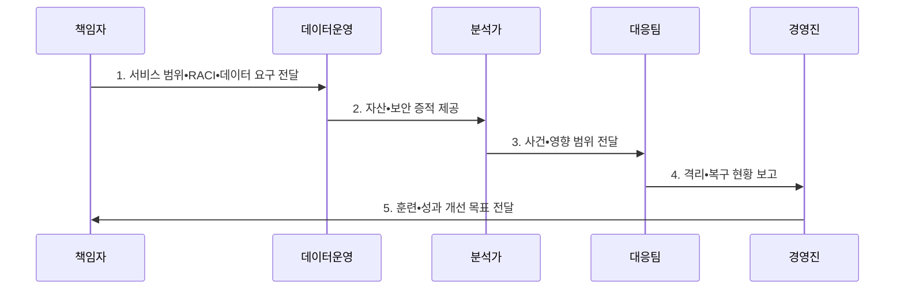

---
sidebar:
  order: 34
  label: "034. SOC 보안 운영 센터 (Security Operations Center)"
  badge:
    text: "기출 • 70%"
    variant: note
title: "SOC 보안 운영 센터 (Security Operations Center)"
date: "2026-08-03T14:18:00+09:00"
tags:
  - "notes-security"
weight: 34
extra:
  question_no: "034"
  source_status: "기출"
  source_history: "128회, 129회"
  priority: 70
  priority_note: "128•129회 반복이며 관제 조직•운영 설계가 독립적임"
---

## Ⅰ. 개요

핵심 용어

- **보안 운영 센터(Security Operations Center, SOC)** 는 사람•절차•기술을 통합하여 보안 이벤트를 상시 탐지•분석•대응하는 조직이다.

- 정의/개념: 사람•절차•기술을 통합해 보안 이벤트를 **상시 탐지•분석•대응**하는 조직
- 배경/필요성: 분산 경보만으로는 사건별 **조치 책임•복구 연계 불가**

#### 한줄 요약

- 탐지•대응을 위해 인력•절차•기술 통합

## Ⅱ. 특징

핵심 용어

- **SIEM** 은 로그를 정규화•상관분석해 경보를 만들고, **SOAR** 는 보안 도구를 연계해 조사•승인•조치를 자동화한다.
- **EDR•NDR** 은 각각 단말 행위와 네트워크 통신을 지속 분석해 위협을 탐지•조사•대응한다.
- **에스컬레이션** 은 분석가의 권한이나 역량을 넘는 사건을 상위 책임자나 전문 대응팀으로 이관하는 절차다.

- 24시간 **탐지•분석•대응 운영**
- 역할•승인•에스컬레이션의 **책임 체계**
- **SIEM•SOAR** 와 **EDR•NDR** 기반 통합 관제

#### 한줄 요약

- 격리 및 복구 주체•권한 정의 필수

## Ⅲ. 구조 및 구성요소

핵심 용어

- **CTI** 는 탐지 규칙과 위협 헌팅에 공격자•전술•지표의 맥락을 제공한다.
- **탐지 공학** 은 위협 행동을 데이터•분석 규칙•시험으로 연결해 탐지 공백을 줄이는 활동이다.

| 구성요소 | 책임 |
|:---|:---|
| 서비스•거버넌스 | **범위•역할•승인•성과** 정의 |
| 데이터 운영 | **자산•망•CTI 가시성** 확보 |
| 탐지 공학 | **위협 분석•탐지 공백** 제거 |
| 사고 대응 | **사건 분석•조치•복구** 수행 |
| 자동화•지식 | **반복 절차•지식** 표준화 |

#### 한줄 요약

- 조직 내 유관 부서와의 유기적 연결

## Ⅳ. 흐름도

핵심 용어

- **서비스 범위** 는 SOC가 보호할 자산•업무와 제공할 탐지•대응 수준을 정의한다.
- **RACI** 는 조치의 실행•책임•협의•통보 역할을 구분하는 책임 체계다.

**동작 원리**

1. **서비스 범위•RACI•데이터 요구 전달**: 임무•책임 역할•필수 가시성 지정
2. **자산•보안 증적 제공**: 탐지에 필요한 정규화 로그 전달
3. **사건•영향 범위 전달**: 경보 검증과 피해 범위 근거 제공
4. **격리•복구 현황 보고**: 승인된 조치와 업무 회복 상태 제공
5. **훈련•성과 개선 목표 전달**: 공백•병목•오탐 보완 과제 지정

#### 한줄 요약

- 훈련을 통한 운영 실효성 검증

## Ⅴ. 종류 및 비교

핵심 용어

- **내부•공동•위탁 SOC** 는 자산 문맥, 전문 역량, 상시 인력과 직접 조치 권한의 배분 방식이 다르다.
- **EDR•NDR** 은 각각 단말 행위와 네트워크 통신을 탐지•조사•대응한다.

| SOC 운영 모델 | 내부 SOC | 공동 SOC | 외부 위탁 |
|:---|:---|:---|:---|
| 적용 기준 | **자산 문맥•조치 권한** 중시 | **내부 책임•외부 역량** 결합 | **상시 인력 확보** 곤란 |
| 핵심 특징 | **내부 직접 탐지•대응** | **내외부 역할 분담** | **외부 전문 조직** 관제 |
| 한계 | **인력 부족•교대 피로** | **책임•인계 경계** 모호 | **자산 문맥•조치 권한** 부족 |

> 요약: 모델은 문맥•전문성•조치 권한으로 결정함

#### 한줄 요약

- 대응 권한 부재 시 운영 효과 저하

## Ⅵ. 실무 고려사항 및 대책

핵심 용어

- **NIST SP 800-61 Rev. 3** 은 사고 탐지•대응•복구를 위험 관리 전반에 통합하는 지침이다.
- **경보 과부하** 는 분석 가능한 양보다 많은 경보가 쌓여 중요한 사건의 확인이 지연되는 문제다.

| 문제 | 대책 | 효과 |
|:---|:---|:---|
| **사고 대응 단절** | **NIST SP 800-61 Rev. 3 적용** | 탐지•복구 **책임 연결** |
| **경보 과부하** | **위험도 기반 선별•자동화** | 분석가 **피로•누락** 완화 |
| **조치 권한 불명확** | **RACI•에스컬레이션 정의** | **승인•격리 지연** 방지 |

#### 한줄 요약

- SOC는 피싱 신고를 접수하면 메일•단말•계정 로그를 함께 조사하고 악성 메일 격리와 탈취 계정 복구까지 추적한다.

## Ⅶ. 결론

핵심 용어

- **SOC 성과** 는 경보 처리량보다 중요한 침해를 격리•복구까지 끝내고 재발 방지에 반영했는지로 평가한다.
- **내부•공동•위탁 SOC 선택** 은 자산 문맥과 직접 조치 권한, 외부 전문 역량, 상시 인력 확보 요구를 비교하는 판단이다.

- 문맥•권한 중시는 **내부 SOC**, 역량 결합은 **공동 SOC**, 인력 부족은 **외부 위탁**

#### 한줄 요약

- 중요한 침해를 끝까지 복구하는 운영 체계
