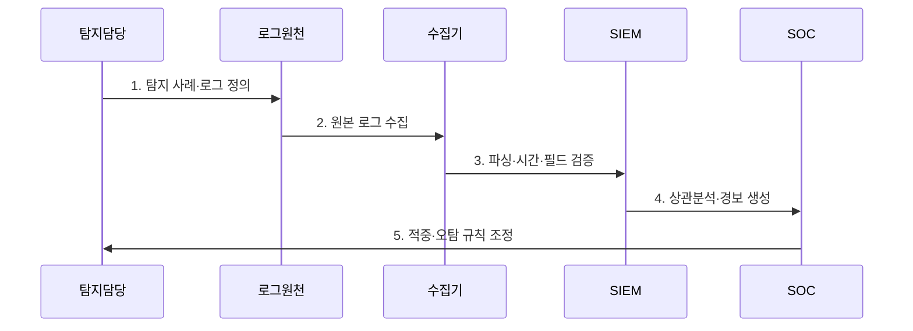

---
sidebar:
  order: 35
  label: "035. SIEM - 보안 이벤트 집계·분석 (SIEM)"
  badge:
    text: "기출 · 85%"
    variant: note
title: "SIEM - 보안 이벤트 집계·분석 (SIEM)"
date: "2026-07-27T23:59:59+09:00"
tags:
  - "notes-security"
weight: 35
extra:
  question_no: "035"
  source_status: "기출"
  source_history: "128회, 129회, 138회"
  priority: 85
  priority_note: "128·129·138회 반복된 보안관제 데이터 허브임"
---

## 미리 알고가기

- **보안 정보 및 이벤트 관리(Security Information and Event Management, SIEM)**: 로그를 정규화·상관분석하여 보안 경보와 조사 근거를 생성하는 시스템이다.
- **응용 프로그래밍 인터페이스(Application Programming Interface, API)**: 보안·업무 시스템의 로그와 이벤트를 SIEM에 자동 연동하는 호출 규격이다.
- **시스템 로그 프로토콜(Syslog Protocol, Syslog)**: 서버와 네트워크 장비의 이벤트 로그를 중앙 수집기로 전달하는 표준 프로토콜이다.
- **탐지 사례(Detection Use Case)**: 탐지할 공격 행위와 필요한 로그·조건·대응 절차를 정의한 분석 시나리오이다.
- **개인용 컴퓨터(Personal Computer, PC)**: 사용자 로그인·프로세스·파일·네트워크 등의 종단 행위 로그를 제공하는 장치이다.
- **IETF RFC 5424**: Syslog 메시지의 계층·구조화 데이터·전송 요구사항을 정의한 공식 표준이다.
- **NIST SP 800-92**: 전사 로그 관리 기반과 수집·보존·분석 절차를 제시한 공식 지침이다.

## Ⅰ. 개요

- 정의: 이종 로그의 **정규화·상관분석 플랫폼**
- 기존 한계: 분산 로그의 **공격 맥락 식별 곤란**

### 쉽게 이해하기 (학습용)

- 여러 기록을 한 시간선에 놓아 침입 분석

## Ⅱ. 특징

- 이종 로그의 **공통 스키마 정규화**
- 시간·자산·신원 기반 **이벤트 상관분석**
- 경보에서 원본까지의 **증거 추적성**

### 쉽게 이해하기 (학습용)

- 기록 정규화 및 맥락 통합 필수

## Ⅲ. 구조 및 구성요소

| 설계 요소 | 설명 |
|:---|:---|
| 수집·전송 | 원천 이벤트 전달 |
| 파싱·정규화 | 공통 스키마·시간 기준 적용 |
| 데이터 보강 | 자산 중요도·소유자 연결 |
| 상관·분석 | 공격 맥락·경보 생성 |
| 저장·관리 | 원본·정규화 로그 보존 |

> 요약: 원본·정규화 로그를 연결해 경보 근거를 추적함

### 쉽게 이해하기 (학습용)

- 가공 경보의 원본 판정 검증 기능

## Ⅳ. 흐름도

| 절차 | 설명 |
|:---|:---|
| 탐지 사례·로그 정의 | 공격 행위·필수 증적을 명시 |
| 원본 로그 수집 | 에이전트·API로 전달 |
| 파싱·시간·필드 검증 | 유실·시각·스키마를 확인 |
| 상관분석·경보 생성 | 자산·신원 맥락을 연결 |
| 적중·오탐 규칙 조정 | 운영 결과로 임계값 보정 |

> 요약: 사례 정의 후 로그·품질·분석 검증 및 튜닝함

### 쉽게 이해하기 (학습용)

- 사전 공격 정의 후 로그 수집 필요

## Ⅴ. 종류 및 비교

| 보안 로그 활용 | 로그 관리 | SIEM | 보안 데이터 레이크 |
|:---|:---|:---|:---|
| 적용 기준 | 감사·장애 기록 필요 | 실시간 보안관제 필요 | 대용량 장기 재분석 |
| 핵심 특징 | 원본 로그 보관·검색 | **실시간 상관·경보** | **장기 원본·재처리** |
| 한계 | 공격 맥락 연결 부족 | 수집 비용·오탐·필드 품질 | 스키마·접근 통제 부족 |

> 요약: 목적에 따라 계층적 저장·분석 선택함

### 쉽게 이해하기 (학습용)

- 보관·탐지·저장 목적별 기록 관리

## Ⅵ. 실무 고려사항 및 대책

| 고려사항 | 대책 | 효과 |
|:---|:---|:---|
| 전사 로그 거버넌스 | **NIST SP 800-92 적용** | 수집·보존 책임 일관화 |
| Syslog 형식 편차 | **IETF RFC 5424 준수** | 파싱·상호운용성 향상 |
| 경보 과다·비용 증가 | **위험도별 수집·튜닝** | 오탐·저장 비용 절감 |

### 쉽게 이해하기 (학습용)

- SIEM은 VPN의 해외 로그인과 사내 시스템의 대량 조회 로그를 같은 계정 기준으로 연결해 계정 탈취 경보를 생성한다.

## Ⅶ. 결론

- **수집완전성·시간정합성·필드품질**로 SIEM 범위를 결정한다.

### 쉽게 이해하기 (학습용)

- 분석 근거가 포함된 중요한 탐지 구현
