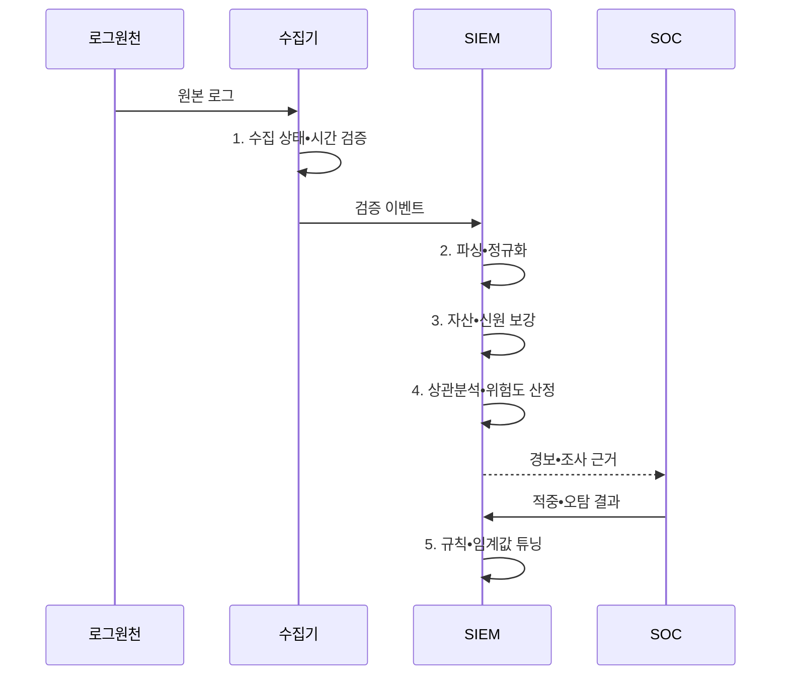

---
sidebar:
  order: 35
  label: "035. SIEM - 보안 이벤트 집계•분석 (SIEM)"
  badge:
    text: "기출 • 85%"
    variant: note
title: "SIEM - 보안 이벤트 집계•분석 (SIEM)"
date: "2026-08-05T00:00:00+09:00"
tags:
  - "notes-security"
weight: 35
extra:
  question_no: "035"
  source_status: "기출"
  source_history: "128회, 129회, 138회"
  priority: 85
  priority_note: "128•129•138회 반복된 보안관제 데이터 허브임"
---

## Ⅰ. 개요

<details>
<summary>핵심 용어</summary>

- **보안 정보 및 이벤트 관리(Security Information and Event Management, SIEM)** 는 이종 로그를 정규화•상관분석하여 보안 경보와 조사 근거를 생성하는 플랫폼이다.

</details>

- 정의/개념: 이종 로그를 정규화•상관 분석해 **경보•조사 근거** 를 생성하는 보안 플랫폼
- 배경/필요성: 분산 로그만으로는 **시간•자산•신원 공격 맥락 연결 불가**

#### 한줄 요약

- 여러 기록을 한 시간선에 놓아 침입 분석

## Ⅱ. 특징

<details>
<summary>핵심 용어</summary>

- **정규화** 는 이종 로그를 공통 스키마와 시간 기준으로 변환한다.
- **상관분석** 은 시간•자산•신원 관계에서 공격 맥락을 찾는다.
- **증거 추적성** 은 경보의 판정 근거를 원본 로그까지 되짚어 검증할 수 있는 성질이다.

</details>

- 이종 로그의 **공통 스키마 정규화**
- 시간•자산•신원 기반 **이벤트 상관분석**
- 경보에서 원본까지의 **증거 추적성**

#### 한줄 요약

- 기록 정규화 및 맥락 통합 필수

## Ⅲ. 구조 및 구성요소

<details>
<summary>핵심 용어</summary>

- **응용 프로그래밍 인터페이스(Application Programming Interface, API)** 는 보안•업무 시스템과 SIEM의 자동 연동 규격이다.
- **Syslog** 는 서버와 네트워크 장비의 이벤트 로그를 중앙 수집기로 전달하는 표준 프로토콜이다.

</details>

```text
[수집•전송] ----- [파싱•정규화] ----- [데이터 보강] ----- [상관•분석]
                                              \             /
                                                [저장•관리]
```

선의 의미: 가로선은 원천 이벤트 수집, 공통 스키마 정규화, 자산•신원 보강과 상관분석 기능의 정적 결합 관계이고, 아래 가지는 저장•관리가 보강 데이터와 분석 근거를 함께 보존하는 관계를 뜻한다.

| 구성요소 | 책임 |
|:---|:---|
| 수집•전송 | **API•Syslog 원천 이벤트** 전달 |
| 파싱•정규화 | **공통 스키마•시간 기준** 적용 |
| 데이터 보강 | **자산 중요도•소유자** 연결 |
| 상관•분석 | **공격 맥락•경보** 생성 |
| 저장•관리 | **원본•정규화 로그** 보존 |


#### 한줄 요약

- 가공 경보의 원본 판정 검증 기능

## Ⅳ. 흐름도

<details>
<summary>핵심 용어</summary>

- **탐지 사례(Detection Use Case)** 는 탐지할 공격 행위와 필요한 로그•조건•대응 절차를 정의한 분석 시나리오다.
- **튜닝** 은 적중•오탐 결과에 따라 필드•조건•임계값을 보정하는 활동이다.

</details>



**동작 원리**

1. **수집 상태•시간 검증**: 유실•지연과 원천 시각 확인
2. **파싱•정규화**: 원본 필드를 공통 스키마로 변환
3. **자산•신원 보강**: 중요도•소유자•계정 문맥 연결
4. **상관분석•위험도 산정**: 시간•자산•신원 관계로 공격 판별
5. **규칙•임계값 튜닝**: 적중•오탐 결과로 분석 조건 보정


#### 한줄 요약

- 사전 공격 정의 후 로그 수집 필요

## Ⅴ. 종류 및 비교

<details>
<summary>핵심 용어</summary>

- **로그 관리** 는 감사•검색을 위해 원본 로그를 수집•보존하는 방식이다.
- **보안 데이터 레이크** 는 대용량 원본 로그를 장기 보존하고 필요할 때 재분석하는 저장소다.

</details>

| 보안 로그 활용 | 로그 관리 | SIEM | 보안 데이터 레이크 |
|:---|:---|:---|:---|
| 적용 기준 | **감사•장애 기록** 필요 | **실시간 보안관제** 필요 | **대용량 장기 재분석** |
| 핵심 특징 | **원본 로그 보관•검색** | **실시간 상관•경보** | **장기 원본•재처리** |
| 한계 | 공격 맥락 **연결 부족** | **수집 비용•오탐** | **스키마•접근 통제** 부족 |

> 요약: 목적에 따라 계층적 저장•분석 선택함

#### 한줄 요약

- 보관•탐지•저장 목적별 기록 관리

## Ⅵ. 실무 고려사항 및 대책

<details>
<summary>핵심 용어</summary>

- **미국 국립표준기술연구소(National Institute of Standards and Technology, NIST)** 는 미국의 기술 표준과 지침을 개발하는 기관이다.
- **특별 간행물(Special Publication, SP) 800-92** 은 전사 로그 수집•보존•분석 절차를 제시한다.
- **인터넷 기술 태스크포스(Internet Engineering Task Force, IETF)** 는 인터넷 프로토콜 표준을 개발하는 조직이다.
- **의견 요청 문서(Request for Comments, RFC) 5424** 는 Syslog 메시지 구조와 전송 요구사항을 정의한다.
- **가상 사설망(Virtual Private Network, VPN)** 은 공용망 위에 암호화된 가상 통신 경로를 만든다.

</details>

| 문제 | 대책 | 효과 |
|:---|:---|:---|
| **전사 로그 거버넌스** | **NIST SP 800-92 적용** | **수집•보존 책임** 일관화 |
| **Syslog 형식 편차** | **IETF RFC 5424 준수** | **파싱•상호운용성** 향상 |
| **경보 과다•비용 증가** | **위험도별 수집•튜닝** | **오탐•저장 비용** 절감 |

#### 한줄 요약

- SIEM은 VPN의 해외 로그인과 사내 시스템의 대량 조회 로그를 같은 계정 기준으로 연결해 계정 탈취 경보를 생성한다.

## Ⅶ. 결론

<details>
<summary>핵심 용어</summary>

- **분석 근거** 는 자산•신원 맥락과 원본 증적을 포함해 분석가가 경보 판정을 재현할 수 있게 해야 한다.

</details>

- 감사•검색은 **로그 관리**, 실시간 상관은 **SIEM**, 장기 재분석은 **데이터 레이크** 선택

#### 한줄 요약

- 분석 근거가 포함된 중요한 탐지 구현
