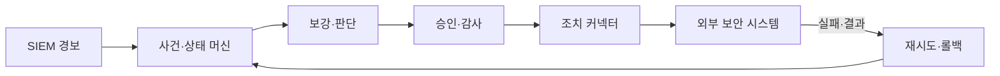
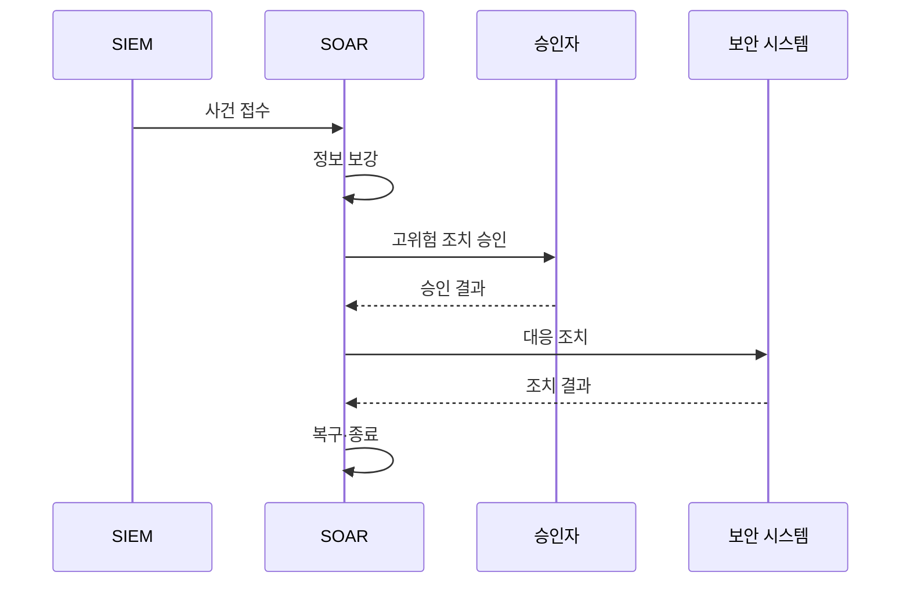

---
sidebar:
  order: 36
  label: "036. SOAR - 보안 자동화·대응 (SOAR)"
  badge:
    text: "기출 · 70%"
    variant: note
title: "SOAR - 보안 자동화·대응 (SOAR)"
date: "2026-07-25T01:05:00+09:00"
tags:
  - "notes-security"
weight: 36
extra:
  question_no: "036"
  source_status: "기출"
  source_history: "138회"
  priority: 70
  priority_note: "138회 최신 기출이며 대응 자동화 설계에 활용됨"
---

## 미리 알고가기

- **보안 오케스트레이션·자동화·대응(Security Orchestration, Automation and Response, SOAR)**: '에스오에이알'로 읽고 영문 머리글자로 보안 도구를 연결해 사건 조사·승인·조치를 자동화하는 체계를 표시
- **보안 정보 및 이벤트 관리(Security Information and Event Management, SIEM)**: '에스아이이엠'으로 읽고 영문 머리글자로 로그를 상관 분석해 탐지 경보를 만드는 체계를 표시
- **응용 프로그래밍 인터페이스(Application Programming Interface, API)**: '에이피아이'로 읽고 영문 머리글자로 외부 보안 시스템을 호출하는 연동 계약을 표시
- **플레이북(Playbook)**: 사건의 조사·판단·승인·조치 순서와 분기 조건을 정의한 절차
- **멱등성(Idempotency)**: 같은 조치 요청이 반복돼도 결과가 한 번 실행한 상태와 같게 유지되는 성질
- **롤백(Rollback)**: 자동 조치가 실패하거나 오조치로 판명될 때 이전 상태로 되돌리는 복구
- **상태 머신(State Machine)**: 사건의 접수·분석·승인·조치·종료 상태와 허용 전이를 관리하는 구조
- **큐(Queue)**: 처리할 API 요청을 순서대로 보관해 장애·과부하 때 유실을 줄이는 대기열
## Ⅰ. 개요

- **정의/개념**: 조사·승인·조치·복구를 자동 연결함
- **배경/필요성**: 반복 대응과 고위험 조치를 통제해야 함

### 쉽게 이해하기 (학습용)
- 경보를 받으면 정해진 순서로 정보를 조회하고 위험한 조치는 사람의 승인을 받은 뒤 실행한다.

## Ⅱ. 특징

- 경보·요청을 사건화하고 위협 정보를 보강한다
- 위험도·영향에 따라 승인·자동 경로를 나눈다
- 최소 권한 자격으로 외부 시스템을 조치한다
- 중복·부분 실패·롤백을 안전하게 처리한다

### 쉽게 이해하기 (학습용)
- 방화벽 차단 실패를 전체 성공으로 오인하지 않아야 함

## Ⅲ. 아키텍처 및 구성요소

| 설계 요소 | 설명 |
|:---|:---|
| 사건·상태 머신 | 사건 상태와 플레이북 전이 관리 |
| 보강·판단 | 자산·위협 정보로 위험도 판정 |
| 승인·감사 | 고위험 조치 승인과 실행 이력 보관 |
| 조치 커넥터 | 최소 권한으로 외부 시스템 제어 |
| 재시도·롤백 | 부분 실패 복구와 수동 전환 |

> 요약: 사건 상태와 승인에 따라 조치·복구

### 쉽게 이해하기 (학습용)

- 자동 명령을 보낸 뒤 대상 시스템의 실제 상태를 확인해야 사건을 완료로 닫을 수 있다.

## Ⅳ. 원리 및 절차 흐름도

| 절차 | 설명 |
|:---|:---|
| 사건 접수 | SIEM 경보를 사건으로 등록 |
| 정보 보강 | 자산·위협 정보로 위험도 판정 |
| 고위험 조치 승인 | 업무 영향 조치의 사람 승인 요청 |
| 승인 결과 | 허용·거부 결과와 승인자 기록 |
| 대응 조치 | 최소 권한으로 외부 시스템 제어 |
| 조치 결과 | 실제 적용 상태와 실패 원인 반환 |
| 복구·종료 | 실패 복구 후 사건 상태 확정 |

> 요약: 위험 승인 후 조치 결과로 종료 판정

### 쉽게 이해하기 (학습용)

- 처음부터 자동 차단하지 않고 조회와 권고부터 검증해 신뢰가 쌓일 때 권한을 넓힘

## Ⅴ. 종류 및 비교

| 판단 기준 | 수동 대응 | 사람 승인 자동화 | 무인 자동화 |
|:---|:---|:---|:---|
| 핵심 특징 | 분석가가 전 과정을 실행 | 자동 보강 후 분석가가 조치 승인 | 정책이 조건 충족 시 조치까지 실행 |
| 적용 기준 | 복잡하고 고영향인 비정형 사건 | 가역적이지만 업무 영향이 있는 조치 | 저영향·반복적이고 신뢰도가 높은 업무 |
| 주요 위험 | 분석가 피로 | 승인 병목 발생 | 대량 오조치 확산 |

> 요약: 신뢰·영향·가역성 기반 자동화 수준 결정함

### 쉽게 이해하기 (학습용)

- 메일 조회는 자동화해도 핵심 관리자 계정 폐기는 사람이 확인하게 만드는 식으로 단계를 나눔

## Ⅵ. 실무 사례

1. 피싱 사건은 메일 격리 전 담당자 승인
2. 계정 잠금은 실행 식별자로 중복 방지
3. 방화벽 장애는 큐 보관 후 수동 전환

### 쉽게 이해하기 (학습용)

- 피싱 메일은 조사 정보를 자동 보강하되 메일 격리 전 담당자의 승인을 받는다.
- 계정 잠금 요청마다 실행 식별자를 붙여 재시도해도 같은 계정을 한 번만 잠근다.
- 방화벽 API가 실패하면 요청을 큐에 보관하고 재시도 한계를 넘으면 분석가에게 넘긴다.

## Ⅶ. 결론

- SOAR는 권한·승인·복구로 자동화를 통제함

### 쉽게 이해하기 (학습용)

- SOAR는 안전한 조치부터 자동화해야 함
