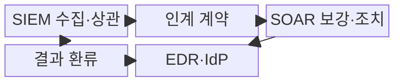
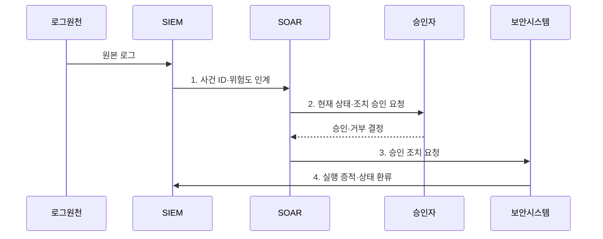

---
sidebar:
  order: 37
  label: "037. SIEM vs SOAR 비교 (SIEM vs SOAR)"
  badge:
    text: "기출 · 50%"
    variant: note
title: "SIEM vs SOAR 비교 (SIEM vs SOAR)"
date: "2026-08-02T23:47:00+09:00"
tags:
  - "notes-security"
weight: 37
extra:
  question_no: "037"
  source_status: "기출"
  source_history: "138회"
  priority: 50
  priority_note: "138회 직전 비교 기출이라 동일문구 반복은 감점함"
---

## Ⅰ. 개요

핵심 용어

- **SIEM·SOAR 연계**는 SIEM이 로그 상관분석으로 만든 경보·조사 근거를 SOAR에 넘기고, SOAR가 보안 도구를 연계해 조사·승인·조치를 수행하는 관제 구조다.

- 정의/개념: SIEM의 **로그 탐지·분석**과 SOAR의 **조사·조치 자동화**를 연결한 관제 구조
- 배경/필요성: 탐지·조치 시스템 분리로 **사건 인계·대응 지연**

#### 한줄 요약
- SIEM이 위협을 찾으면 SOAR가 조치를 자동 실행함

## Ⅱ. 특징

핵심 용어

- **사건 ID**는 SIEM 경보와 SOAR 대응 기록을 동일 사건으로 연결하는 고유 값이다.
- **폐쇄 루프**는 조치 결과를 탐지 규칙에 되돌려 다음 경보 판단을 개선하는 순환이다.

- SIEM의 **로그 상관분석·경보 생성**
- SOAR의 **정보 보강·플레이북 실행**
- 사건 ID 기반 **폐쇄 루프 결과 환류**

#### 한줄 요약
- 운영 규칙으로 역할 및 판정 주체를 정해야 함

## Ⅲ. 구조 및 구성요소

핵심 용어

- **인계 계약**은 사건 ID·증거·위험도·대상 필드를 SIEM과 SOAR가 일관되게 주고받도록 정의한다.
- **EDR·IdP**는 각각 단말 격리와 계정 잠금·세션 회수를 집행한다.

| 구성요소 | 책임 |
|:---|:---|
| SIEM 수집·상관 | 원본 로그 기반 **경보·조사 근거** 생성 |
| 인계 계약 | **사건 ID·증거·위험도** 전달 보장 |
| SOAR 보강·조치 | **사건 승인·외부 조치·복구** 수행 |
| EDR·IdP | **단말 격리·계정 세션 회수** 집행 |
| 결과 환류 | 조치 결과 기반 **탐지 규칙 개선** |

#### 한줄 요약

- 경보 번호와 대응 티켓이 연결돼야 무엇을 왜 막았고 결과가 어땠는지 다시 추적할 수 있음

## Ⅳ. 흐름도

핵심 용어

- **실행 증적**은 요청 성공 응답뿐 아니라 실제 격리·차단·복구 상태까지 기록한 결과다.
- **최소 권한 API**는 SOAR가 승인된 대상과 조치 범위에 한해서만 보안 시스템의 기능을 호출하게 하는 연동 통제다.

**동작 원리**

1. **사건 ID·위험도 인계**: 증거·대상·우선순위를 SOAR에 전달
2. **현재 상태·조치 승인 요청**: 오탐·업무 영향·가역성 검토 요청
3. **승인 조치 요청**: 최소 권한 API로 격리·차단·복구 지시
4. **실행 증적·상태 환류**: 실제 결과로 탐지 규칙·플레이북 개선

#### 한줄 요약

- 화면 연동만 보지 말고 검증 경보가 실제 격리와 확인과 복구까지 이어지는지 검증해야 함

## Ⅴ. 종류 및 비교

핵심 용어

- **탐지 근거**는 SIEM의 책임이고, **대응 수행**은 SOAR의 책임이며 두 시스템은 사건 ID로 연결한다.

| 보안 관제 플랫폼 | SIEM | SOAR |
|:---|:---|:---|
| 적용 기준 | **탐지 근거** 필요 시 | **자동 대응** 필요 시 |
| 핵심 특징 | **로그 상관·경보 생성** | **플레이북 대응 실행** |
| 한계 | **로그 품질 저하·오탐** | **오탐 자동화·권한 집중** |

> 요약: SIEM은 탐지 근거, SOAR는 대응 수행함

#### 한줄 요약

- 감지기의 판단이 틀리면 자동 대응이 더 빨리 틀리므로 두 시스템의 품질은 앞뒤로 연결됨

## Ⅵ. 실무 고려사항 및 대책

핵심 용어

- **NIST SP 800-92**는 전사 로그 수집·보존·분석 절차를 제시한다.
- **OASIS CACAO 2.0**은 자동 대응 플레이북의 구조·워크플로·명령을 정의한다.
- **EDR 격리**는 단말 탐지·대응 시스템이 침해 단말의 네트워크 통신을 제한하는 조치다.

| 문제 | 대책 | 효과 |
|:---|:---|:---|
| **로그 품질·추적성** | **NIST SP 800-92 적용** | 경보 근거 **신뢰성** 확보 |
| **플레이북 이식성** | **OASIS CACAO 2.0 적용** | 대응 절차 **상호운용** 확보 |
| **오탐 자동 조치** | **사건 ID·승인·결과 환류** | **오조치 확산·책임 공백** 방지 |

#### 한줄 요약

- SIEM이 단말의 악성 행위를 로그 연계로 탐지하면 SOAR가 현재 상태를 확인하고 승인된 절차에 따라 EDR 격리를 실행한다.

## Ⅶ. 결론

핵심 용어

- **운영 추적성**은 탐지 근거와 승인·조치·복구 결과가 하나의 사건 기록에 남을 때 확보된다.
- **SIEM·SOAR 역할 분리**는 탐지·증거 생성은 SIEM이, 조사·조치 실행은 SOAR가 맡고 사건 ID로 결과를 환류하는 구조다.

- 탐지·증거는 **SIEM**, 조사·조치는 **SOAR**, 사건 ID로 결과 폐쇄 루프 연결

#### 한줄 요약

- 탐지 근거와 조치 결과가 한 사건에 남아야 함
