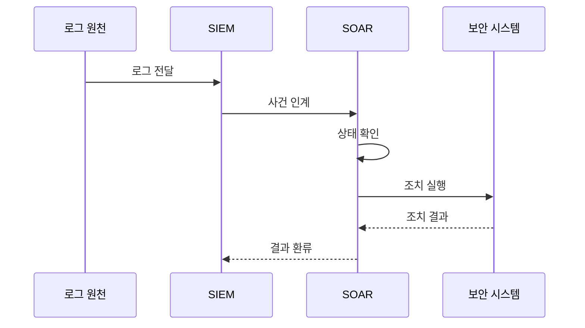

---
sidebar:
  order: 37
  label: "037. SIEM vs SOAR 비교 (SIEM vs SOAR)"
  badge:
    text: "기출 · 50%"
    variant: note
title: "SIEM vs SOAR 비교 (SIEM vs SOAR)"
date: "2026-07-27T23:59:59+09:00"
tags:
  - "notes-security"
weight: 37
extra:
  question_no: "037"
  source_status: "기출"
  source_history: "138회"
  priority: 50
  priority_note: "138회 직전 비교 기출이라 동일문구 반복은 감점함"
---

## 미리 알고가기

- **보안 정보 및 이벤트 관리(Security Information and Event Management, SIEM)**: 심으로 읽고 영문 머리글자를 딴 표기이며, 로그 상관분석으로 경보와 조사 근거를 생성
- **보안 오케스트레이션·자동화·대응(Security Orchestration, Automation and Response, SOAR)**: 소어로 읽고 영문 머리글자를 딴 표기이며, 사건 조사·승인·조치를 자동화
- **종단 탐지·대응(Endpoint Detection and Response, EDR)**: '이디알'로 읽고 영문 머리글자로 단말 위협 탐지·격리를 수행하는 도구를 표시
- **신원 제공자(Identity Provider, IdP)**: '아이디피'로 읽고 영문 머리글자로 계정 인증과 잠금을 제공하는 시스템을 표시
- **사건 식별자(Incident Identifier, Incident ID)**: '인시던트 아이디'로 읽고 영문 머리글자로 SIEM 경보와 SOAR 대응을 같은 사건으로 연결하는 값을 표시
- **폐쇄 루프(Closed Loop)**: 조치 결과를 탐지 규칙에 되돌려 다음 경보 판단을 개선하는 순환
## Ⅰ. 개요

- 정의: SIEM **탐지**와 SOAR **대응**의 연계
- 기존 한계: 탐지·조치 분리의 **대응 지연**

### 쉽게 이해하기 (학습용)
- SIEM이 위협을 찾으면 SOAR가 조치를 자동 실행함

## Ⅱ. 특징

- SIEM의 **로그 상관분석·경보 생성**
- SOAR의 **정보 보강·플레이북 실행**
- 사건 ID 기반 **조치 결과 환류**

### 쉽게 이해하기 (학습용)
- 운영 규칙으로 역할 및 판정 주체를 정해야 함

## Ⅲ. 아키텍처 및 구성요소

| 설계 요소 | 설명 |
|:---|:---|
| SIEM 수집·상관 | 원본 로그로 경보·조사 근거 생성 |
| 인계 계약 | 사건 ID·증거·위험도 전달 보장 |
| SOAR 보강·조치 | 사건 승인·외부 조치·복구 수행 |
| 결과 환류 | 조치 결과로 탐지 규칙 개선 |

> 요약: SIEM 분석과 SOAR 조치를 사건ID로 연결함

### 쉽게 이해하기 (학습용)

- 경보 번호와 대응 티켓이 연결돼야 무엇을 왜 막았고 결과가 어땠는지 다시 추적할 수 있음

## Ⅳ. 원리 및 절차 흐름도

| 절차 | 설명 |
|:---|:---|
| 로그 전달 | 원본 로그를 SIEM에 수집 |
| 사건 인계 | 사건 ID·근거·위험도 전달 |
| 상태 확인 | 근거와 대상의 현재 상태 검증 |
| 조치 실행 | 최소 권한으로 대응 수행 |
| 조치 결과 | 적용 상태와 실패 원인 반환 |
| 결과 환류 | 탐지 규칙에 조치 결과 반영 |

> 요약: 사례 선정 후 사건 인계 및 조치 후 환류함

### 쉽게 이해하기 (학습용)

- 화면 연동만 보지 말고 검증 경보가 실제 격리와 확인과 복구까지 이어지는지 검증해야 함

## Ⅴ. 종류 및 비교

| 보안 관제 플랫폼 | SIEM | SOAR |
|:---|:---|:---|
| 적용 기준 | 탐지 근거 필요 시 | 자동 대응 필요 시 |
| 핵심 특징 | 로그 상관분석·경보 생성 | 플레이북 기반 대응 실행 |
| 한계 | 로그 품질 저하·오탐 | 오탐 자동화·권한 집중 |

> 요약: SIEM은 탐지 근거, SOAR는 대응 수행함

### 쉽게 이해하기 (학습용)

- 감지기의 판단이 틀리면 자동 대응이 더 빨리 틀리므로 두 시스템의 품질은 앞뒤로 연결됨

## Ⅵ. 실무 사례

1. 악성 단말의 **상태 확인 후 격리**
2. 계정 탈취의 **사건 ID 결과 환류**
3. 연동 장애의 **사건 큐 유실 방지**

### 쉽게 이해하기 (학습용)

- 조치 전에 SIEM 원본 근거와 현재 자산 상태를 다시 확인함
- 연동 장애·지연 때 사건 유실과 중복 조치를 검증함
- 탐지 적중·격리 성공·오조치를 같은 사건 ID로 측정함

## Ⅶ. 결론

- **탐지 근거·조치 결과**를 사건 ID로 연결

### 쉽게 이해하기 (학습용)

- 탐지 근거와 조치 결과가 한 사건에 남아야 함
