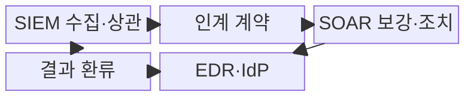
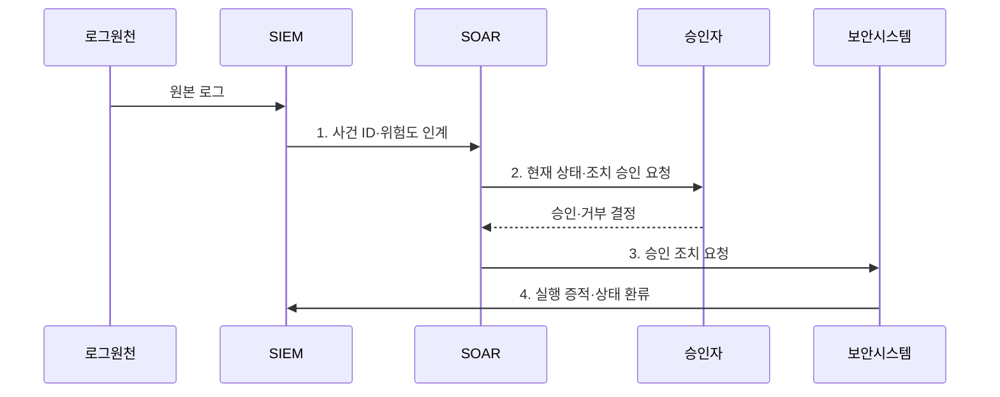

---
sidebar:
  order: 37
  label: "037. SIEM vs SOAR 비교 (SIEM vs SOAR)"
  badge:
    text: "기출 · 50%"
    variant: note
title: "SIEM vs SOAR 비교 (SIEM vs SOAR)"
date: "2026-07-31T03:32:00+09:00"
tags:
  - "notes-security"
weight: 37
extra:
  question_no: "037"
  source_status: "기출"
  source_history: "138회"
  priority: 50
  priority_note: "138회 직전 비교 기출이라 동일문구 반복은 감점함"
---

## 미리 알고가기

- **보안 정보 및 이벤트 관리(Security Information and Event Management, SIEM)**: 로그 상관분석으로 경보와 조사 근거를 생성하는 탐지·분석 시스템이다.
- **보안 오케스트레이션·자동화·대응(Security Orchestration, Automation and Response, SOAR)**: 보안 도구를 연계하여 사건 조사·승인·조치를 자동화하는 대응 플랫폼이다.
- **종단 탐지·대응(Endpoint Detection and Response, EDR)**: 단말 행위를 탐지하고 위협 프로세스·호스트를 격리하는 보안 도구이다.
- **신원 제공자(Identity Provider, IdP)**: 사용자 인증과 계정 잠금·세션 회수를 제공하는 신원 시스템이다.
- **사건 식별자(Incident Identifier, Incident ID)**: SIEM 경보와 SOAR 대응 기록을 동일 사건으로 연결하는 고유 값이다.
- **폐쇄 루프(Closed Loop)**: 조치 결과를 탐지 규칙에 되돌려 다음 경보 판단을 개선하는 순환이다.
- **NIST SP 800-92**: 전사 로그 관리 기반과 수집·보존·분석 절차를 제시한 공식 지침이다.
- **OASIS CACAO 2.0**: 자동 대응 플레이북의 구조·워크플로·명령을 정의한 공식 규격이다.
## Ⅰ. 개요

- 정의/개념: SIEM의 **로그 탐지·분석**과 SOAR의 **조사·조치 자동화**를 연결한 관제 구조
- 배경/필요성: 탐지·조치 분리의 **대응 지연**

### 쉽게 이해하기 (학습용)
- SIEM이 위협을 찾으면 SOAR가 조치를 자동 실행함

## Ⅱ. 특징

- SIEM의 **로그 상관분석·경보 생성**
- SOAR의 **정보 보강·플레이북 실행**
- 사건 ID 기반 **조치 결과 환류**

### 쉽게 이해하기 (학습용)
- 운영 규칙으로 역할 및 판정 주체를 정해야 함

## Ⅲ. 구조 및 구성요소

| 구성요소 | 책임 |
|:---|:---|
| SIEM 수집·상관 | 원본 로그 기반 **경보·조사 근거** 생성 |
| 인계 계약 | **사건 ID·증거·위험도** 전달 보장 |
| SOAR 보강·조치 | **사건 승인·외부 조치·복구** 수행 |
| EDR·IdP | **단말 격리·계정 세션 회수** 집행 |
| 결과 환류 | 조치 결과 기반 **탐지 규칙 개선** |

### 쉽게 이해하기 (학습용)

- 경보 번호와 대응 티켓이 연결돼야 무엇을 왜 막았고 결과가 어땠는지 다시 추적할 수 있음

## Ⅳ. 흐름도

**동작 원리**

1. **사건 ID·위험도 인계**: 증거·대상·우선순위를 SOAR에 전달
2. **현재 상태·조치 승인 요청**: 오탐·업무 영향·가역성 검토 요청
3. **승인 조치 요청**: 최소 권한 API로 격리·차단·복구 지시
4. **실행 증적·상태 환류**: 실제 결과로 탐지 규칙·플레이북 개선

### 쉽게 이해하기 (학습용)

- 화면 연동만 보지 말고 검증 경보가 실제 격리와 확인과 복구까지 이어지는지 검증해야 함

## Ⅴ. 종류 및 비교

| 보안 관제 플랫폼 | SIEM | SOAR |
|:---|:---|:---|
| 적용 기준 | **탐지 근거** 필요 시 | **자동 대응** 필요 시 |
| 핵심 특징 | **로그 상관·경보 생성** | **플레이북 대응 실행** |
| 한계 | **로그 품질 저하·오탐** | **오탐 자동화·권한 집중** |

> 요약: SIEM은 탐지 근거, SOAR는 대응 수행함

### 쉽게 이해하기 (학습용)

- 감지기의 판단이 틀리면 자동 대응이 더 빨리 틀리므로 두 시스템의 품질은 앞뒤로 연결됨

## Ⅵ. 실무 고려사항 및 대책

| 고려사항 | 대책 | 효과 |
|:---|:---|:---|
| **로그 품질·추적성** | **NIST SP 800-92 적용** | 경보 근거 **신뢰성** 확보 |
| **플레이북 이식성** | **OASIS CACAO 2.0 적용** | 대응 절차 **상호운용** 확보 |
| **오탐 자동 조치** | **사건 ID·승인·결과 환류** | **오조치 확산·책임 공백** 방지 |

### 쉽게 이해하기 (학습용)

- SIEM이 단말의 악성 행위를 로그 연계로 탐지하면 SOAR가 현재 상태를 확인하고 승인된 절차에 따라 EDR 격리를 실행한다.

## Ⅶ. 결론

- 탐지·증거는 **SIEM**, 조사·조치는 **SOAR**, 사건 ID로 결과 폐쇄 루프 연결

### 쉽게 이해하기 (학습용)

- 탐지 근거와 조치 결과가 한 사건에 남아야 함
