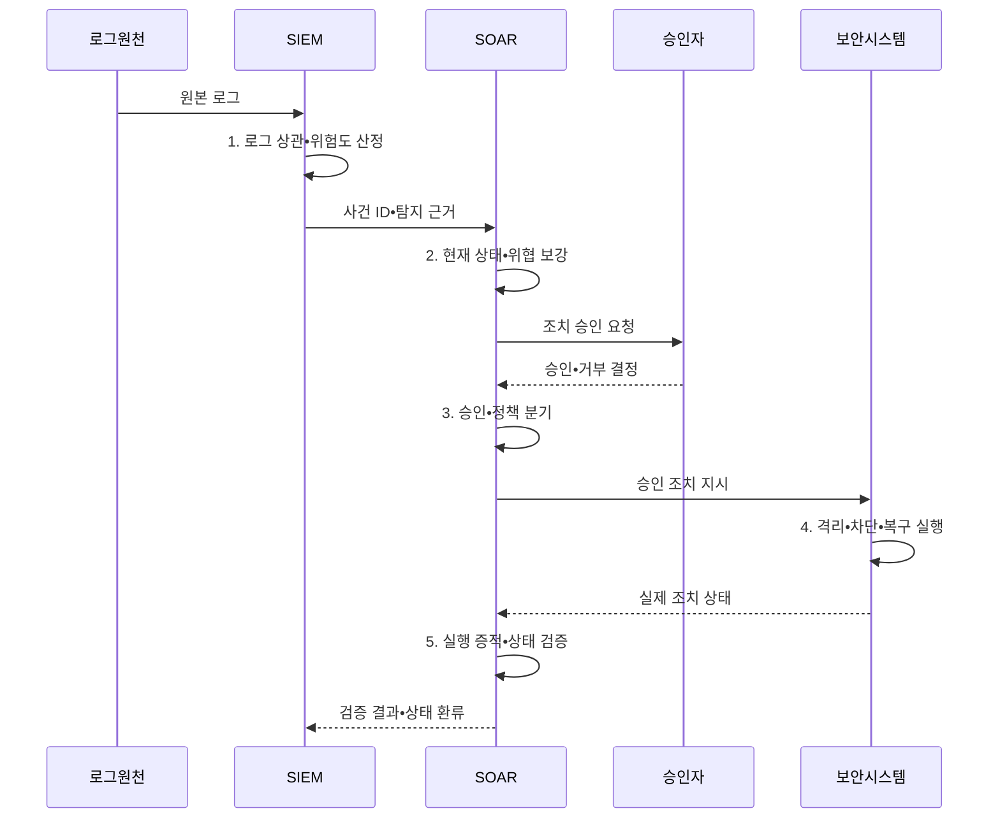

---
sidebar:
  order: 37
  label: "037. SIEM vs SOAR 비교 (SIEM vs SOAR)"
  badge:
    text: "기출 • 50%"
    variant: note
title: "SIEM vs SOAR 비교 (SIEM vs SOAR)"
date: "2026-08-05T00:00:00+09:00"
tags:
  - "notes-security"
weight: 37
extra:
  question_no: "037"
  source_status: "기출"
  source_history: "138회"
  priority: 50
  priority_note: "138회 직전 비교 기출이라 동일문구 반복은 감점함"
---

## Ⅰ. 개요

<details>
<summary>핵심 용어</summary>

- **보안 정보•이벤트 관리(Security Information and Event Management, SIEM)** 는 로그를 상관분석하여 경보와 조사 근거를 생성한다.
- **보안 오케스트레이션•자동화•대응(Security Orchestration, Automation and Response, SOAR)** 은 보안 도구를 연계하여 조사•승인•조치를 수행한다.

</details>

- 정의/개념: SIEM의 **로그 탐지•분석** 과 SOAR의 **조사•조치 자동화** 를 연결한 관제 구조
- 배경/필요성: 탐지•조치 시스템 분리로 **사건 인계•대응 지연**

#### 한줄 요약
- SIEM이 위협을 찾으면 SOAR가 조치를 자동 실행함

## Ⅱ. 특징

<details>
<summary>핵심 용어</summary>

- **사건 ID** 는 SIEM 경보와 SOAR 대응 기록을 동일 사건으로 연결하는 고유 값이다.
- **폐쇄 루프** 는 조치 결과를 탐지 규칙에 되돌려 다음 경보 판단을 개선하는 순환이다.

</details>

- SIEM의 **로그 상관분석•경보 생성**
- SOAR의 **정보 보강•플레이북 실행**
- 사건 ID 기반 **폐쇄 루프 결과 환류**

#### 한줄 요약
- 운영 규칙으로 역할 및 판정 주체를 정해야 함

## Ⅲ. 구조 및 구성요소

<details>
<summary>핵심 용어</summary>

- **인계 계약** 은 사건 ID•증거•위험도•대상 필드를 SIEM과 SOAR가 일관되게 주고받도록 정의한다.
- **엔드포인트 탐지•대응(Endpoint Detection and Response, EDR)** 은 침해 단말의 격리를 집행한다.
- **신원 제공자(Identity Provider, IdP)** 는 계정 잠금과 세션 회수를 집행한다.

</details>

```text
[SIEM 수집•상관] ----- [인계 계약] ----- [SOAR 보강•조치] ----- [EDR•IdP]
        \                                                       /
                               [결과 환류]
```

선의 의미: 가로선은 SIEM 탐지 근거가 인계 계약을 경계로 SOAR와 EDR•IdP 집행 기능에 결합되는 관계이고, 아래 가지는 실제 조치 결과를 SIEM 탐지 규칙에 연결하는 정적 환류 구조를 뜻한다.

| 구성요소 | 책임 |
|:---|:---|
| SIEM 수집•상관 | 원본 로그 기반 **경보•조사 근거** 생성 |
| 인계 계약 | **사건 ID•증거•위험도** 전달 보장 |
| SOAR 보강•조치 | **사건 승인•외부 조치•복구** 수행 |
| EDR•IdP | **단말 격리•계정 세션 회수** 집행 |
| 결과 환류 | 조치 결과 기반 **탐지 규칙 개선** |


#### 한줄 요약

- 경보 번호와 대응 티켓이 연결돼야 무엇을 왜 막았고 결과가 어땠는지 다시 추적할 수 있음

## Ⅳ. 흐름도

<details>
<summary>핵심 용어</summary>

- **실행 증적** 은 요청 성공 응답뿐 아니라 실제 격리•차단•복구 상태까지 기록한 결과다.
- **최소 권한 응용 프로그래밍 인터페이스(Application Programming Interface, API)** 는 승인된 대상과 조치 범위만 호출하게 하는 통제다.

</details>



**동작 원리**

1. **로그 상관•위험도 산정**: 원본 증거와 자산 맥락으로 경보 판별
2. **현재 상태•위협 보강**: 대상 상태와 위협 정보 추가 조회
3. **승인•정책 분기**: 업무 영향•가역성에 따라 실행 방식 선택
4. **격리•차단•복구 실행**: 최소 권한 API로 승인 조치 수행
5. **실행 증적•상태 검증**: 실제 결과 확인과 사건 기록 갱신


#### 한줄 요약

- 화면 연동만 보지 말고 검증 경보가 실제 격리와 확인과 복구까지 이어지는지 검증해야 함

## Ⅴ. 종류 및 비교

<details>
<summary>핵심 용어</summary>

- **탐지 근거** 는 원본 로그와 상관 조건으로 SIEM의 경보 판정을 재현하는 증적이다.
- **대응 수행** 은 승인된 플레이북에 따라 SOAR가 외부 보안 도구의 조치를 실행하는 책임이다.

</details>

| 보안 관제 플랫폼 | SIEM | SOAR |
|:---|:---|:---|
| 적용 기준 | **탐지 근거** 필요 시 | **자동 대응** 필요 시 |
| 핵심 특징 | **로그 상관•경보 생성** | **플레이북 대응 실행** |
| 한계 | **로그 품질 저하•오탐** | **오탐 자동화•권한 집중** |

> 요약: SIEM은 탐지 근거, SOAR는 대응 수행함

#### 한줄 요약

- 감지기의 판단이 틀리면 자동 대응이 더 빨리 틀리므로 두 시스템의 품질은 앞뒤로 연결됨

## Ⅵ. 실무 고려사항 및 대책

<details>
<summary>핵심 용어</summary>

- **미국 국립표준기술연구소(National Institute of Standards and Technology, NIST)** 는 미국의 기술 표준과 지침을 개발하는 기관이다.
- **특별 간행물(Special Publication, SP) 800-92** 은 전사 로그 수집•보존•분석 절차를 제시한다.
- **구조화 정보 표준 발전 기구(Organization for the Advancement of Structured Information Standards, OASIS)** 는 개방형 정보 표준을 개발하는 조직이다.
- **자동화된 행동 과정 협업(Collaborative Automated Course of Action Operations, CACAO) 2.0** 은 자동 대응 플레이북의 구조•워크플로•명령을 정의한다.
- **EDR 격리** 는 단말 탐지•대응 시스템이 침해 단말의 네트워크 통신을 제한하는 조치다.

</details>

| 문제 | 대책 | 효과 |
|:---|:---|:---|
| **로그 품질•추적성** | **NIST SP 800-92 적용** | 경보 근거 **신뢰성** 확보 |
| **플레이북 이식성** | **OASIS CACAO 2.0 적용** | 대응 절차 **상호운용** 확보 |
| **오탐 자동 조치** | **사건 ID•승인•결과 환류** | **오조치 확산•책임 공백** 방지 |

#### 한줄 요약

- SIEM이 단말의 악성 행위를 로그 연계로 탐지하면 SOAR가 현재 상태를 확인하고 승인된 절차에 따라 EDR 격리를 실행한다.

## Ⅶ. 결론

<details>
<summary>핵심 용어</summary>

- **운영 추적성** 은 탐지 근거와 승인•조치•복구 결과가 하나의 사건 기록에 남을 때 확보된다.

</details>

- 탐지•증거는 **SIEM**, 조사•조치는 **SOAR**, 사건 ID로 결과 폐쇄 루프 연결

#### 한줄 요약

- 탐지 근거와 조치 결과가 한 사건에 남아야 함
