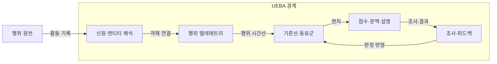
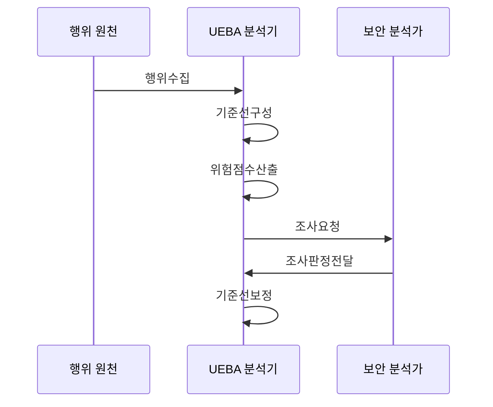

---
sidebar:
  order: 38
  label: "038. UEBA 사용자·엔티티 행동 분석 (UEBA)"
  badge:
    text: "기출 · 70%"
    variant: note
title: "UEBA 사용자·엔티티 행동 분석 (UEBA)"
date: "2026-07-27T23:59:59+09:00"
tags:
  - "notes-security"
weight: 38
extra:
  question_no: "038"
  source_status: "기출"
  source_history: "138회"
  priority: 70
  priority_note: "138회 기출이며 내부자·계정 이상탐지로 확장됨"
---

## 미리 알고가기

- **사용자·엔티티 행동 분석(User and Entity Behavior Analytics, UEBA)**: 사용자·계정·기기의 평소 행동에서 벗어난 활동을 찾아 조사 대상을 선별하는 분석 기법이다.
- **시그니처(Signature)**: 알려진 공격의 고정된 특징을 기록해 관측 데이터와 대조하는 탐지 패턴이다.
- **기준선(Baseline)**: 사용자나 동료 집단의 정상 행동 범위를 나타내며 이상 여부의 비교 기준이 된다.
- **동료군(Peer Group)**: 직무·권한이 비슷한 사용자를 묶어 개인 이력이 부족할 때 비교 기준을 제공하는 집단이다.
- **문맥(Context)**: 직무·위치·시간·자산 중요도처럼 행동 편차의 위험 의미를 해석하는 업무 정보이다.
- **엔티티(Entity)**: 사용자·계정·기기·응용처럼 행동을 연결해 추적할 수 있는 식별 객체이다.
- **텔레메트리(Telemetry)**: 로그인·파일·프로세스·네트워크 활동을 관측해 분석기로 보내는 행위 데이터이다.
- **기준선 오염**: 공격 행동이 정상 학습 데이터에 섞여 이상 탐지 민감도가 낮아지는 현상이다.
- **약어 읽기와 표기**: UEBA는 유이비에이로 읽고 User·Entity·Behavior·Analytics의 머리글자를 딴 표기이며, 사용자·계정·기기의 행동 편차를 분석한다.
## Ⅰ. 개요

- 정의: 엔티티 행동의 **기준선 편차 분석**
- 기존 한계: 정상 계정 악용의 **서명 탐지 한계**

### 쉽게 이해하기 (학습용)

- 도둑이 정상 열쇠로 들어와도 평소와 다른 시간·파일 접근을 묶어 수상한 계정을 찾는다.

## Ⅱ. 특징

- 사용자·계정·기기의 **엔티티 연결**
- 개인·동료군 기반 **행동 기준선**
- 편차·업무 문맥 기반 **위험 점수**

### 쉽게 이해하기 (학습용)

- 개인 기록이 짧아도 비슷한 직무의 행동과 비교하지만 오염된 기준선은 공격을 정상으로 배울 수 있다.

## Ⅲ. 아키텍처 및 구성요소

| 설계 요소 | 설명 |
|:---|:---|
| 신원·엔티티 해석 | 계정·사용자·장비 관계 통합 |
| 행위 텔레메트리 | 활동 내역 실시간 수집 |
| 기준선·동료군 | 정상 행위 범위 모델링 |
| 점수·문맥·설명 | 위험 점수 및 편차 근거 생성 |
| 조사·피드백 | 증거를 검증해 판정을 기준선에 반영 |

> 요약: 신원 행위를 기준선과 비교해 조사 위험 산출함

### 쉽게 이해하기 (학습용)

- 흩어진 계정·기기 기록을 한 사용자 행동으로 연결한 뒤 평소 범위와 비교해 조사 순서를 정한다.

## Ⅳ. 원리 및 절차 흐름도

| 절차 | 설명 |
|:---|:---|
| 행위수집 | 신원 연결과 데이터 품질을 검증함 |
| 기준선구성 | 정상 행위 범위를 모델링함 |
| 위험점수산출 | 행동 편차와 업무 문맥을 결합함 |
| 조사요청 | 고위험 엔티티와 근거를 전달함 |
| 조사판정전달 | 분석가가 오탐·정탐 판정을 전달함 |
| 기준선보정 | 조사 결과로 기준선을 보정함 |

> 요약: 조사 판정으로 기준선을 보정함

### 쉽게 이해하기 (학습용)

- 평소와 다른 행동을 발견하면 근거와 함께 분석가에게 보내고 조사 결과를 다음 판단에 반영한다.

## Ⅴ. 종류 및 비교

| 이상 행위 탐지 | UEBA | 고정 규칙 |
|:---|:---|:---|
| 적용 기준 | 정상 계정의 이상 행위 탐지 | 명확한 공격 패턴 탐지 |
| 핵심 특징 | 개인·동료군·문맥 편차 분석 | 알려진 패턴 직접 대조 |
| 한계 | 기준선 오염·동료군 편향 | 신규·변형 공격 누락 |

> 요약: 규칙·개인·동료군 편차로 조사 우선순위화함

### 쉽게 이해하기 (학습용)

- 알려진 공격 모양은 고정 규칙으로 찾고 정상 계정의 낯선 행동은 개인·동료군 변화로 찾는다.

## Ⅵ. 실무 사례

1. 내부자의 **민감 파일 접근 편차** 조사
2. 탈취 계정의 **접속 위치·시간 편차** 분석

### 쉽게 이해하기 (학습용)

- 내부자 조사에서는 평소보다 민감 파일을 많이 본 계정부터 확인한다.
- 계정 탈취 조사에서는 평소와 다른 장소와 시간에 접속한 계정을 먼저 확인한다.

## Ⅶ. 결론

- **기준선 신뢰도·업무 문맥**으로 임계값 결정

### 쉽게 이해하기 (학습용)

- 정상 기록이 공격에 오염됐으면 경보 기준을 낮추고 분석가 확인을 늘린다.
