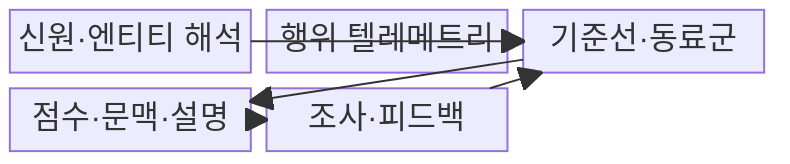
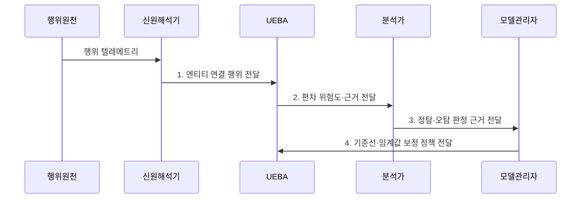

---
sidebar:
  order: 38
  label: "038. UEBA 사용자·엔티티 행동 분석 (UEBA)"
  badge:
    text: "기출 · 70%"
    variant: note
title: "UEBA 사용자·엔티티 행동 분석 (UEBA)"
date: "2026-08-02T23:48:00+09:00"
tags:
  - "notes-security"
weight: 38
extra:
  question_no: "038"
  source_status: "기출"
  source_history: "138회"
  priority: 70
  priority_note: "138회 기출이며 내부자·계정 이상탐지로 확장됨"
---

## Ⅰ. 개요

핵심 용어

- **사용자 및 엔티티 행동 분석(User and Entity Behavior Analytics, UEBA)**은 사용자·계정·기기의 평소 행동에서 벗어난 활동을 찾아 조사 대상을 선별하는 분석 기법이다.
- **시그니처**는 알려진 공격의 고정된 특징을 관측 데이터와 대조하는 탐지 패턴이다.

- 정의/개념: 사용자·계정·기기의 기준선 편차와 문맥으로 **위험 행동을 선별**하는 분석 기법
- 배경/필요성: 정상 계정 악용은 **서명 탐지로 식별 곤란**

### 쉽게 이해하기 (학습용)

- 도둑이 정상 열쇠로 들어와도 평소와 다른 시간·파일 접근을 묶어 수상한 계정을 찾는다.

## Ⅱ. 특징

핵심 용어

- **기준선**은 정상 행동 범위이고, **동료군**은 직무·권한이 비슷한 사용자를 묶어 개인 이력 부족을 보완하는 비교 집단이다.
- **문맥**은 직무·위치·시간·자산 중요도처럼 행동 편차의 위험 의미를 해석하는 업무 정보다.

- 사용자·계정·기기의 **엔티티 연결**
- 개인·동료군 기반 **행동 기준선**
- 편차·업무 문맥 기반 **위험 점수**

### 쉽게 이해하기 (학습용)

- 개인 기록이 짧아도 비슷한 직무의 행동과 비교하지만 오염된 기준선은 공격을 정상으로 배울 수 있다.

## Ⅲ. 구조 및 구성요소

핵심 용어

- **엔티티**는 사용자·계정·기기·응용처럼 행동을 연결해 추적할 수 있는 식별 객체다.
- **텔레메트리**는 로그인·파일·프로세스·네트워크 활동을 관측해 분석기로 보내는 행위 데이터다.

| 구성요소 | 책임 |
|:---|:---|
| 신원·엔티티 해석 | **계정·사용자·장비 관계** 통합 |
| 행위 텔레메트리 | **로그인·파일·프로세스 활동** 수집 |
| 기준선·동료군 | **정상 행위 범위** 모델링 |
| 점수·문맥·설명 | **위험 점수·편차 근거** 생성 |
| 조사·피드백 | **정탐·오탐 판정**을 기준선에 반영 |

### 쉽게 이해하기 (학습용)

- 흩어진 계정·기기 기록을 한 사용자 행동으로 연결한 뒤 평소 범위와 비교해 조사 순서를 정한다.

## Ⅳ. 흐름도

핵심 용어

- **위험 점수**는 기준선 편차와 업무 문맥을 결합해 조사 우선순위를 나타낸 값이다.
- **피드백 보정**은 분석가의 정탐·오탐 판정을 기준선과 임계값 개선에 반영한다.

**동작 원리**

1. **엔티티 연결 행위 전달**: 신원 관계·결측·시각 검증 후 활동 제공
2. **편차 위험도·근거 전달**: 개인·동료군 기준선과 업무 문맥 비교
3. **정탐·오탐 판정 근거 전달**: 고위험 엔티티의 조사 결과 제공
4. **기준선·임계값 보정 정책 전달**: 오염 제거와 모델 개선 조건 지정

### 쉽게 이해하기 (학습용)

- 평소와 다른 행동을 발견하면 근거와 함께 분석가에게 보내고 조사 결과를 다음 판단에 반영한다.

## Ⅴ. 종류 및 비교

핵심 용어

- **고정 규칙**은 알려진 패턴을 직접 대조하고, **UEBA**는 개인·동료군 기준선에서 벗어난 정상 계정의 행동을 찾는다.

| 이상 행위 탐지 | UEBA | 고정 규칙 |
|:---|:---|:---|
| 적용 기준 | 정상 계정의 **이상 행위** 탐지 | 명확한 **공격 패턴** 탐지 |
| 핵심 특징 | **개인·동료군 편차 분석** | **알려진 패턴 직접 대조** |
| 한계 | **기준선 오염·동료군 편향** | **신규·변형 공격** 누락 |

### 쉽게 이해하기 (학습용)

- 알려진 공격 모양은 고정 규칙으로 찾고 정상 계정의 낯선 행동은 개인·동료군 변화로 찾는다.

## Ⅵ. 실무 고려사항 및 대책

핵심 용어

- **기준선 오염**은 공격 행동이 정상 학습 데이터에 섞여 이상 탐지 민감도가 낮아지는 현상이다.
- **NIST SP 800-137**은 조직 위험에 맞춰 보안 상태를 지속 관찰·분석·보고하는 지침이다.

| 문제 | 대책 | 효과 |
|:---|:---|:---|
| **지속 관찰 체계** | **NIST SP 800-137 적용** | 위험 기반 **관찰·보고** 정렬 |
| **기준선 오염·편향** | **학습 구간 격리·동료군 검증** | **공격 행위의 정상 학습·차별 경보** 완화 |
| 설명 없는 **위험 점수** | **편차 근거·문맥 함께 제공** | 조사 **신뢰도·속도** 향상 |

### 쉽게 이해하기 (학습용)

- UEBA는 사용자와 동료 집단의 평소 조회량을 기준으로, 갑자기 대량의 민감 파일을 열람한 계정을 우선 조사 대상으로 올린다.

## Ⅶ. 결론

핵심 용어

- **설명 가능성**은 위험 점수와 함께 어떤 행동이 어떤 기준에서 얼마나 벗어났는지 근거를 제공하는 성질이다.

- 알려진 패턴은 **고정 규칙**, 정상 계정 편차는 **UEBA**, 기준선 오염 시 분석가 확인 강화

### 쉽게 이해하기 (학습용)

- 정상 기록이 공격에 오염됐으면 경보 기준을 낮추고 분석가 확인을 늘린다.
