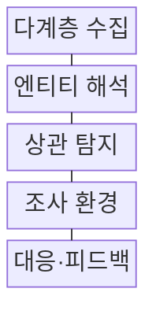
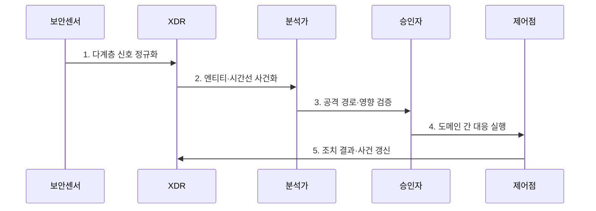

---
sidebar:
  order: 39
  label: "039. XDR 확장 탐지·대응 (XDR Extended Detection Response)"
  badge:
    text: "미출 · 70%"
    variant: note
title: "XDR 확장 탐지·대응 (XDR Extended Detection Response)"
date: "2026-07-25T21:39:00+09:00"
tags:
  - "notes-security"
weight: 39
extra:
  question_no: "039"
  source_status: "미출"
  source_history: ""
  priority: 70
  priority_note: "엔드포인트·망·클라우드 상관분석의 우산 답안임"
---

## 미리 알고가기

- **확장 탐지·대응(Extended Detection and Response, XDR)**: 단말·신원·메일·망·클라우드 신호를 한 사건으로 연결해 조사와 대응을 수행하는 체계이다.
- **엔드포인트 탐지·대응(Endpoint Detection and Response, EDR)**: 단말의 프로세스·파일 행위를 탐지하고 침해 단말을 격리하는 체계이다.
- **네트워크 탐지·대응(Network Detection and Response, NDR)**: 네트워크 흐름과 세션을 분석해 통신 위협을 탐지하고 대응하는 체계이다.
- **텔레메트리(Telemetry)**: 단말·신원·메일·망·클라우드의 활동을 관측해 탐지기에 보내는 데이터이다.
- **상관 분석**: 서로 다른 보안 신호의 사용자·자산·시간 관계를 찾아 하나의 공격 사건으로 묶는 분석이다.
- **MITRE ATT&CK**: 공격자의 전술·기법을 지식 기반으로 구조화하여 탐지 범위를 점검하는 공식 프레임워크이다.
- **NIST SP 800-61 Rev. 3**: 사고 탐지·대응·복구를 사이버 위험관리와 연결하는 공식 지침이다.
## Ⅰ. 개요

- 정의/개념: 다계층 신호를 사건화하는 **통합 대응 체계**
- 배경/필요성: 분산 경보만으로는 **공격 경로 연결 곤란**

### 쉽게 이해하기 (학습용)

- 여러 장소에 흩어진 발자국을 한 침입자의 이동 경로로 이어 붙여 조사와 차단을 함께 수행한다.

## Ⅱ. 특징

- 사용자·자산·세션의 **공통 엔티티 연결**
- 다계층 신호의 **공격 사건 상관분석**
- 도메인 간 **통합 조사·대응**

### 쉽게 이해하기 (학습용)

- 단말 경보와 수상한 통신을 같은 사용자·시간으로 묶지만 연동 범위가 좁으면 공격 경로가 끊긴다.

## Ⅲ. 구조 및 구성요소

| 구성요소 | 책임 |
|:---|:---|
| 다계층 수집 | 종단·신원·메일·망·클라우드 신호 수집 |
| 엔티티 해석 | 자산·계정·프로세스 관계 통합 |
| 상관 탐지 | 문맥 분석으로 경보를 사건화 |
| 조사 환경 | 공격 경로·원본 증거·조치 상태 제공 |
| 대응·피드백 | 조치 결과 기록과 탐지 개선 |

### 쉽게 이해하기 (학습용)

- 여러 보안 센서의 기록을 공통 사용자·자산으로 연결해 한 화면에서 공격 경로를 조사하고 차단한다.

## Ⅳ. 흐름도

**동작 원리**

1. **다계층 신호 정규화**: 센서 필드와 시각 통일
2. **엔티티·시간선 사건화**: 자산·계정·세션 연결
3. **공격 경로·영향 검증**: 원본 근거와 업무 영향 확인
4. **도메인 간 대응 실행**: 단말·신원·망 조치 수행
5. **조치 결과·사건 갱신**: 성공·실패 기록과 환류

### 쉽게 이해하기 (학습용)

- 흩어진 경보를 한 사건으로 묶어 분석가가 공격 경로를 확인한 뒤 여러 보안 장비에 차단을 지시한다.

## Ⅴ. 종류 및 비교

| 탐지·대응 유형 | XDR | EDR | NDR |
|:---|:---|:---|:---|
| 적용 기준 | 도메인 간 공격 경로 대응 | 단말 침해 조사·격리 | 비관리 장치·통신 관측 |
| 핵심 특징 | **다계층 사건·조치 연결** | **단말 행위·격리** | 네트워크 세션·흐름 분석 |
| 한계 | 공급자 종속·통합 깊이 부족 | 단말 밖 문맥 부족 | 암호화 통신 가시성 제한 |

### 쉽게 이해하기 (학습용)

- 단말만 보면 EDR, 통신만 보면 NDR, 두 영역의 공격 경로를 함께 잇고 대응하면 XDR을 쓴다.

## Ⅵ. 실무 고려사항 및 대책

| 고려사항 | 대책 | 효과 |
|:---|:---|:---|
| 탐지 범위 공백 | **MITRE ATT&CK 기법 매핑** | 도메인별 가시성 점검 |
| 사고 대응 단절 | **NIST SP 800-61 Rev. 3 연계** | 탐지·복구 책임 연결 |
| 공급자 종속·오조치 | **개방 API·승인·롤백 설계** | 이식성·통제 가능성 확보 |

### 쉽게 이해하기 (학습용)

- XDR은 감염 단말의 행위, 최초 유입 메일, 내부 확산 통신을 한 사건으로 연결해 단말 격리와 악성 메일 삭제를 함께 수행한다.

## Ⅶ. 결론

- **도메인 범위·조치 영향**으로 XDR 도입 결정

### 쉽게 이해하기 (학습용)

- 공격이 여러 보안 영역을 건너면 필요한 센서와 차단 장비를 모두 잇는 XDR을 선택한다.
